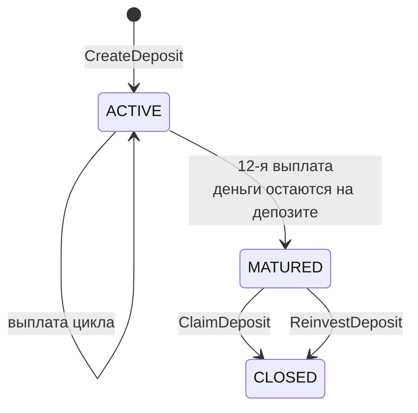
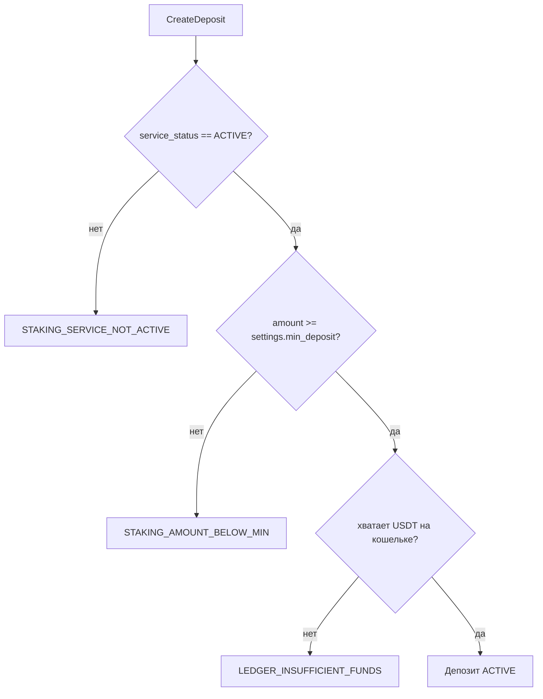

# Стейкинг USDT — справочник для фронта (proto `v0.3.12`)

> Документ самодостаточный: его достаточно, чтобы сверстать экран стейкинга с нуля.
> Он **отменяет** `CHANGELOG_2026-08-13.md` — там описана первая редакция контракта,
> которая в работу не пошла. Сверять с ней ничего не нужно.
>
> Модели — `biconom/types/staking.proto`, клиентский сервис —
> `biconom/client/staking/staking.proto`. Подробности по каждой сущности:
> [`types/staking.md`](biconom/types/staking.md),
> [`client/staking.md`](biconom/client/staking/staking.md).

---

## 1. Что это за продукт

Партнёр вкладывает USDT в **депозит**. Депозит приносит **12 выплат дохода**, по одной за
цикл. После двенадцатой он **созревает**: начисления прекращаются, но деньги остаются
лежать на счёте депозита и ждут решения партнёра — забрать на кошелёк или вложить заново.

```
СОЗДАНИЕ ──▶ ACTIVE ──12 выплат──▶ MATURED ──┬─ забрать ──▶ CLOSED  (деньги на кошельке)
                                             └─ вложить ──▶ CLOSED + новый депозит
```

Параллельно работает **партнёрская часть**: каждое пополнение тела кем-то в структуре
раздаёт бонусы вверх по спонсорскому дереву. Сколько получит вышестоящий — зависит от его
**ранга**.

### Два процента, которые нельзя путать

Самая частая ошибка в вёрстке: обе величины — проценты, но означают разное.

| | **Тир** | **Ранг** |
|---|---|---|
| Что даёт | доход **со своих** денег | долю в раздаче **с чужих** депозитов |
| От чего зависит | сумма активных депозитов **сейчас** | вклад + оборот команды **за всё время** |
| Динамика | плавает вверх-вниз | **никогда не понижается** |
| Где в API | `DepositsSummary.current_rate`, `Config.tiers` | `RankProgress`, `Config.ranks` |

Партнёр спокойно может иметь ранг 12 (16% с чужих) и тир 5% (минимум со своих) —
показывать их рядом как «ваш процент» нельзя.

---

## 2. С чего начать экран

Два запроса, с разной частотой:

| Запрос | Когда звать | Что даёт |
|---|---|---|
| `GetConfig` | **один раз** при старте приложения, дальше кэш | таблица 12 рангов, сетка тиров, число и длина циклов |
| `GetState` | на каждый показ экрана | всё состояние партнёра: настройки, сводка, депозиты, ранг, бонусы |

`GetState` возвращает `Staking.State` — сделан так, чтобы главный экран обходился **одним**
запросом:

| Блок | Что внутри |
|---|---|
| `settings` | минимум входа, дефолт реинвеста прибыли, статус модуля |
| `summary` | агрегаты по всем депозитам (см. §5) |
| `deposits` | список депозитов, новые сверху |
| `rank` | прогресс по карьерной лестнице, **без** разбивки по веткам |
| `obligations` | бонусы за ранги, включая невыплаченные. Максимум 9 записей за всю жизнь |
| `to_next_tier`, `next_tier_rate` | сколько не хватает до следующей ставки и какая она |
| `total_referral_received` | получено с чужих депозитов за всё время |
| `total_achievement_bonus_received` | получено бонусов за ранги |

Флаг запроса `include_closed_deposits`: `false` (по умолчанию) — приходят активные и
созревшие, `true` — плюс вся история закрытых. **Блок `summary` от флага не зависит**, он
всегда считается по всем депозитам.

> ⚠️ Модуль может быть выключен. `settings.service_status` — `ACTIVE` / `PAUSED` /
> `STOPPED`. При `PAUSED` и `STOPPED` кнопку покупки надо прятать, а не показывать и
> ловить ошибку.

---

## 3. Депозит: статусы и что рендерить



| Статус | Смысл | `body` | `next_payout_at` | `closed_at` | Кнопки |
|---|---|---|---|---|---|
| `ACTIVE` | работает, идут выплаты | текущий баланс | дата следующей выплаты | пусто | реинвест прибыли |
| `MATURED` | отработал, ждёт решения | **сумма к получению** | пусто | **пусто** | «Забрать», «Реинвестировать» |
| `CLOSED` | деньги ушли с депозита | тело на момент закрытия | пусто | дата решения | нет |

Три вещи, которые ломают вёрстку, если про них не знать:

**`MATURED` — это не «закрыт».** Деньги ещё принадлежат партнёру и физически лежат на счёте
депозита. Срока на решение нет, ничего не сгорает — депозит может висеть в этом состоянии
сколько угодно. Состояние обязано быть заметным: без действия партнёра деньги просто лежат.

**Созревшие приходят в `GetState` всегда**, независимо от `include_closed_deposits`.
Спрятать их под фильтр «показать закрытые» нельзя.

**Прогресс цикла** — `cycles_done` из `cycles_total` (сейчас 12). У созревшего они равны.

### Поля депозита

| Поле | Что показывать |
|---|---|
| `initial_amount` | сумма при создании, не меняется никогда |
| `body` | тело: у активного и созревшего — живой баланс, у закрытого — снимок |
| `total_income_paid` | начислено дохода за всё время по этому депозиту |
| `cycles_done` / `cycles_total` | прогресс, «7 из 12» |
| `created_at` | когда депозит открыт. Он же точка отсчёта расписания: первая выплата через `cycle_interval_secs` после него |
| `next_payout_at` | дата следующей выплаты. **Пусто у `MATURED` и `CLOSED`** |
| `last_cycle_at` | плановая дата последней прошедшей выплаты. Пусто, если выплат ещё не было |
| `closed_at` | когда тело ушло с депозита. Пусто у `ACTIVE` и `MATURED` |
| `reinvest_profit_applied` / `reinvest_profit_requested` | состояние переключателя, см. §6.2 |
| `source_deposit_id` / `reinvested_into_deposit_id` | цепочка реинвестов, см. §7 |
| `plan_id`, `cycle_interval_secs`, `cycles_total` | снимки условий на момент создания — у старого депозита могут отличаться от текущего `Config` |

Сколько ушло в реинвест по депозиту = `body − initial_amount`: тело растёт **только**
реинвестом дохода, отдельного поля нет.

---

## 4. Действия партнёра

| Метод | Запрос | Ответ |
|---|---|---|
| `CreateDeposit` | `CreateDepositRequest { string amount }` | созданный депозит |
| `ClaimDeposit` | `Staking.Deposit.Id` | закрытый **исходный** депозит |
| `ReinvestDeposit` | `Staking.Deposit.Id` | **новый** депозит |
| `SetAutoReinvestProfit` | `{ uint32 deposit_id, bool enabled }` | обновлённый депозит |
| `GetDeposit` | `Staking.Deposit.Id` | карточка своего депозита |

Дистрибьютор берётся из токена. Чужой `deposit_id` даёт `NotFound` — по ответу нельзя
отличить «нет такого» от «чужой».

### 4.1. Когда какая кнопка доступна

| Действие | `ACTIVE` | `PAUSED` | `STOPPED` |
|---|---|---|---|
| Купить депозит | ✅ | ❌ | ❌ |
| **Забрать** созревшее тело | ✅ | ✅ | ✅ |
| **Реинвестировать** созревшее тело | ✅ | ❌ | ❌ |
| Переключить реинвест прибыли | ✅ | ✅ | ✅ |

Логика простая: забрать своё партнёру запретить нельзя ни при каких обстоятельствах, а
вложить заново — такая же продажа, как новая покупка.

**Кнопку «Забрать» по `service_status` не прятать. Кнопку «Реинвестировать» — прятать.**

### 4.2. Создание депозита



Запрос содержит **только сумму**. Переключателей реинвеста в форме покупки нет: значение
берётся сервером из `Config.settings.default_reinvest_profit`. Менять — уже в карточке
депозита, через `SetAutoReinvestProfit`.

> 🚫 **Дедупликации на сервере нет и не будет.** Два депозита подряд — законный сценарий,
> ограничения на их число тоже нет, и сервер не отличит намеренный повтор от двойного
> нажатия. **Блокируйте кнопку до получения ответа** — это единственная защита. Отменить
> созданный депозит невозможно: реферальные бонусы уже разошлись по структуре.

### 4.3. Забрать или реинвестировать

Оба метода работают **только** со статусом `MATURED`; на активном или уже закрытом вернут
`STAKING_DEPOSIT_NOT_MATURED`.

| | `ClaimDeposit` | `ReinvestDeposit` |
|---|---|---|
| Что происходит | тело уходит на USDT-кошелёк | тело целиком открывает новый депозит |
| Частично | нельзя, только всё тело | нельзя, только всё тело |
| Минимум входа | — | не проверяется, это не покупка |
| Что вернётся | закрытый исходный депозит | **новый** депозит с новыми 12 циклами |

`ReinvestDeposit` возвращает **новый** депозит — перерисовывать надо весь список, а не
только карточку, по которой нажали. Новый депозит наследует выбор партнёра по реинвесту
прибыли, а не дефолт настроек.

Повторно реинвестировать то же тело нельзя: `STAKING_DEPOSIT_ALREADY_REINVESTED`.

---

## 5. Сводка `DepositsSummary`

| Поле | Что показывать |
|---|---|
| `active_count`, `active_total` | сколько депозитов работает и на какую сумму |
| `current_rate` | текущая ставка за цикл, коэффициентом (`"0.07"`). Пусто — активных депозитов нет |
| **`matured_count`, `matured_total`** | **сколько ждёт решения и на какую сумму** |
| `total_count`, `invested_total` | сколько депозитов было всего и сколько реальных денег внесено |
| `personal_volume` | личный вклад для рангов — с учётом роста тела от реинвеста |
| `total_income_paid`, `total_reinvested` | начислено дохода и сколько из него ушло обратно в тела |

`matured_total` стоит вывести на главный экран отдельной строкой: это деньги, которые
партнёр может забрать прямо сейчас, и он не должен ради этого пролистывать список.

> ⚠️ **Созревшие депозиты не входят в `active_total`** и не влияют на тир. Как только
> депозит созрел, ставка по остальным депозитам партнёра пересчитывается вниз. Это не
> ошибка расчёта: депозит больше не зарабатывает, значит и ставку держать не должен.

Разница `personal_volume − invested_total` показывает, сколько объёма создано реинвестом,
а не новыми деньгами.

---

## 6. Реинвест — их два, и это разные вещи

### 6.1. Реинвест **тела** — разовое решение

Кнопка `ReinvestDeposit` на созревшем депозите (§4.3). Флага «включить заранее» не
существует: пока депозит не созрел, решать нечего.

### 6.2. Реинвест **прибыли** — переключатель на депозите

Направляет выплату дохода обратно в тело того же депозита. Включается и выключается
`SetAutoReinvestProfit` в любой момент, но **отключение отложенное**:

| Действие | `requested` | `applied` | Что писать в интерфейсе |
|---|---|---|---|
| Включил | `true` | `true` | «включено, действует сразу» |
| Выключил | `false` | `true` | «отключится после ближайшей выплаты — она ещё уйдёт в тело» |
| Выплата прошла | `false` | `false` | «выключено» |

Расхождение `requested ≠ applied` и есть «подана заявка на отключение». Заявку можно
отозвать повторным `enabled = true` до наступления выплаты. Показывать надо **оба**
состояния, иначе партнёр решит, что кнопка не сработала.

---

## 7. Цепочка реинвестов

Одни и те же деньги перекладываются из депозита в депозит сколько угодно раз. Связь
двусторонняя, поэтому историю можно пройти в обе стороны без перебора списка:

```
#1 CLOSED ──reinvested_into_deposit_id──▶ #7 CLOSED ──reinvested_into_deposit_id──▶ #12 ACTIVE
   ◀──────── source_deposit_id ─────────     ◀──────── source_deposit_id ─────────
```

| Поле | Направление | Когда `0` |
|---|---|---|
| `source_deposit_id` | назад, к источнику | депозит куплен за деньги |
| `reinvested_into_deposit_id` | вперёд, к порождённому | депозит активен, созрел, или тело забрано на кошелёк |

`source = SOURCE_BODY_REINVEST` помечает депозиты, открытые реинвестом тела,
`SOURCE_MANUAL` — купленные за деньги. Полезно для карточки: «открыт из депозита #7».

---

## 8. Ранги и партнёрская часть

`GetState.rank` даёт текущий ранг, требования следующего и прогресс. `GetRankProgress` —
то же плюс **разбивку по веткам первой линии** (`legs`); отдельным методом, потому что
веток у лидера могут быть сотни.

| Поле | Смысл |
|---|---|
| `current_rank`, `achieved_at` | достигнутый ранг и когда взят. Ранг **никогда не понижается** |
| `next` | требования следующего ранга: вклад, оборот, лимит на ветку, бонус |
| `personal_volume` | вклад партнёра |
| `team_volume` | **засчитанный** оборот под следующий ранг (с лимитами) |
| `team_volume_uncapped` | **полный** оборот команды без лимитов |
| `legs` | по каждой ветке: объём, лимит, сколько засчитано, `capped`, `leader_exceeds_cap` |
| `achievements` | история: по записи на каждый взятый ранг |

Разница `team_volume_uncapped − team_volume` — прямой ответ на «у меня в команде $60 000,
почему не дали ранг, где нужно $50 000»: одна ветка упёрлась в лимит. Показывать обе
величины рядом.

**Бонусы за ранги** приходят в `GetState.obligations`, включая невыплаченные
(`released == false`) — партнёр видит, что бонус начислен и ожидает выплаты админом.
Отказать в бонусе нельзя: состояний ровно два.

---

## 9. Две ленты: журнал и финансовые транзакции

Не путать — это разные вещи с разным назначением.

| | `ListEvents` / `ListDepositEvents` | `ListTransactions` / `ListDepositTransactions` |
|---|---|---|
| Что показывает | **бизнес-события** модуля | **движение денег** |
| Безденежные записи | есть: созревание, смена флага, достижение ранга | нет |
| Тип ответа | `Staking.Event.List` | **`biconom.client.transaction.HistoryResponse`** |
| Вёрстка | своя | **та же, что у истории кошелька** |
| Пагинация | по событиям | по группам проводок |

### 9.1. Журнал событий

`ListEvents` — вся история партнёра, `ListDepositEvents` — история одного депозита.

**Устройство записи.** У `Event` есть общая шапка, а тело лежит в `oneof data` — по нему и
пишется `switch` при вёрстке:

| Поле шапки | Что это |
|---|---|
| `id` | глобальный монотонный идентификатор. **Он же курсор** пагинации |
| `seq` | порядковый номер в рамках партнёра: 1, 2, 3 … Годится для подписи «событие №12» |
| `deposit_id` | СВОЙ депозит события. `0` — событие не про свой депозит (`RankAchieved`, `ReferralReceived`) |
| `ts` | бизнес-время (см. ниже про плановое время) |
| `ledger_group_id` | группа проводок, породившая событие. `0` — событие без денег |

`ledger_group_id` — **мост между двумя лентами**: по нему событие журнала сопоставляется с
группой из `ListTransactions`. Если нужен переход «из журнала в карточку кошелька» —
связывать по нему, а не по времени и сумме.

| Ветка `oneof data` | Событие | Когда |
|---|---|---|
| `deposit_opened` | `DepositOpened` | создан депозит (за деньги или реинвестом тела) |
| `income_paid` | `IncomePaid` | начислен доход за цикл |
| `income_reinvested` | `IncomeReinvested` | доход ушёл в тело того же депозита |
| `auto_reinvest_changed` | `AutoReinvestChanged` | переключён реинвест прибыли — партнёром (`USER`) или системой (`SYSTEM`) |
| `deposit_matured` | `DepositMatured` | депозит отработал все циклы и ждёт решения |
| `deposit_closed` | `DepositClosed` | тело ушло: на кошелёк (`reinvested_into_deposit_id == 0`) или в новый депозит |
| `rank_achieved` | `RankAchieved` | взят новый ранг |
| `rank_bonus_released` | `RankBonusReleased` | бонус за ранг выплачен (автоматически или админом) |
| **`referral_received`** | **`ReferralReceived`** | **пришла доля с депозита нижестоящего партнёра** |

Ветка `data` может быть не заполнена — это событие вида, о котором клиент ещё не знает.
Такие пропускать, а не падать: список видов пополняется без смены мажорной версии.

`RankAchieved` и `RankBonusReleased` — разные моменты: между достижением ранга и выплатой
бонуса могут пройти недели ручной модерации. Показывать оба.

Журнал закрывает **весь** заработок партнёра в модуле: и свои депозиты, и доход со
структуры. Отдельно ходить в историю кошелька за рефералкой не нужно.

#### `ReferralReceived` — доля с чужого вложения

Единственное событие, приходящее не от своего депозита. Пишется на **каждый** прирост тела
в структуре: создание депозита нижестоящим, реинвест его прибыли, реинвест его тела.

| Поле | Что показывать |
|---|---|
| `source_distributor_id` | чьё вложение породило начисление |
| `source_deposit_id` | его депозит |
| `base_amount` | база: прирост тела у источника |
| `amount` | сколько получено |
| `rate` | **фактическая** ставка — разница между процентом своего ранга и тем, что уже забрали нижестоящие звенья. Не процент ранга |
| `depth` | глубина, `1` — прямой личник |
| `lost_profit` | **недозаработок**: сколько дало бы это же начисление на максимальном ранге |

> ⚠️ У этих событий **`Event.deposit_id == 0`**, депозит-источник лежит внутри payload.
> В `ListDepositEvents` они не приходят — только в `ListEvents`. Иначе чужое начисление
> всплывало бы в журнале одноимённого своего депозита.

**Про `lost_profit`.** Это не долг и не «заморожённые деньги» — их не существует и никто
их не получил. Величина отвечает на вопрос «что мне даст рост ранга»: `amount + lost_profit`
— потолок конкретно этого начисления. Считается от той же базы и того же уже выбранного
процента, поэтому это честный потолок, а не «16% от базы»: часть процента забрали
нижестоящие звенья цепочки, и ростом собственного ранга её не вернуть. Ноль означает «взял
всё возможное» — либо максимальный ранг, либо лимит уже выбран внизу.

Формулировка для интерфейса: «на ранге 12 это начисление принесло бы на $110 больше».
Слова «потерял», «упущено», «недоплатили» не подходят — партнёру ничего не должны.

`IncomePaid` самодостаточно: несёт `rate`, `active_deposits_total` и `body_at_payout`,
поэтому «почему 7%, а не 8%» объясняется прямо из события.

То же реферальное начисление приходит и в историю кошелька — карточкой
`Transaction.Details.staking_referral` с теми же полями (`source_distributor_id`,
`deposit_id`, `base_amount`, `rate`, `lost_profit`). Дублирование намеренное: журнал —
для экрана стейкинга, история — для экрана кошелька. Что использовать, решает экран.

**Время события `ts` — плановое, а не фактическое.** Если сервис лежал и догонял выплаты,
в истории стоит плановая дата цикла. Сортировать и группировать по `ts` можно, разрывов
не будет.

Пагинация стандартная: `cursor` (`Event.id` последнего полученного, exclusive) + `Sort`
(по умолчанию `BACKWARD`, 50). Конец списка — пришло меньше, чем `sort.limit`.

### 9.2. Финансовые транзакции

`ListTransactions` возвращает **тот же самый тип**, что `TransactionService.History` —
`items` плюс справочники `accounts` / `distributors` / `slots`. Не копию и не похожую
структуру: тот же контракт, поэтому карточки рисуются **существующим кодом экрана
кошелька**, без единой правки. Отличие ровно одно — список уже отфильтрован модулем.

`ListDepositTransactions` сужает выборку до одного своего депозита. Доли реферальной
лестницы туда не попадают: они приходят с чужих депозитов.

Шесть карточек, полностью описанных в [`types/transaction.md`](biconom/types/transaction.md),
разделы 16–21:

| `details` | Операция | Ключевые метаданные |
|---|---|---|
| `staking_deposit_fund` | вложено в депозит | `deposit_id`, `source_deposit_id` (≠0 — депозит-донор, оплативший этот) |
| `staking_body_return` | тело вернулось на кошелёк | `deposit_id`, `reinvested_into_deposit_id` (≠0 — тело сразу ушло в новый депозит) |
| `staking_income` | доход за цикл | `deposit_id`, `payout_seq`, `rate`, `is_final` |
| `staking_profit_reinvest` | доход ушёл в тело | `deposit_id`, `payout_seq` |
| `staking_referral` | доля лестницы | `source_distributor_id`, `depth` («N Line»), `deposit_id`, `base_amount`, `rate`, `lost_profit` |
| `staking_rank_bonus` | бонус за ранг | `rank`, `obligation_id` |

> ⚠️ **Выплата с включённым реинвестом прибыли даёт две строки в ОДНОЙ группе:**
> `staking_income` (пришло) + `staking_profit_reinvest` (ушло в тело). Суммарно ноль —
> показывать обе, иначе непонятно, почему баланс не изменился. На макете это одна карточка
> с суммой дохода и бейджем «Reinvest».
>
> **Реинвест тела даёт две ОТДЕЛЬНЫЕ группы:** сначала `staking_body_return` (тело
> вернулось), затем `staking_deposit_fund` (куплен новый депозит). Это две самостоятельные
> карточки в ленте, а не одна.

**Цепочка реинвеста читается прямо из карточек, в обе стороны.** У возврата тела
`reinvested_into_deposit_id` показывает, куда деньги ушли дальше (`0` — партнёр их забрал),
у вложения `source_deposit_id` — каким депозитом оно оплачено (`0` — куплено за деньги).
Отдельного булева «был реинвест» нет намеренно: ненулевой идентификатор и есть флаг, а два
представления одного факта однажды разошлись бы.

**Лимит считается в группах**, а не в строках: одна операция стейкинга — одна группа.
Курсор — `group_id` последней полученной группы, exclusive, как в `TransactionService.History`.

Обратная сторона проводок (счёт депозита, орг-пулы) до клиента **не доходит** — эти счета
не принадлежат аккаунту. Поэтому в группе видны только строки самого партнёра.

---

## 10. Уведомления

| Событие | Топик | Канал |
|---|---|---|
| Начислен доход по депозиту | `bonus_received`, `kind = StakingIncome` | как настроено у пользователя |
| Пришла доля с чужого депозита | `bonus_received`, `kind = StakingReferral` | то же |
| Достигнут новый ранг | `staking_rank_achieved` | только Telegram |
| **Депозит созрел и ждёт решения** | `staking_deposit_matured` | только Telegram |
| Бонус за ранг выплачен админом | `bonus_received`, `kind = StakingRankPremium` | как настроено |

Топики видны и переключаются в `NotificationPreferences`; `staking_deposit_matured`
включён по умолчанию.

Создание депозита, реинвест прибыли, забор тела и закрытие уведомлений **не** порождают —
это действия самого партнёра, он видит результат в ответе.

---

## 11. Соглашения контракта

**Деньги — строками.** Как балансы в `biconom.types.Ledger`: высокая точность, без потерь
на `double`. Парсить как decimal, не как число.

**Ставки — тоже строками, но коэффициентом.** `"0.05"` = 5%, `"0.16"` = 16%. Для показа
умножить на 100. На коэффициент умножают напрямую: `выплата = тело × rate`.

**Время — `google.protobuf.Timestamp`, а не unix-число.** Все даты (`created_at`,
`next_payout_at`, `last_cycle_at`, `closed_at`, `Event.ts`, `achieved_at`) — вложенное
сообщение. «Пусто» в таблицах этого документа означает, что сообщения **нет**: в JSON
это `null`/отсутствующий ключ, в сгенерированном коде — `None` / `undefined`, а НЕ нулевая
дата 1970 года. Проверять на наличие, а не сравнивать с нулём.

**`optional` содержателен.** У ранга 1 нет требования по обороту, у рангов 1–3 нет бонуса —
это `optional` без значения, а не ноль. Отсутствие и ноль различать.

**Право `STAKING_USE`.** Все клиентские методы требуют его на Session-токене. Обычному
партнёру оно выдано по умолчанию, поэтому в норме не заметно; на делегированных
(`act_as`) токенах его может не быть — тогда придёт `PermissionDenied`. Плюс обычный
`Unauthenticated` при истёкшем токене. Оба кода — общие для API, не стейкинговые.

**Длина цикла — из `Config.cycle_interval_secs`, не константой.** На продакшене 2 592 000
секунд (30 суток), на стейджинге **60 секунд**, чтобы весь путь депозита проходился за
12 минут. Значение фиксируется в депозите при создании (`Deposit.cycle_interval_secs`),
поэтому у старых депозитов оно может отличаться от текущего конфига.

**Идентификаторы.** Где запрос состоит только из идентификатора — он и есть тело запроса
(`Staking.Deposit.Id`, `Staking.Obligation.Id`). Где рядом есть другие поля — простое
число: `uint32 deposit_id`.

---

## 12. Коды ошибок

Приходят в `Status.message`; тип `Status.code` указан рядом.

| Код | gRPC | Когда |
|---|---|---|
| `STAKING_SERVICE_NOT_ACTIVE` | `FailedPrecondition` | покупка или реинвест тела при `PAUSED` / `STOPPED` |
| `STAKING_AMOUNT_INVALID` | `InvalidArgument` | сумма не парсится |
| `STAKING_AMOUNT_BELOW_MIN` | `InvalidArgument` | сумма меньше `settings.min_deposit` |
| `LEDGER_INSUFFICIENT_FUNDS` | `FailedPrecondition` | не хватает USDT на кошельке |
| `STAKING_DEPOSIT_NOT_FOUND` | `NotFound` | депозита нет или он чужой |
| `STAKING_DEPOSIT_NOT_MATURED` | `FailedPrecondition` | забрать/реинвестировать не созревший депозит |
| `STAKING_DEPOSIT_ALREADY_REINVESTED` | `FailedPrecondition` | тело этого депозита уже переоткрыто |
| `STAKING_DEPOSIT_CLOSED` | `FailedPrecondition` | менять реинвест прибыли у закрытого депозита |

---

## 13. Чек-лист вёрстки

- [ ] `GetConfig` один раз при старте, дальше кэш; `GetState` — на показ экрана.
- [ ] Кнопку покупки прятать при `service_status != ACTIVE`.
- [ ] Блокировать кнопку создания до ответа — дедупликации на сервере нет.
- [ ] В форме покупки **нет** переключателей реинвеста, только сумма.
- [ ] Отдельное состояние карточки для `MATURED` с двумя кнопками.
- [ ] `matured_total` — строкой на главном экране.
- [ ] «Забрать» показывать всегда; «Реинвестировать» прятать при `PAUSED` / `STOPPED`.
- [ ] После `ReinvestDeposit` перерисовать весь список: пришёл **новый** депозит.
- [ ] Переключатель реинвеста прибыли показывает `requested` **и** `applied`.
- [ ] Длина цикла — из конфига, не «30 дней» в коде.
- [ ] Ставки умножать на 100 для показа; деньги парсить как decimal.
- [ ] Отрисовать `ReferralReceived` и `RankBonusReleased` в ленте журнала.
- [ ] Экран «транзакции стейкинга» — на `ListTransactions`, вёрстка карточек берётся с
      экрана кошелька как есть.
- [ ] Не схлопывать парные строки в группе (доход + реинвест, возврат + вложение).
- [ ] Показать `lost_profit` как мотивацию роста ранга, не как долг перед партнёром.
- [ ] Даты — `Timestamp`; отсутствие проверять на `null`, а не сравнивать с 1970 годом.
- [ ] В `switch` по `Event.data` предусмотреть ветку «неизвестный вид» — пропускать, не падать.
- [ ] Обработать все коды из §12.

---

## 14. Админский сервис

`biconom.admin.staking.StakingAdminService` — отдельная поверхность под правом
`ADMIN_STAKING`: разбор депозитов и квалификации любого партнёра, ручная выплата бонусов
за ранги, настройки модуля. Описание — [`admin/staking.md`](biconom/admin/staking/staking.md).

Для фронта кабинета важно одно: `GetSummary` показывает `deposits_matured` и
`matured_total` — деньги, которые партнёры могут забрать в любой момент.
