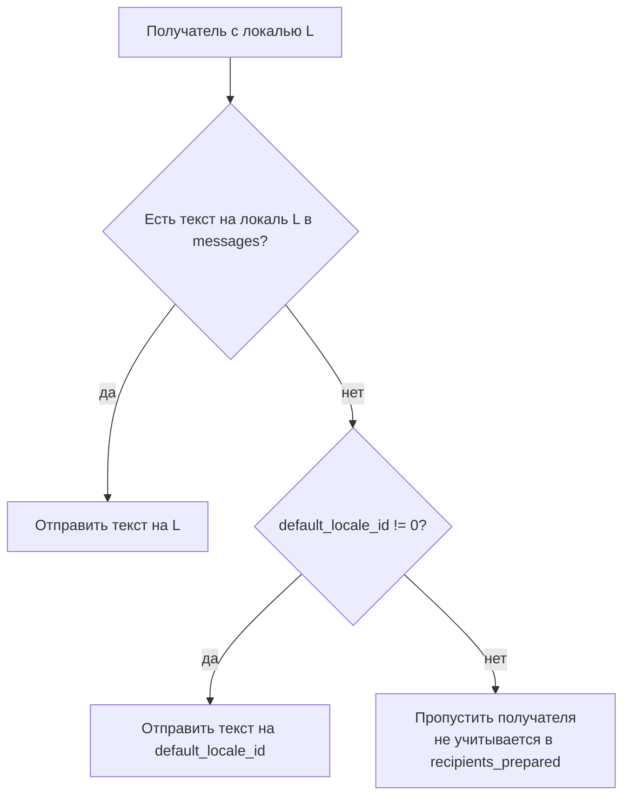

# Сервис: BroadcastService (Admin)

## 1. Описание

**`BroadcastService`** — административный сервис для рассылки сообщений в Telegram-бот пользователям платформы, у которых в профиле привязан активный Telegram.

Сервис предоставляет три метода:
- `SendTelegramToAll` — отправка одинакового текста всем получателям;
- `SendTelegramLocalized` — отправка с учётом языка профиля получателя (с fallback на локаль по умолчанию);
- `SendTelegramToDistributor` — точечная отправка конкретному дистрибьютору (по id или логину).

**Охват получателей (массовые методы `SendTelegramToAll` / `SendTelegramLocalized`).**
В рассылку попадают пользователи, для которых одновременно:
- в записи `user` установлен `user_telegram_id > 0`;
- соответствующая запись `user_telegram` активна (`exists && active`);
- пользователь **НЕ** забанен (`user.banned == false`).

Точечный метод `SendTelegramToDistributor` адресует конкретного дистрибьютора и
бан владельца **не** проверяет (см. описание метода).

**Форматирование.** Режим задаётся полем `parse_mode` (`ParseMode`):
- `PARSE_MODE_PLAIN` (по умолчанию) — спецсимволы `< > &` экранируются сервером, разметка не интерпретируется. Безопасно для любого ввода.
- `PARSE_MODE_HTML` — текст отправляется как есть, поддерживается HTML-разметка Telegram (`<b>`, `<i>`, `<code>`, `<a>` и т.д.). Перед отправкой сервер **валидирует** разметку (см. ниже); невалидный HTML отклоняется с `InvalidArgument` до постановки в очередь бота.

**Валидация HTML (только PARSE_MODE_HTML).** Проверяется, что:
- используются только теги из белого списка Telegram: `b, strong, i, em, u, ins, s, strike, del, span, tg-spoiler, a, tg-emoji, code, pre, blockquote`;
- теги корректно вложены (баланс open/close по правилу LIFO — без незакрытых тегов и перехлёстов);
- у тега `<a>` присутствует атрибут `href`.

Любое нарушение → `InvalidArgument` (`TELEGRAM_BROADCAST_HTML_INVALID`), сообщение **не** отправляется ни одному получателю.

> Примечание: валидация проверяет только имя тега и не проверяет атрибуты (кроме
> наличия `href` у `<a>`). В частности, `` пропускается по имени, тогда как
> Telegram принимает его лишь с `class="tg-spoiler"`. Для спойлера надёжнее
> использовать `<tg-spoiler>`.

**Ограничение скорости.** Скорость отправки не задаётся клиентом — она ограничивается конфигурным лимитом `telegram.rate_limit_count` / `telegram.rate_limit_period`, который применяется на стороне бота при отправке каждого сообщения. Метод лишь ставит сообщения в очередь; фактическая доставка асинхронна.

## 2. Логика выбора текста (SendTelegramLocalized)

## 3. Описание методов (RPC)

### `rpc SendTelegramToAll(SendToAllRequest) returns (BroadcastResponse)`
- **Назначение**: Разослать один и тот же текст всем получателям с активным Telegram (без учёта языка).
- **Входные параметры** (`SendToAllRequest`):
    - `parse_mode` (`ParseMode`): режим форматирования.
    - `text` (string): текст сообщения.
- **Возвращаемое значение**: `BroadcastResponse` (см. раздел 4).
- **Ошибки**:
    - `InvalidArgument` (`TELEGRAM_BROADCAST_TEXT_EMPTY`) — `text` пуст после `trim`.
    - `InvalidArgument` (`TELEGRAM_BROADCAST_HTML_INVALID`) — `parse_mode = PARSE_MODE_HTML`, но разметка не прошла валидацию.
    - `FailedPrecondition` (`TELEGRAM_BOT_NOT_CONFIGURED`) — Telegram-бот не сконфигурирован на сервере.
- **Побочные эффекты**:
    - Ставит в очередь бота по одному сообщению на каждого подходящего получателя.

### `rpc SendTelegramLocalized(SendLocalizedRequest) returns (BroadcastResponse)`
- **Назначение**: Разослать текст с учётом языка профиля получателя.
- **Входные параметры** (`SendLocalizedRequest`):
    - `parse_mode` (`ParseMode`): режим форматирования (общий для всех локалей).
    - `default_locale_id` (uint32): локаль по умолчанию. Либо `0` (нет fallback — таких получателей пропускаем), либо обязана совпадать с одним из `locale_id` в `messages`.
    - `messages` (repeated `LocalizedText`): варианты текста по локалям, где `LocalizedText { locale_id, text }`.
- **Возвращаемое значение**: `BroadcastResponse` (см. раздел 4).
- **Логика выбора текста для получателя**: локаль профиля → иначе `default_locale_id` (если `!= 0`) → иначе получатель пропускается (не входит в `recipients_prepared`).
- **Ошибки**:
    - `InvalidArgument` (`TELEGRAM_BROADCAST_MESSAGES_EMPTY`) — список `messages` пуст.
    - `InvalidArgument` (`TELEGRAM_BROADCAST_TEXT_EMPTY`) — `text` любого варианта пуст после `trim`.
    - `InvalidArgument` (`TELEGRAM_BROADCAST_LOCALE_DUPLICATE`) — дублирующийся `locale_id` в `messages`.
    - `InvalidArgument` (`TELEGRAM_BROADCAST_DEFAULT_LOCALE_INVALID`) — `default_locale_id != 0`, но отсутствует среди `messages`.
    - `InvalidArgument` (`TELEGRAM_BROADCAST_HTML_INVALID`) — `parse_mode = PARSE_MODE_HTML`, но разметка любого варианта не прошла валидацию.
    - `FailedPrecondition` (`TELEGRAM_BOT_NOT_CONFIGURED`) — Telegram-бот не сконфигурирован на сервере.
- **Побочные эффекты**:
    - Ставит в очередь бота по одному сообщению на каждого получателя, для которого удалось выбрать текст.

### `rpc SendTelegramToDistributor(SendToDistributorRequest) returns (BroadcastResponse)`
- **Назначение**: Точечно отправить текст конкретному дистрибьютору. Без локализации — текст отправляется как есть (с учётом `parse_mode`).
- **Входные параметры** (`SendToDistributorRequest`):
    - `distributor` (`biconom.types.Distributor.Id`): идентификатор дистрибьютора; поддерживаются варианты `id` и `username` (а также составные).
    - `parse_mode` (`ParseMode`): режим форматирования.
    - `text` (string): текст сообщения.
- **Резолвинг получателя**: дистрибьютор → аккаунт-владелец (обязан быть `User`) → пользователь → активная запись `user_telegram` → `chat_id`. Бан пользователя **не** проверяется (адресная админская отправка).
- **Возвращаемое значение**: `BroadcastResponse` — `recipients_prepared` = `1` при успешной постановке в очередь.
- **Ошибки**:
    - `InvalidArgument` (`TELEGRAM_BROADCAST_TEXT_EMPTY`) — `text` пуст после `trim`.
    - `InvalidArgument` (`TELEGRAM_BROADCAST_HTML_INVALID`) — `parse_mode = PARSE_MODE_HTML`, но разметка не прошла валидацию.
    - `NotFound` (`DISTRIBUTOR_NOT_FOUND`) — дистрибьютор по указанному идентификатору не найден.
    - `NotFound` (`DISTRIBUTOR_CURSOR_NOT_FOUND`) — передан несуществующий `id`.
    - `FailedPrecondition` (`DISTRIBUTOR_TELEGRAM_NOT_LINKED`) — у дистрибьютора нет привязанного активного Telegram (или владелец аккаунта не является пользователем).
    - `FailedPrecondition` (`TELEGRAM_BOT_NOT_CONFIGURED`) — Telegram-бот не сконфигурирован на сервере.
- **Побочные эффекты**:
    - Ставит в очередь бота одно сообщение выбранному получателю.

## 4. Ответ (BroadcastResponse)

| Поле | Тип | Значение |
|---|---|---|
| `recipients_prepared` | uint64 | Сколько получателей потенциально подготовлено к публикации, т.е. сколько сообщений реально поставлено в очередь отправки боту. Для `SendTelegramLocalized` получатели без подходящей локали и без default сюда **не** входят. |

> **Важно**: `recipients_prepared` — это число поставленных в очередь сообщений, а **не** число фактически доставленных. Ошибки доставки конкретным получателям (пользователь заблокировал бота) происходят асинхронно и в статистику ответа не попадают — они логируются на стороне бота.

## 5. Права доступа и безопасность

- **Требуемые права**: `Permission::ROOT` (см. `core/src/infra/access_control.rs`). По умолчанию выдаётся только `user_id = 1`.
- Токены `Guest` и `Confirmation` отклоняются; принимается только `Session`-токен с правом `ROOT`.

## 6. Сценарии использования

- **Массовое объявление**: важные события платформы, техработы, анонсы — `SendTelegramToAll` с единым текстом.
- **Локализованная рассылка**: то же объявление на нескольких языках — `SendTelegramLocalized`, где каждый получатель получает текст на языке своего профиля, а при отсутствии перевода — на `default_locale_id`.
- **Строгая локализация без fallback**: если нужно доставить сообщение только тем, для чьего языка есть перевод, — передать `default_locale_id = 0`; получатели без подходящей локали будут пропущены (не войдут в `recipients_prepared`).
- **Точечное обращение**: индивидуальное сообщение конкретному дистрибьютору (поддержка, ручное уведомление) — `SendTelegramToDistributor` по `id` или `username`.
