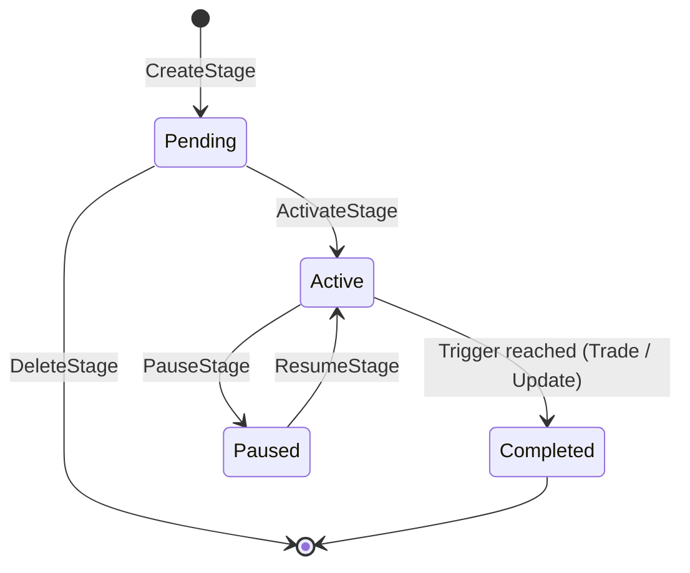

# Сервис: TradeQuestAdminService (Admin)

## 1. Описание

**`TradeQuestAdminService`** — административный сервис для управления торговыми квестами. Квесты позволяют отслеживать торговую активность пользователей на определенных валютных парах и биржах, предоставляя награды (изменение цен тикеров) при достижении заданных порогов объема.

Сервис обеспечивает полный жизненный цикл квеста: от создания этапов (stages) до каскадного закрытия с переносом surplus на следующий этап.

## 2. Жизненный цикл этапа

### Строгий порядок

Этапы выполняются строго последовательно. Нельзя активировать/возобновлять этап,
если предыдущий (по `sequence`) ещё не завершён (`Completed`).

## 3. Описание методов (RPC)

### `rpc GetQuest(biconom.types.ExchangeCurrencyPair.Id) returns (biconom.types.Quest)`
- **Назначение**: Получить полную модель квеста для конкретной пары (Exchange, CurrencyPair).
- **Использование**: Проверка текущего состояния всех этапов, накопленных метрик и истории закрытий.

### `rpc CreateStage(CreateStageRequest) returns (CreateStageResponse)`
- **Назначение**: Добавить новый этап в квест.
- **Особенности**: Порядковый номер (`sequence`) назначается автоматически (инкрементно).

### `rpc UpdateStage(UpdateStageRequest) returns (google.protobuf.Empty)`
- **Назначение**: Изменить параметры этапа (триггер, награда, авто-активация).
- **Ограничения**: Доступно только для этапов в статусе `Pending` или `Active`.
- **Каскад**: Если изменение trigger у Active-этапа приводит к достижению порога — срабатывает каскадное закрытие.

### `rpc DeleteStage(TradeQuestStageIdentifier) returns (google.protobuf.Empty)`
- **Назначение**: Удалить этап из квеста.
- **Ограничения**: Удалить можно только этап в статусе `Pending`.

### `rpc ActivateStage(TradeQuestStageIdentifier) returns (google.protobuf.Empty)`
- **Назначение**: Перевести этап из `Pending` в `Active`.
- **Ограничения**: Все предыдущие этапы (по `sequence`) должны быть `Completed`. Не должно быть другого Active-этапа.

### `rpc PauseStage(TradeQuestStageIdentifier) returns (google.protobuf.Empty)`
- **Назначение**: Приостановить этап (`Active` → `Paused`).
- **Результат**: Сделки во время паузы **игнорируются** — метрики не аккумулируются.

### `rpc ResumeStage(TradeQuestStageIdentifier) returns (google.protobuf.Empty)`
- **Назначение**: Вернуть этап в работу (`Paused` → `Active`).
- **Ограничения**: Все предыдущие этапы должны быть `Completed`. Не должно быть другого Active-этапа.

## 4. Каскадное закрытие и перенос surplus

При достижении триггера (целевого объема) этап переходит в статус `Completed`:

1. Вычисляется **surplus** = текущее значение triggered-метрики − target.
2. Вычисляется **пропорциональная часть** парной метрики (pair_surplus).
3. Метрики завершённого этапа **обрезаются** до target (+ пропорция парной).
4. Генерируется **RewardAction** (изменение цен Buy/Sell для тикера).
5. Если у следующего этапа (по `sequence`) установлен `auto_activate=true` — он активируется автоматически, и surplus переносится в его метрики.
6. Если surplus следующего этапа ≥ его target — каскад продолжается.

### Паринг метрик

| Buy | Sell |
|-----|------|
| BaseReceived ↔ QuoteGiven | BaseGiven ↔ QuoteReceived |

## 5. Права доступа

Все методы защищены правом **`ADMIN_FINANCE`**. Операции, изменяющие состояние (`write`), блокируют `QuestCache` на время выполнения, поэтому не рекомендуется вызывать их массово в высоконагруженные периоды.
