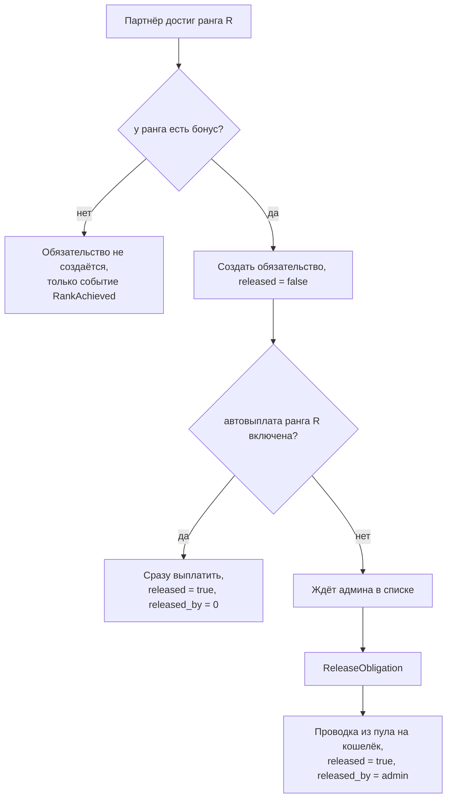

# Сервис: StakingAdminService (Admin)

> Общие модели (`biconom.types.Staking.*`) описаны в
> [`biconom/types/staking.md`](../../types/staking.md). Здесь — только админский сервис.

## 1. Описание

**`StakingAdminService`** — админская поверхность стейкинга: разбор депозитов и
квалификации любого партнёра, ручная выплата бонусов за достижение рангов,
управление настройками модуля.

## 2. Права

Вся поверхность закрыта одним правом — **`ADMIN_STAKING`**: и чтение, и выпуск денег
(реализация обязательства, переключение автовыплаты), и правка настроек модуля.
`ROOT` включает все биты, поэтому под ним доступно всё без отдельной выдачи.

Право выдаётся **узкому кругу**: оно позволяет выпустить бонус за ранг 12
(до $1 000 000) и остановить приём новых депозитов. Отдельного read-only права нет —
если поддержке понадобится смотреть журнал без возможности выпускать деньги, право
придётся разделить.

### Наследование при `act_as`

Проверка прав устроена так: под собой берётся personal-набор, под другим пользователем
(`act_as`) — **только** delegated-набор. Значит модератор, зашедший под партнёра,
работает с его правом `STAKING_USE` (создать депозит, забрать или реинвестировать
созревшее тело, переключить реинвест прибыли) и админские
методы стейкинга ему недоступны, пока `ADMIN_STAKING` не выдан ему делегированно.

## 3. Методы

### 3.1. Чтение

| RPC | Назначение |
|---|---|
| `GetState` | Всё состояние дистрибьютора одним запросом: настройки, сводка, депозиты, ранг, обязательства. Тот же тип, что у клиента |
| `GetDeposit` | Карточка любого депозита. Запрос — `Staking.Deposit.Id` |
| `ListEvents` | Журнал стейкинга произвольного дистрибьютора |
| `ListDepositEvents` | Журнал конкретного депозита |
| `GetRankProgress` | Разбор квалификации: почему не взял следующий ранг. Запрос — `Distributor.Id`, поэтому можно спросить **по username** |
| `GetConfig` | Захардкоженная экономика + текущие изменяемые настройки |
| `GetSummary` | Сводка по модулю в целом (не по партнёру) |

### 3.2. Бонусы за достижение рангов

| RPC | Назначение | Право |
|---|---|---|
| `ListObligations` | Обязательства, новые сверху, фильтры + курсор | `ADMIN_STAKING` |
| `GetObligation` | Одно обязательство | `ADMIN_STAKING` |
| `ReleaseObligation` | Выплатить бонус. Запрос — `Staking.Obligation.Id` | `ADMIN_STAKING` |
| `ListRankBonusSettings` | 12 строк: ранг, сумма бонуса, флаг автовыплаты | `ADMIN_STAKING` |
| `SetRankBonusAutoRelease` | Переключить автовыплату для одного ранга | `ADMIN_STAKING` |

### 3.3. Настройки модуля

| RPC | Назначение | Право |
|---|---|---|
| `UpdateSettings` | Частичное обновление настроек | `ADMIN_STAKING` |

## 4. Разбор квалификации

`GetRankProgress` — главный инструмент поддержки. Возвращает вклад, командный оборот
под следующий ранг и **разбивку по каждой ветке первой линии**: её объём, лимит на
ветку, сколько засчитано, сработал ли лимит (`capped`), взят ли весь вклад лидера
без учёта его нижестоящих (`leader_exceeds_cap`).

Типичный вопрос партнёра — «у меня в команде $60 000, почему не дали ранг 5, там же
нужно $50 000». Ответ виден сразу из пары полей: `team_volume_uncapped` = $60 000
(весь оборот команды), `team_volume` = $16 666.67 (засчитано) — одна ветка дала
$55 000, но лимит на ветку для ранга 5 срезал её до трети требования. Разбивка
`legs` показывает, какая именно ветка обрезана (`capped == true`).

## 5. Ручная выплата бонусов

Обязательство создаётся **всегда**, когда у достигнутого ранга есть бонус — и при
автоматической выплате, и при ручной. Поэтому один список показывает все достижения
рангов по системе, а `released` отделяет выплаченные от ожидающих.

**Фильтры `ListObligations`** комбинируются: `optional bool released`, `rank`,
`distributor_id`. Пагинация — стандартная для проекта: `optional uint64 cursor`
(`Obligation.id` последнего полученного, exclusive) + `optional biconom.types.Sort`
(по умолчанию `BACKWARD`, 50). Конец — записей меньше, чем `sort.limit`.
Типичный сценарий: «последние 100 невыплаченных обязательств по рангу 9».

**Массовой реализации нет** — только поштучно. В этом и смысл ручной модерации:
крупные суммы админ смотрит по одной.

`ReleaseObligation` защищён от повтора самими данными: флагом `released` и натуральным
ключом `(distributor_id, rank)` — бонус за ранг выплачивается один раз за жизнь
аккаунта. Повторный вызов на уже выплаченном возвращает `FailedPrecondition`, а не
выплачивает второй раз. Ключ идемпотентности в запросе для этого не нужен — поэтому
запрос состоит из одного идентификатора и передаётся `Staking.Obligation.Id` напрямую,
без сообщения-обёртки.

**Отказать в бонусе нельзя.** Состояний ровно два: выплачено или ожидает. Статуса
«отменено» нет.

## 6. Автовыплата по рангам

`SetRankBonusAutoRelease` переключает автовыплату **для одного ранга** — не общий
тумблер на все.

Ключевое: включение действует только на **будущие** достижения. Уже висящие
невыплаченные обязательства автоматически **не** выплачиваются — их по-прежнему
нужно реализовывать вручную. Иначе одно переключение тумблера разом выпустило бы все
накопленные суммы.

У рангов 1…3 бонуса нет, настройка неприменима — `InvalidArgument`.

## 7. Настройки модуля

`UpdateSettings` — частичное обновление: задаются только изменяемые поля,
незаданные остаются как есть. Возвращается полное новое состояние.

| Поле | Что меняет |
|---|---|
| `min_deposit` | Минимальная сумма входа в депозит |
| `default_reinvest_profit` | Реинвест прибыли у новых депозитов. **Единственный** источник флага: клиент его в `CreateDeposit` не передаёт |
| `service_status` | Приём новых депозитов |

Изменения действуют на **будущие** депозиты: у уже открытых ни минимум, ни значение
реинвеста не переписываются.

Длина цикла настройкой **не является**: она зависит от окружения (30 суток на
продакшене, 60 секунд на стейджинге), приходит на старте сервиса и в БД не хранится —
иначе копия базы стейджинга принесла бы минутный цикл на прод.

### 7.1. Статусы

| Статус | `CreateDeposit` | `ReinvestDeposit` | `ClaimDeposit` | Выплаты и реинвест прибыли |
|---|---|---|---|---|
| `ACTIVE` | можно | можно | можно | идут |
| `PAUSED` | **нельзя** | **нельзя** | **можно** | **идут** |
| `STOPPED` | нельзя | нельзя | **можно** | заморожены; плановые моменты накапливаются и догоняются после `ACTIVE` |

`PAUSED` — «старые работают, новые купить нельзя». Реинвест тела созревшего депозита
тоже относится к покупкам: это решение партнёра вложить деньги заново. Выплаты и
реинвест прибыли идут — они исполняют уже принятое обязательство.

Забрать тело созревшего депозита (`ClaimDeposit`) партнёр может при **любом** статусе,
включая `STOPPED`: остановка модуля не повод удерживать чужие деньги.

Стартовый статус после первого деплоя — `STOPPED`, пока админ не активирует модуль
явно. Защита от того, что модуль начнёт раздавать деньги сразу после выкатки.

### 7.2. Что через API НЕ меняется

Таблица рангов, сетка тиров, число и длина циклов **захардкожены** и меняются только
пересборкой. `GetConfig` отдаёт их read-only — чтобы можно было посмотреть, что
сейчас работает, не заходя в код.

Причины такого разделения: конфиг читается один раз на старте, поэтому правка файла
всё равно требует рестарта; опечатка в YAML-ключе не падает, а тихо подставляет
дефолт и молча меняет экономику; инвариант `3 × max_per_leg ≥ required_team_volume`
с константами проверяется тестом в CI, а не на проде; изменение процента ранга —
финансовое решение, ему нужны ревью и git-история.

## 8. Сводка

`GetSummary` отдаёт: сколько сейчас в депозитах, сколько депозитов активно, созрело и
всего, выплачено доходности / рефералки / бонусов за достижение, сумма и количество
невыплаченных обязательств, текущий статус сервиса.

| Поле | Смысл |
|---|---|
| `total_in_deposits` | Тела, которые программа держит: активные **плюс** созревшие, но не забранные. Это обязательства перед партнёрами |
| `deposits_active` / `deposits_total` | Сколько депозитов работает и сколько было за всё время |
| `deposits_matured` / `matured_total` | Созрели и ждут решения. Партнёры могут забрать эти деньги в любой момент — величину полезно держать на глазах |
| `total_income_paid`, `total_referral_paid`, `total_achievement_bonus_paid` | Сколько роздано по каждому направлению |
| `obligations_pending_amount` / `obligations_pending_count` | Невыплаченные обязательства |

Суммы выплат читаются **из балансов орг-пулов**, а не из отдельных счётчиков: пулы
работают в бесконечный кредит и ничем не пополняются, поэтому модуль их отрицательного
баланса — это и есть фактическая стоимость программы, и разойтись с леджером он не
может по построению.

Счётчики депозитов считаются обходом таблицы: величина административная, а
персистентный счётчик пришлось бы держать согласованным с проводками.

## 9. Коды ошибок

| Ситуация | Код |
|---|---|
| Нет права на операцию | `PermissionDenied` |
| Обязательство не найдено | `NotFound` |
| Обязательство уже выплачено | `FailedPrecondition` |
| `SetRankBonusAutoRelease` для ранга без бонуса | `InvalidArgument` |
| `min_deposit` ≤ 0 | `InvalidArgument` |
| `GetRankProgress` по несуществующему дистрибьютору | `NotFound`, `DISTRIBUTOR_NOT_FOUND` |
