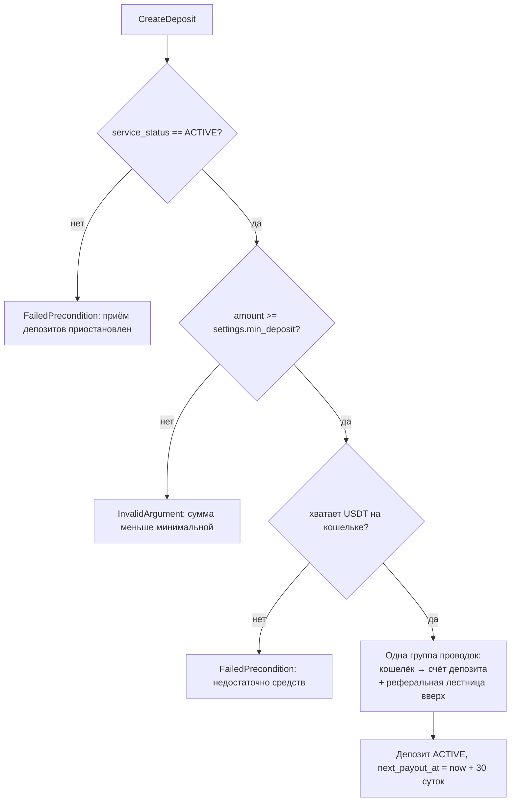

# Сервис: StakingService (Client)

> Общие модели (`biconom.types.Staking.*`) описаны в
> [`biconom/types/staking.md`](../../types/staking.md). Здесь — только клиентский сервис.

## 1. Описание

**`StakingService`** — клиентская поверхность стейкинга USDT: партнёр создаёт
депозиты, управляет реинвестом, смотрит свой журнал и прогресс по карьерной лестнице.

**Партнёр.** Дистрибьютор берётся из **контекста авторизации**, не из запроса.
Партнёр видит и меняет только собственные депозиты; чужой `deposit_id` даёт
`NotFound`.

Все методы требуют Session-токен обычного пользователя.

## 2. Методы

| RPC | Назначение |
|---|---|
| `GetState` | **Всё состояние одним запросом**: настройки, сводка, депозиты, ранг, бонусы |
| `GetConfig` | Статичная экономика: таблица рангов, сетка тиров, циклы. Забирается один раз и кэшируется |
| `GetDeposit` | Карточка одного своего депозита |
| `CreateDeposit` | Создать депозит |
| `SetAutoReinvestProfit` | Включить / подать заявку на отключение реинвеста прибыли |
| `SetReinvestDeposit` | Переоткрывать ли тело новым депозитом при закрытии |
| `ListEvents` | Весь свой журнал стейкинга, курсорная пагинация |
| `ListDepositEvents` | Журнал конкретного своего депозита |
| `GetRankProgress` | Детальный разбор ранга с разбивкой по веткам (`legs`) |

## 3. Создание депозита

**Дедупликации нет, и она не планируется.** Каждый вызов `CreateDeposit` создаёт новый
депозит: два депозита подряд — законный сценарий, а не ошибка, и сервер не может
отличить его от повторной отправки одного и того же намерения. Ограничения на число
активных депозитов тоже нет.

Отсюда требование к клиенту: **кнопку создания блокировать до получения ответа**.
Иначе двойное нажатие спишет с кошелька дважды и дважды раздаст реферальную
лестницу — отменить это нельзя.

**Флаги реинвеста опциональны.** Если клиент не передал `reinvest_profit` или
`reinvest_deposit`, применяются значения по умолчанию из
`Config.settings.default_reinvest_profit` / `default_reinvest_deposit`. Это позволяет
фронту не спрашивать партнёра о настройках при быстром создании депозита.

**Ограничений на количество активных депозитов нет.** Единственное ограничение —
минимальная сумма, и она действует **только при создании**: реинвест прибыли
добавляет в тело любую начисленную сумму, даже меньше минимума.

**Отменить созданный депозит нельзя** — реферальные бонусы уже разошлись по аплайну.

## 3.1. `GetState` — состояние одним запросом

Главный метод экрана. Возвращает `Staking.State`:

| Блок | Что |
|---|---|
| `settings` | Минимум входа, дефолты реинвеста, статус приёма — по ним экран решает, показывать ли кнопку покупки и как предзаполнить форму |
| `summary` | Агрегаты по всем депозитам |
| `deposits` | Активные всегда; закрытые — только если запрошен флаг `include_closed_deposits` |
| `rank` | Прогресс по лестнице, **без** `legs` |
| `obligations` | Бонусы за ранги, включая невыплаченные. Целиком: максимум 9 записей за жизнь аккаунта |
| `to_next_tier`, `next_tier_rate_percent` | Сколько до следующего тира |
| `total_referral_received`, `total_achievement_bonus_received` | Итоги по чужим депозитам и по рангам |

**Флаг `include_closed_deposits` влияет только на `deposits`.** Блок `summary` всегда
считается по всем депозитам, включая закрытые: партнёр смотрит только активные и
одновременно видит итоги за всё время.

### Что намеренно НЕ в состоянии

**Таблица рангов и сетка тиров** — они статичны, меняются только пересборкой сервиса.
Гонять 12 рангов и 6 тиров в каждом опросе состояния расточительно; клиент забирает их
один раз через `GetConfig` и кэширует. Разделение проведено **по частоте изменения**,
а не по теме: изменяемые `settings` при этом приходят в каждом `GetState`.

**`rank.legs`** — разбивка по веткам первой линии не ограничена по размеру: у лидера
их могут быть сотни. В `GetState` поле всегда пустое, детальный разбор — отдельным
`GetRankProgress`.

| Поле `summary` | Что показывает |
|---|---|
| `active_count`, `active_total` | Сколько депозитов активно и на какую сумму. `active_total` — это же база выбора тира |
| `current_rate` | Текущая ставка за цикл, коэффициентом (`"0.07"`) |
| `total_count`, `invested_total` | Сколько депозитов было за всё время и сколько **реальных денег** внесено |
| `personal_volume` | Личный вклад для рангов — с учётом роста тела от реинвеста |
| `total_income_paid`, `total_reinvested` | Начислено дохода и сколько из него ушло обратно в тела |

Разница `personal_volume − invested_total` показывает, сколько объёма создано
реинвестом, а не новыми деньгами.

Тот же `DepositsSummary` вложен в `GetOverview` — одна модель, один источник правды,
никакого дублирования полей между двумя RPC.

## 4. Управление реинвестом

### 4.1. Реинвест прибыли — `SetAutoReinvestProfit`

- `enabled = true` — действует **немедленно**: ближайшая выплата уйдёт в тело.
- `enabled = false` — **заявка на отключение**: ближайшая выплата ещё уйдёт в тело,
  а со следующей доход пойдёт на кошелёк.
- Заявку можно **отозвать** повторным вызовом с `true` до наступления выплаты.

В ответе видно оба поля: `reinvest_profit_requested` — что хочет партнёр,
`reinvest_profit_applied` — по чему отработает ближайшая выплата. Расхождение и
означает поданную заявку.

### 4.2. Реинвест всего депозита — `SetReinvestDeposit`

Действует в момент закрытия: тело целиком откроет новый депозит с новыми 12 циклами.
Менять можно в любой момент до закрытия, отложенного применения нет — читается
значение на момент закрытия.

## 5. Журнал

`ListEvents` — вся история партнёра, `ListDepositEvents` — история конкретного
депозита.

Пагинация — как во всех списках проекта: `optional uint64 cursor` (это `Event.id`
последнего полученного события, exclusive) плюс `optional biconom.types.Sort`
(направление и лимит). По умолчанию `BACKWARD`, 50 записей. **Конец списка** —
получено записей меньше, чем `sort.limit`.

**Реферальные бонусы в журнал стейкинга не попадают.** Они видны в общей истории
транзакций кошелька (`TransactionService.History`), как любые другие бонусы.

## 6. Прогресс по рангу

`GetRankProgress` возвращает не только цифры, но и **разбор по веткам** (`legs`):
для каждой ветки первой линии видно её объём, лимит на ветку для проверяемого ранга,
сколько фактически засчитано и сработал ли лимит. Это прямой ответ на вопрос
«почему я не взял ранг».

`team_volume` считается под **следующий** ранг, потому что лимит на ветку зависит от
проверяемого ранга. На максимальном ранге (`is_max == true`) блоки `next` и
`team_volume` отсутствуют.

Рядом отдаётся `team_volume_uncapped` — **полный оборот команды без лимитов**.
Разница между ним и `team_volume` — это ровно то, что срезал лимит на ветку, и прямой
ответ на «у меня в команде $60 000, почему не дали ранг, где нужно $50 000».
`legs_count` — число веток первой линии.

## 7. Бонусы за достижение

Приходят в `GetState.obligations` — все бонусы за ранги, включая **ещё не выплаченные**
(`released == false`): партнёр видит, что бонус начислен и ожидает выплаты. Отдельного
метода нет и пагинации нет — максимум 9 записей за всю жизнь аккаунта (бонусы есть у
рангов 4…12).

Уведомление о достижении ранга приходит сразу, но **сумму бонуса не упоминает**, если
он ещё не выплачен — чтобы push не обещал денег, которых пока нет. Когда админ
реализует обязательство, деньги приходят обычным уведомлением о бонусе.

## 8. Уведомления

| Событие | Топик |
|---|---|
| Начислен доход по депозиту | `bonus_received` (`BonusKind::StakingIncome`) |
| Достигнут новый ранг | `staking_rank_achieved` |
| Бонус за ранг выплачен вручную | `bonus_received` (`BonusKind::StakingRankPremium`) |

Создание депозита, реинвест и закрытие уведомлений не порождают.

## 9. Коды ошибок

| Ситуация | Код |
|---|---|
| Приём депозитов приостановлен (`PAUSED` / `STOPPED`) | `FailedPrecondition` |
| Сумма меньше `settings.min_deposit` | `InvalidArgument` |
| Недостаточно USDT на кошельке | `FailedPrecondition` |
| Депозит не найден или принадлежит другому партнёру | `NotFound` |
| Изменение реинвеста у закрытого депозита | `FailedPrecondition` |
