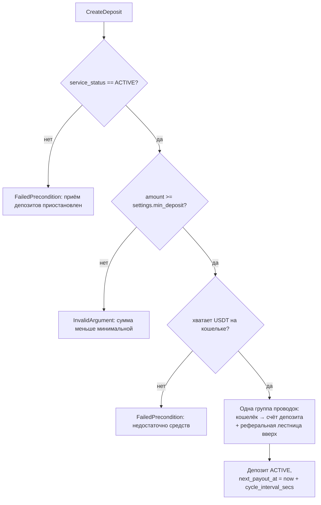
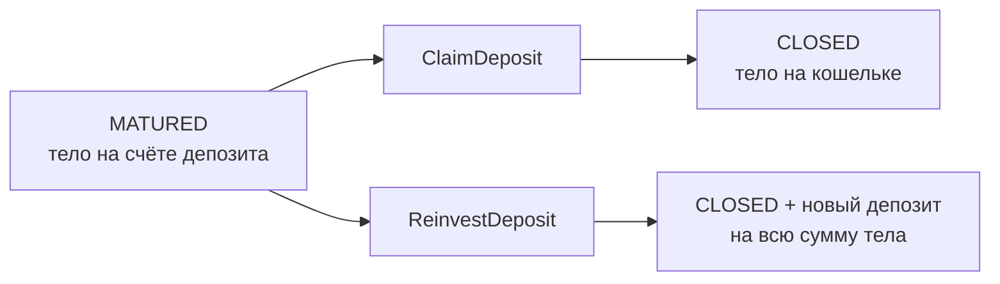

# Сервис: StakingService (Client)

> Общие модели (`biconom.types.Staking.*`) описаны в
> [`biconom/types/staking.md`](../../types/staking.md). Здесь — только клиентский сервис.

## 1. Описание

**`StakingService`** — клиентская поверхность стейкинга USDT: партнёр создаёт
депозиты, управляет реинвестом, смотрит свой журнал и прогресс по карьерной лестнице.

**Партнёр.** Дистрибьютор берётся из **контекста авторизации**, не из запроса.
Партнёр видит и меняет только собственные депозиты; чужой `deposit_id` даёт
`NotFound`.

Все методы требуют Session-токен обычного пользователя.

## 2. Методы

| RPC | Назначение |
|---|---|
| `GetState` | **Всё состояние одним запросом**: настройки, сводка, депозиты, ранг, бонусы |
| `GetConfig` | Статичная экономика: таблица рангов, сетка тиров, циклы. Забирается один раз и кэшируется |
| `GetDeposit` | Карточка одного своего депозита |
| `CreateDeposit` | Создать депозит |
| `ClaimDeposit` | Забрать тело созревшего депозита на кошелёк |
| `ReinvestDeposit` | Переоткрыть тело созревшего депозита новым депозитом |
| `SetAutoReinvestProfit` | Включить / подать заявку на отключение реинвеста прибыли |
| `ListEvents` | Весь свой журнал стейкинга, курсорная пагинация |
| `ListDepositEvents` | Журнал конкретного своего депозита |
| `ListTransactions` | **Финансовые** транзакции по стейкингу — ответ `TransactionService.History` |
| `ListDepositTransactions` | То же по одному своему депозиту |
| `GetRankProgress` | Детальный разбор ранга с разбивкой по веткам (`legs`) |

## 3. Создание депозита

**Дедупликации нет, и она не планируется.** Каждый вызов `CreateDeposit` создаёт новый
депозит: два депозита подряд — законный сценарий, а не ошибка, и сервер не может
отличить его от повторной отправки одного и того же намерения. Ограничения на число
активных депозитов тоже нет.

Отсюда требование к клиенту: **кнопку создания блокировать до получения ответа**.
Иначе двойное нажатие спишет с кошелька дважды и дважды раздаст реферальную
лестницу — отменить это нельзя.

**Флаги реинвеста в запросе не передаются.** `CreateDepositRequest` содержит только
`amount`. Реинвест прибыли для нового депозита берётся из
`Config.settings.default_reinvest_profit` — клиент не может переопределить серверную
настройку, иначе карточка депозита расходилась бы с тем, что показано в настройках
модуля. Переключатель в форме покупки не нужен; менять флаг — после создания, через
`SetAutoReinvestProfit`.

**Ограничений на количество активных депозитов нет.** Единственное ограничение —
минимальная сумма, и она действует **только при создании**: реинвест прибыли
добавляет в тело любую начисленную сумму, даже меньше минимума, а `ReinvestDeposit`
минимум не проверяет вовсе.

**Отменить созданный депозит нельзя** — реферальные бонусы уже разошлись по аплайну.

## 3.1. `GetState` — состояние одним запросом

Главный метод экрана. Возвращает `Staking.State`:

| Блок | Что |
|---|---|
| `settings` | Минимум входа, дефолты реинвеста, статус приёма — по ним экран решает, показывать ли кнопку покупки и как предзаполнить форму |
| `summary` | Агрегаты по всем депозитам |
| `deposits` | Активные и созревшие всегда; закрытые — только если запрошен флаг `include_closed_deposits` |
| `rank` | Прогресс по лестнице, **без** `legs` |
| `obligations` | Бонусы за ранги, включая невыплаченные. Целиком: максимум 9 записей за жизнь аккаунта |
| `to_next_tier`, `next_tier_rate` | Сколько до следующего тира и по какой ставке |
| `total_referral_received`, `total_achievement_bonus_received` | Итоги по чужим депозитам и по рангам |

**Флаг `include_closed_deposits` влияет только на `deposits`.** Блок `summary` всегда
считается по всем депозитам, включая закрытые: партнёр смотрит только активные и
одновременно видит итоги за всё время. Созревшие приходят **всегда**, независимо от
флага: они ждут действия партнёра, прятать их нельзя.

### Что намеренно НЕ в состоянии

**Таблица рангов и сетка тиров** — они статичны, меняются только пересборкой сервиса.
Гонять 12 рангов и 6 тиров в каждом опросе состояния расточительно; клиент забирает их
один раз через `GetConfig` и кэширует. Разделение проведено **по частоте изменения**,
а не по теме: изменяемые `settings` при этом приходят в каждом `GetState`.

**`rank.legs`** — разбивка по веткам первой линии не ограничена по размеру: у лидера
их могут быть сотни. В `GetState` поле всегда пустое, детальный разбор — отдельным
`GetRankProgress`.

| Поле `summary` | Что показывает |
|---|---|
| `active_count`, `active_total` | Сколько депозитов активно и на какую сумму. `active_total` — это же база выбора тира. Созревшие сюда **не** входят |
| `matured_count`, `matured_total` | Сколько депозитов созрело и на какую сумму — столько партнёр может забрать или реинвестировать прямо сейчас |
| `current_rate` | Текущая ставка за цикл, коэффициентом (`"0.07"`) |
| `total_count`, `invested_total` | Сколько депозитов было за всё время и сколько **реальных денег** внесено |
| `personal_volume` | Личный вклад для рангов — с учётом роста тела от реинвеста |
| `total_income_paid`, `total_reinvested` | Начислено дохода и сколько из него ушло обратно в тела |

Разница `personal_volume − invested_total` показывает, сколько объёма создано
реинвестом, а не новыми деньгами.

## 3.2. Созревший депозит — забрать или реинвестировать

После последней выплаты депозит переходит в `MATURED`: начисления прекращены, но тело
**остаётся на счёте депозита**. Автоматического возврата нет — решает партнёр, и срока
на решение тоже нет.

| | `ClaimDeposit` | `ReinvestDeposit` |
|---|---|---|
| Возвращает | закрытый **исходный** депозит | **новый** депозит |
| Статус сервиса | работает при **любом**, включая `STOPPED` | запрещён при `PAUSED` и `STOPPED` |
| Минимум входа | — | не проверяется |
| Реферальная лестница | нет | раздаётся от полной суммы тела |

Отсюда два требования к экрану:

1. Кнопку «забрать» по `service_status` **не прятать** — забрать своё тело можно
   всегда. Кнопку «реинвестировать» прятать при `PAUSED` и `STOPPED`.
2. Показать `summary.matured_total` на главном экране: партнёр должен видеть, что
   деньги ждут действия, не заходя в каждый депозит.

Частичный вывод не поддерживается: забирается или реинвестируется всё тело. Повторный
реинвест того же тела невозможен.

## 4. Управление реинвестом

### 4.1. Реинвест прибыли — `SetAutoReinvestProfit`

- `enabled = true` — действует **немедленно**: ближайшая выплата уйдёт в тело.
- `enabled = false` — **заявка на отключение**: ближайшая выплата ещё уйдёт в тело,
  а со следующей доход пойдёт на кошелёк.
- Заявку можно **отозвать** повторным вызовом с `true` до наступления выплаты.

В ответе видно оба поля: `reinvest_profit_requested` — что хочет партнёр,
`reinvest_profit_applied` — по чему отработает ближайшая выплата. Расхождение и
означает поданную заявку.

### 4.2. Реинвест тела — `ReinvestDeposit`

Не флаг, а **разовая команда** по созревшему депозиту (см. 3.2). Флага
`reinvest_deposit` больше нет: заранее заданного поведения при завершении не
существует.

Новый депозит наследует **выбор партнёра** по реинвесту прибыли с прежнего депозита,
а не дефолт настроек: если партнёр отключил реинвест прибыли, переоткрытое тело тоже
будет платить на кошелёк.

## 5. Журнал

`ListEvents` — вся история партнёра, `ListDepositEvents` — история конкретного
депозита.

Пагинация — как во всех списках проекта: `optional uint64 cursor` (это `Event.id`
последнего полученного события, exclusive) плюс `optional biconom.types.Sort`
(направление и лимит). По умолчанию `BACKWARD`, 50 записей. **Конец списка** —
получено записей меньше, чем `sort.limit`.

**Реферальные доли приходят сюда же** — событием `ReferralReceived`, в журнал
получателя. Так экран стейкинга показывает и свои депозиты, и заработок со структуры
одной лентой, без обращения к истории кошелька.

У этих событий `deposit_id == 0` (депозит-источник чужой, он внутри payload), поэтому в
`ListDepositEvents` они не попадают — только в `ListEvents`.

То же начисление дублируется и в истории транзакций кошелька карточкой
`StakingReferralDetails` — с теми же полями. Что использовать, решает экран.

## 5.1. Журнал или транзакции — что когда

Две разные ленты, и путать их не надо:

| | `ListEvents` | `ListTransactions` |
|---|---|---|
| Что показывает | **бизнес-события** модуля | **движение денег** |
| Есть безденежные записи | да: созревание, смена флага реинвеста, достижение ранга | нет |
| Формат ответа | `Staking.Event` — модели стейкинга | `HistoryResponse` — **тот же**, что у истории кошелька |
| Вёрстка | своя | переиспользуется с экрана кошелька |
| Единица пагинации | событие | группа проводок |

`ListTransactions` возвращает **тот же самый** тип, что `TransactionService.History`:
`items` плюс справочники `accounts` / `distributors` / `slots`. Это не копия и не похожая
структура — тот же контракт, поэтому карточки рисуются существующим кодом экрана кошелька,
без изменений. Отличие ровно одно: список уже отфильтрован модулем.

Попадает всё, что стейкинг сделал с деньгами партнёра: вложение, доход за цикл, реинвест
прибыли, возврат тела, доли реферальной лестницы, бонусы за ранги. Описание карточек —
разделы 16–21 в [`types/transaction.md`](../../types/transaction.md).

`ListDepositTransactions` сужает выборку до одного своего депозита. Доли реферальной
лестницы туда **не попадают**: они приходят с чужих депозитов и к своему не относятся.

> Лимит считается в **группах проводок**, а не в строках: одна операция стейкинга — одна
> группа, но внутри неё может быть несколько строк. Например, выплата с включённым
> реинвестом прибыли даёт две: начисление дохода и его уход в тело.

---

## 6. Прогресс по рангу

`GetRankProgress` возвращает не только цифры, но и **разбор по веткам** (`legs`):
для каждой ветки первой линии видно её объём, лимит на ветку для проверяемого ранга,
сколько фактически засчитано и сработал ли лимит. Это прямой ответ на вопрос
«почему я не взял ранг».

`team_volume` считается под **следующий** ранг, потому что лимит на ветку зависит от
проверяемого ранга. На максимальном ранге (`is_max == true`) блоки `next` и
`team_volume` отсутствуют.

Рядом отдаётся `team_volume_uncapped` — **полный оборот команды без лимитов**.
Разница между ним и `team_volume` — это ровно то, что срезал лимит на ветку, и прямой
ответ на «у меня в команде $60 000, почему не дали ранг, где нужно $50 000».

Вместе с `legs` приходят справочники `distributors` и `accounts`: карточки лидеров
веток с логином, аватаром и контактами — отдельный запрос на каждую ветку не нужен.
Сопоставление — по id: `Leg.distributor_id → Distributor.id → Distributor.account_id
→ Account.id`. В `distributors` есть и сам партнёр — под карточку в шапке экрана.

Сколько партнёров структуры реально участвуют в стейкинге, показывают
`stakers_partners` (личники) и `stakers_team` (вся команда). По каждой ветке тот
же разрез: `Leg.personal_activated` (активировался ли сам лидер),
`Leg.stakers_partners` и `Leg.stakers_team`. Считаются партнёры, а не депозиты, и
счёт пожизненный: закрытый депозит партнёра из него не убирает. Поля уровня
`RankProgress` приходят и в `GetState`.
`legs_count` — число веток первой линии.

## 7. Бонусы за достижение

Приходят в `GetState.obligations` — все бонусы за ранги, включая **ещё не выплаченные**
(`released == false`): партнёр видит, что бонус начислен и ожидает выплаты. Отдельного
метода нет и пагинации нет — максимум 9 записей за всю жизнь аккаунта (бонусы есть у
рангов 4…12).

Уведомление о достижении ранга приходит сразу, но **сумму бонуса не упоминает**, если
он ещё не выплачен — чтобы push не обещал денег, которых пока нет. Когда админ
реализует обязательство, деньги приходят обычным уведомлением о бонусе.

## 8. Уведомления

| Событие | Топик |
|---|---|
| Начислен доход по депозиту | `bonus_received` (`BonusKind::StakingIncome`) |
| Получена доля реферальной лестницы | `bonus_received` (`BonusKind::StakingReferral`) |
| Достигнут новый ранг | `staking_rank_achieved` |
| **Депозит созрел и ждёт решения** | `staking_deposit_matured` — только Telegram |
| Бонус за ранг выплачен вручную | `bonus_received` (`BonusKind::StakingRankPremium`) |

Создание депозита, реинвест прибыли, забор тела и закрытие уведомлений не порождают —
они видны в журнале.

Уведомление о созревании обязательно: тело больше не возвращается само, и без
напоминания партнёр может месяцами не знать, что деньги лежат без движения.

## 9. Коды ошибок

| Ситуация | Код |
|---|---|
| Приём депозитов приостановлен (`PAUSED` / `STOPPED`) | `FailedPrecondition` |
| Сумма меньше `settings.min_deposit` | `InvalidArgument` |
| Недостаточно USDT на кошельке | `FailedPrecondition` |
| Депозит не найден или принадлежит другому партнёру | `NotFound` |
| Изменение реинвеста прибыли у закрытого депозита | `FailedPrecondition` |
| `ClaimDeposit` / `ReinvestDeposit` на депозите не в статусе `MATURED` | `FailedPrecondition`, `STAKING_DEPOSIT_NOT_MATURED` |
| Тело этого депозита уже переоткрыто | `FailedPrecondition`, `STAKING_DEPOSIT_ALREADY_REINVESTED` |
| `ReinvestDeposit` при `PAUSED` / `STOPPED` | `FailedPrecondition`, `STAKING_SERVICE_NOT_ACTIVE` |
