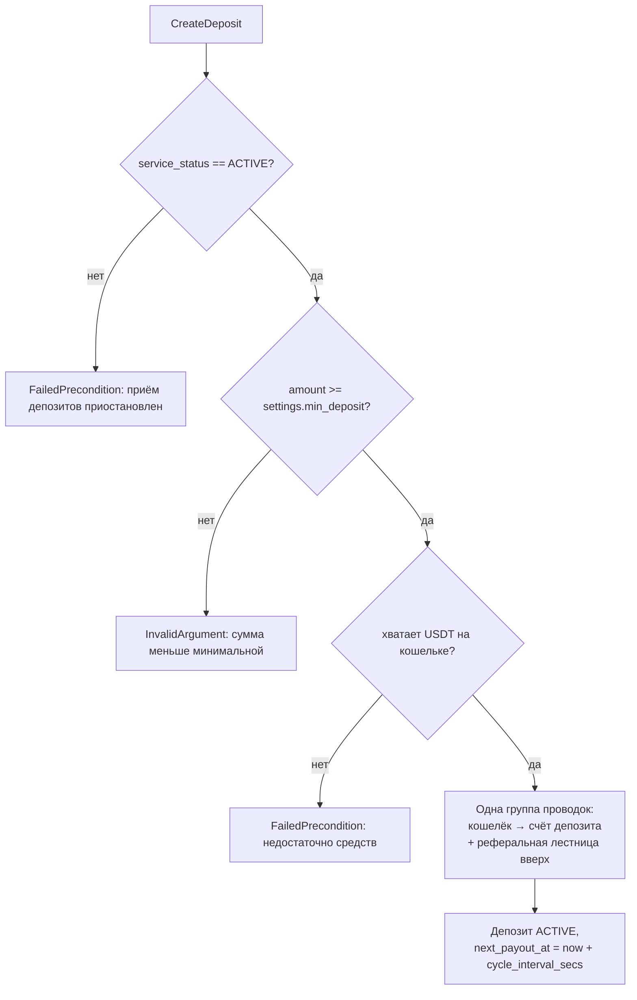
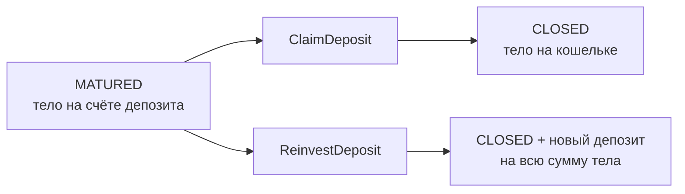

# Сервис: StakingService (Client)

> Общие модели (`biconom.types.Staking.*`) описаны в
> [`biconom/types/staking.md`](../../types/staking.md). Здесь — только клиентский сервис.

## 1. Описание

**`StakingService`** — клиентская поверхность стейкинга USDT: партнёр создаёт
депозиты, управляет реинвестом, смотрит свой журнал и прогресс по карьерной лестнице.

**Партнёр.** Дистрибьютор берётся из **контекста авторизации**, не из запроса.
Партнёр видит и меняет только собственные депозиты; чужой `deposit_id` даёт
`NotFound`.

Все методы требуют Session-токен обычного пользователя (право `STAKING_USE`). **Прав админа
не нужно ни для одного поля ответа**: все свои денежные цифры — сводка по депозитам
(`State.summary`), экстра-прибыль, реферальные, бонусы за ранги и итог «всего заработано»
(`State.total_earned`) — партнёр получает в `GetState`.

> В моделях есть два похожих сообщения. `Staking.DepositsSummary` — цифры **одного**
> партнёра, приходит здесь как `State.summary`. `Staking.Summary` — итоги **всего модуля**,
> его отдаёт только админский `StakingAdminService.GetSummary`, и клиентскому приложению
> оно не нужно. Одноимённые поля (`total_income_paid`, `total_extra_paid`, `matured_total`)
> в `State.summary` — про самого партнёра.

## 2. Методы

| RPC | Назначение |
|---|---|
| `GetState` | **Всё состояние одним запросом**: настройки, сводка, депозиты, ранг, бонусы |
| `GetConfig` | Статичная экономика: таблица рангов, сетка тиров, циклы. Забирается один раз и кэшируется |
| `GetDeposit` | Карточка одного своего депозита |
| `CreateDeposit` | Создать депозит |
| `ClaimDeposit` | Забрать тело созревшего депозита на кошелёк |
| `ReinvestDeposit` | Переоткрыть тело созревшего депозита новым депозитом |
| `SetAutoReinvestProfit` | Включить / подать заявку на отключение реинвеста прибыли |
| `ListEvents` | Весь свой журнал стейкинга, курсорная пагинация |
| `ListDepositEvents` | Журнал конкретного своего депозита |
| `ListTransactions` | **Финансовые** транзакции по стейкингу — ответ `TransactionService.History` |
| `ListDepositTransactions` | То же по одному своему депозиту |
| `GetRankProgress` | Детальный разбор ранга с разбивкой по веткам (`legs`). По умолчанию свой, по `Distributor.Id` — партнёра из своей команды |

## 3. Создание депозита


```mermaid
flowchart TD
    A[CreateDeposit] --> B{service_status == ACTIVE?}
    B -- нет --> E1[FailedPrecondition: приём депозитов приостановлен]
    B -- да --> C{amount >= settings.min_deposit?}
    C -- нет --> E2[InvalidArgument: сумма меньше минимальной]
    C -- да --> D{хватает USDT на кошельке?}
    D -- нет --> E3[FailedPrecondition: недостаточно средств]
    D -- да --> F[Одна группа проводок:<br/>кошелёк → счёт депозита<br/>+ реферальная лестница вверх]
    F --> G[Депозит ACTIVE,<br/>next_payout_at = now + cycle_interval_secs]
```

**Дедупликации нет, и она не планируется.** Каждый вызов `CreateDeposit` создаёт новый
депозит: два депозита подряд — законный сценарий, а не ошибка, и сервер не может
отличить его от повторной отправки одного и того же намерения. Ограничения на число
активных депозитов тоже нет.

Отсюда требование к клиенту: **кнопку создания блокировать до получения ответа**.
Иначе двойное нажатие спишет с кошелька дважды и дважды раздаст реферальную
лестницу — отменить это нельзя.

**Флаги реинвеста в запросе не передаются.** `CreateDepositRequest` содержит только
`amount`. Реинвест прибыли для нового депозита берётся из
`Config.settings.default_reinvest_profit` — клиент не может переопределить серверную
настройку, иначе карточка депозита расходилась бы с тем, что показано в настройках
модуля. Переключатель в форме покупки не нужен; менять флаг — после создания, через
`SetAutoReinvestProfit`.

**Ограничений на количество активных депозитов нет.** Единственное ограничение —
минимальная сумма, и она действует **только при создании**: реинвест прибыли
добавляет в тело любую начисленную сумму, даже меньше минимума, а `ReinvestDeposit`
минимум не проверяет вовсе.

**Отменить созданный депозит нельзя** — реферальные бонусы уже разошлись по аплайну.

## 3.1. `GetState` — состояние одним запросом

Главный метод экрана. Возвращает `Staking.State`:

| Блок | Что |
|---|---|
| `settings` | Минимум входа, дефолты реинвеста, статус приёма — по ним экран решает, показывать ли кнопку покупки и как предзаполнить форму |
| `summary` | Сводка по всем **своим** депозитам (`DepositsSummary`) |
| `deposits` | Активные и созревшие всегда; закрытые — только если запрошен флаг `include_closed_deposits` |
| `rank` | Прогресс по лестнице, **без** `legs` |
| `obligations` | Бонусы за ранги, включая невыплаченные. Целиком: максимум 9 записей за жизнь аккаунта |
| `to_next_tier`, `next_tier_rate` | Сколько `summary.active_total` не хватает до следующей ступени тира и её ставка. Отсутствуют **только** на максимальном тире; у партнёра без депозитов или с суммой ниже первой ступени это расстояние до первой ступени |
| `extra_promo` | Акция экстра-прибыли, действующая **сейчас** (`optional`), — для нового депозита. Нет акции — поля нет. См. 3.3 |
| `total_referral_received` | Получено по реферальной лестнице с **чужих** депозитов за всё время (включая токены упущенной выгоды) |
| `total_achievement_bonus_received` | **Выплаченные** бонусы за ранги. Бонус, который ещё ждёт выплаты, сюда не входит — он виден в `obligations` с `released == false` |
| `total_earned` | **Всего заработано в стейкинге** — готовое число для плитки «Заработано». См. 3.1.1 |

**Флаг `include_closed_deposits` влияет только на `deposits`.** Блок `summary` всегда
считается по всем депозитам, включая закрытые: партнёр смотрит только активные и
одновременно видит итоги за всё время. Созревшие приходят **всегда**, независимо от
флага: они ждут действия партнёра, прятать их нельзя.

### Что намеренно НЕ в состоянии

**Таблица рангов и сетка тиров** — они статичны, меняются только пересборкой сервиса.
Гонять 12 рангов и 6 тиров в каждом опросе состояния расточительно; клиент забирает их
один раз через `GetConfig` и кэширует. Разделение проведено **по частоте изменения**,
а не по теме: изменяемые `settings` при этом приходят в каждом `GetState`.

**`rank.legs`** — разбивка по веткам первой линии не ограничена по размеру: у лидера
их могут быть сотни. В `GetState` поле всегда пустое, детальный разбор — отдельным
`GetRankProgress`.

| Поле `summary` | Что показывает |
|---|---|
| `active_count`, `active_total` | Сколько депозитов активно и на какую сумму. `active_total` — это же база выбора тира. Созревшие сюда **не** входят |
| `matured_count`, `matured_total` | Сколько депозитов созрело и на какую сумму — столько партнёр может забрать или реинвестировать прямо сейчас |
| `current_rate` | Текущая ставка за цикл, коэффициентом (`"0.07"`). Всегда непустая; `"0.00"` = начислять нечего. Блок ставки прятать по `active_count == 0`, а не по этому полю |
| `total_count`, `invested_total` | Сколько депозитов было за всё время и сумма их **начальных сумм** (`initial_amount`). Это **не** «сколько своих денег внесено»: тело, переложенное `ReinvestDeposit`, входит повторно, подарок компании — наравне с покупкой |
| `personal_volume` | Личный вклад для рангов — квалификационный объём, **не деньги**. Депозиты вне маркетинга в него не входят |
| `total_income_paid` | Начислено дохода **по ставке тира** за всё время, по всем депозитам, включая закрытые. Экстра, реферальные и бонусы за ранги сюда **не** входят |
| `total_extra_paid` | Начислено экстра-прибыли за всё время. В `total_income_paid` **не** входит |
| `total_reinvested` | Сколько из `total_income_paid + total_extra_paid` ушло обратно в тела. Это **часть** заработанного, а не добавка к нему: прибавлять нельзя |

Пока у партнёра нет депозитов вне маркетинга, `personal_volume = invested_total +
total_reinvested`. Подробный разбор каждого поля — в
[`types/staking.md`, раздел 4.4](../../types/staking.md).

### 3.1.1. «Заработано» — `State.total_earned`

**Плитка «Заработано» = `State.total_earned`, складывать ничего не нужно.** Сервер считает:

```
total_earned = summary.total_income_paid          — доход своих депозитов по тиру
             + summary.total_extra_paid           — экстра-прибыль своих депозитов
             + total_referral_received            — реферальные с чужих депозитов
             + total_achievement_bonus_received   — ВЫПЛАЧЕННЫЕ бонусы за ранги
```

Равенство точное. Число считается по всем депозитам, включая закрытые, не зависит от
`include_closed_deposits` и только растёт.

Чего в числе **нет** и что прибавлять нельзя:

- `summary.total_reinvested` — это уже учтённый доход, ушедший в тела; прибавить его значит
  посчитать дважды;
- `Deposit.body`, `summary.active_total`, `summary.matured_total` — это деньги в депозитах, а
  не заработок (и в них уже сидит реинвестированная прибыль);
- бонусы за ранги, которые ещё ждут выплаты;
- WINZU по промо «токен за депозит» — другая валюта;
- подаренный компанией депозит, возврат своего тела (`ClaimDeposit`), реинвест тела
  (`ReinvestDeposit`) — это не доход.

### 3.1.2. Какое поле для какого элемента экрана

| Элемент | Поле |
|---|---|
| Плитка «Текущий депозит» | `summary.active_total` — сумма тел работающих депозитов. Созревшие, ждущие решения, — отдельно в `summary.matured_total`; все деньги в депозитах = сумма этих двух полей |
| Плитка «Заработано» | `total_earned` |
| Плитка «Текущая доходность» | `summary.current_rate` (коэффициент, `"0.07"` = 7% за цикл). До следующей ступени — `to_next_tier`, её ставка — `next_tier_rate` |
| Плитка ранга | `rank.current_rank`; процент лестницы и требования — строка `GetConfig → ranks[]` с этим номером; следующий ранг — `rank.next` |
| Карточка депозита: следующая выплата | `Deposit.next_payout_at` (есть только у `ACTIVE`) |
| Карточка депозита: ожидаемый доход | `Deposit.body × summary.current_rate` |
| Карточка депозита: экстра-прибыль | `Deposit.body × Deposit.extra_rate`; при `"0.00"` строку скрыть |
| Карточка депозита: заработано по депозиту | `Deposit.total_income_paid + Deposit.total_extra_paid` |
| Диалог нового депозита: «Extra profit X %» | `extra_promo.rate`; нет `extra_promo` — строку не показывать |
| Диалог нового депозита: минимальная сумма | `settings.min_deposit` |
| Блок «ждёт решения» | `summary.matured_count`, `summary.matured_total` |

Произведения `body × ставка` считает клиент — прогнозных полей сервер не отдаёт; сервер при
выплате округляет вниз до минимальной единицы валюты. Ставка тира выбирается в момент
выплаты: если до неё сумма активных депозитов изменится, изменится и ставка.

## 3.2. Созревший депозит — забрать или реинвестировать

После последней выплаты депозит переходит в `MATURED`: начисления прекращены, но тело
**остаётся на счёте депозита**. Автоматического возврата нет — решает партнёр, и срока
на решение тоже нет.


```mermaid
flowchart LR
    A[MATURED<br/>тело на счёте депозита] --> B[ClaimDeposit]
    A --> C[ReinvestDeposit]
    B --> D[CLOSED<br/>тело на кошельке]
    C --> E[CLOSED + новый депозит<br/>на всю сумму тела]
```

| | `ClaimDeposit` | `ReinvestDeposit` |
|---|---|---|
| Возвращает | закрытый **исходный** депозит | **новый** депозит |
| Статус сервиса | работает при **любом**, включая `STOPPED` | запрещён при `PAUSED` и `STOPPED` |
| Минимум входа | — | не проверяется |
| Реферальная лестница | нет | раздаётся от полной суммы тела |

Отсюда два требования к экрану:

1. Кнопку «забрать» по `service_status` **не прятать** — забрать своё тело можно
   всегда. Кнопку «реинвестировать» прятать при `PAUSED` и `STOPPED`.
2. Показать `summary.matured_total` на главном экране: партнёр должен видеть, что
   деньги ждут действия, не заходя в каждый депозит.

Частичный вывод не поддерживается: забирается или реинвестируется всё тело. Повторный
реинвест того же тела невозможен.

## 3.3. Экстра-прибыль

Для части депозитов действует **акция экстра-прибыли** (`Staking.ExtraPromo`): на каждой
выплате цикла депозит, **созданный** в диапазоне акции, получает сверх дохода по тиру
дополнительно `тело × rate`. Правило целиком — в
[`types/staking.md`, раздел 4.5](../../types/staking.md). Важное для экрана:

- Экстра зависит от даты **создания** депозита, а не от даты выплаты.
- Приходит **отдельной проводкой** в той же группе, что и доход цикла.
- При включённом реинвесте прибыли в тело уходят доход и экстра **вместе**.
- Акцию могут завести задним числом: она затронет только **следующие** выплаты, доплаты
  за прошедшие циклы не будет. Новая версия акции меняет будущие выплаты, но не прошлые.

| Что рисовать | Откуда брать |
|---|---|
| Строка «Extra profit X %» в диалоге **нового** депозита | `State.extra_promo.rate` (коэффициент, `"0.05"` → 5%). Нет `extra_promo` — строку не показывать |
| Строка у **открытого** депозита | `Deposit.extra_rate`. `"0.00"` — акции нет либо депозит созрел или закрыт: строку скрыть |
| Ожидаемая экстра ближайшей выплаты | Считает **клиент**: `Deposit.body × Deposit.extra_rate`. Прогнозных полей сервер не отдаёт |
| Сколько экстры уже начислено | `Deposit.total_extra_paid`; по всем депозитам — `summary.total_extra_paid` |

- `Deposit.total_income_paid` экстру **не** включает: это отдельные счётчики. Сколько принёс
  один депозит — `total_income_paid + total_extra_paid`; сколько партнёр заработал всего —
  готовое `State.total_earned` (раздел 3.1.1), его клиент не складывает.
- Диапазон дат акции ограничивает дату **создания** депозита, а не период выплат: депозит,
  созданный в диапазоне, получает экстру на каждой выплате до созревания, пока акция
  действующая, — в том числе после окончания диапазона.
- `Deposit.extra_promo_id` — версия акции, давшая `extra_rate`; `0` — акции нет.
- `Deposit.extra_rate` — ставка **ближайшей** выплаты, а не зафиксированная: админ может
  выпустить новую версию акции, и значение изменится при следующем `GetState` /
  `GetDeposit`. Уже выплаченное не пересчитывается.
- В диалоге нового депозита ставка берётся из `State.extra_promo`, у уже созданного — из
  `Deposit.extra_rate`: у каждого депозита она определяется его **собственной** датой
  создания, а не текущей акцией.
- В `State.extra_promo` поле `created_by_user_id` всегда `0`.

## 4. Управление реинвестом

### 4.1. Реинвест прибыли — `SetAutoReinvestProfit`

- `enabled = true` — действует **немедленно**: ближайшая выплата уйдёт в тело.
- `enabled = false` — **заявка на отключение**: ближайшая выплата ещё уйдёт в тело,
  а со следующей доход пойдёт на кошелёк.
- Заявку можно **отозвать** повторным вызовом с `true` до наступления выплаты.

В ответе видно оба поля: `reinvest_profit_requested` — что хочет партнёр,
`reinvest_profit_applied` — по чему отработает ближайшая выплата. Расхождение и
означает поданную заявку.

### 4.2. Реинвест тела — `ReinvestDeposit`

Не флаг, а **разовая команда** по созревшему депозиту (см. 3.2). Флага
`reinvest_deposit` больше нет: заранее заданного поведения при завершении не
существует.

Новый депозит наследует **выбор партнёра** по реинвесту прибыли с прежнего депозита,
а не дефолт настроек: если партнёр отключил реинвест прибыли, переоткрытое тело тоже
будет платить на кошелёк.

## 5. Журнал

`ListEvents` — вся история партнёра, `ListDepositEvents` — история конкретного
депозита.

Пагинация — как во всех списках проекта: `optional uint64 cursor` (это `Event.id`
последнего полученного события, exclusive) плюс `optional biconom.types.Sort`
(направление и лимит). По умолчанию `BACKWARD`, 50 записей. **Конец списка** —
получено записей меньше, чем `sort.limit`.

**Реферальные доли приходят сюда же** — событием `ReferralReceived`, в журнал
получателя. Так экран стейкинга показывает и свои депозиты, и заработок со структуры
одной лентой, без обращения к истории кошелька.

**Экстра-прибыль** приходит событием `ExtraIncomePaid` (`payout_seq`, `amount`, `rate`,
`body_at_payout`, `extra_promo_id`) — в той же группе проводок, что и `IncomePaid` цикла.
`IncomeReinvested.amount` теперь означает сумму, ушедшую в тело: доход цикла **вместе** с
экстрой, если она была (`IncomePaid.amount` + `ExtraIncomePaid.amount`). Сопоставлять его
только с `IncomePaid.amount` больше нельзя.

У этих событий `deposit_id == 0` (депозит-источник чужой, он внутри payload), поэтому в
`ListDepositEvents` они не попадают — только в `ListEvents`.

То же начисление дублируется и в истории транзакций кошелька карточкой
`StakingReferralDetails` — с теми же полями. Что использовать, решает экран.

## 5.1. Журнал или транзакции — что когда

Две разные ленты, и путать их не надо:

| | `ListEvents` | `ListTransactions` |
|---|---|---|
| Что показывает | **бизнес-события** модуля | **движение денег** |
| Есть безденежные записи | да: созревание, смена флага реинвеста, достижение ранга | нет |
| Формат ответа | `Staking.Event` — модели стейкинга | `HistoryResponse` — **тот же**, что у истории кошелька |
| Вёрстка | своя | переиспользуется с экрана кошелька |
| Единица пагинации | событие | группа проводок |

`ListTransactions` возвращает **тот же самый** тип, что `TransactionService.History`:
`items` плюс справочники `accounts` / `distributors` / `slots`. Это не копия и не похожая
структура — тот же контракт, поэтому карточки рисуются существующим кодом экрана кошелька,
без изменений. Отличие ровно одно: список уже отфильтрован модулем.

Попадает всё, что стейкинг сделал с деньгами партнёра: вложение, доход за цикл, экстра-прибыль,
реинвест прибыли, возврат тела, доли реферальной лестницы, бонусы за ранги. Описание карточек —
разделы 16–22 в [`types/transaction.md`](../../types/transaction.md). Экстра-прибыль — карточка
`staking_extra_income` (раздел 22), отдельная строка рядом с `staking_income` того же цикла.

`ListDepositTransactions` сужает выборку до одного своего депозита. Доли реферальной
лестницы туда **не попадают**: они приходят с чужих депозитов и к своему не относятся.

> Лимит считается в **группах проводок**, а не в строках: одна операция стейкинга — одна
> группа, но внутри неё может быть несколько строк. Например, выплата с включённым
> реинвестом прибыли даёт две: начисление дохода и его уход в тело. Если по депозиту есть
> экстра-прибыль, добавляется ещё `staking_extra_income`, а в тело уходит сумма дохода и
> экстры одной проводкой — итого три строки.

---

## 6. Прогресс по рангу

`GetRankProgress` возвращает не только цифры, но и **разбор по веткам** (`legs`):
для каждой ветки первой линии видно её объём, лимит на ветку для проверяемого ранга,
сколько фактически засчитано и сработал ли лимит. Это прямой ответ на вопрос
«почему я не взял ранг».

`team_volume` считается под **следующий** ранг, потому что лимит на ветку зависит от
проверяемого ранга. На максимальном ранге (`is_max == true`) блоки `next` и
`team_volume` отсутствуют.

Рядом отдаётся `team_volume_uncapped` — **полный оборот команды без лимитов**.
Разница между ним и `team_volume` — это ровно то, что срезал лимит на ветку, и прямой
ответ на «у меня в команде $60 000, почему не дали ранг, где нужно $50 000».

Запрос метода — `Distributor.Id` напрямую, без обёртки: пустой идентификатор
означает свой прогресс, заданный (id или username) — прогресс партнёра из своей
команды. Право проверяется тем же гейтом, что у
`DistributorService.Get` (свой / команда / слотовая иерархия, плюс глобальный
просмотр у поддержки); нет права — `PermissionDenied`, нет такого — `NotFound`.
В ответе поле `distributor_id` называет, ЧЕЙ прогресс показан, а `summary` несёт
его цифры по депозитам — внесено за всё время, активно сейчас, начислено дохода,
созрело и ждёт решения. Для чужой карточки это единственный источник: `GetState`
всегда про себя.

Вместе с `legs` приходят справочники `distributors` и `accounts`: карточки лидеров
веток с логином, аватаром и контактами — отдельный запрос на каждую ветку не нужен.
Сопоставление — по id: `Leg.distributor_id → Distributor.id → Distributor.account_id
→ Account.id`. В `distributors` есть и сам партнёр — под карточку в шапке экрана.

Сколько партнёров структуры реально участвуют в стейкинге, показывают
`stakers_partners` (личники) и `stakers_team` (вся команда). По каждой ветке тот
же разрез: `Leg.personal_activated` (активировался ли сам лидер),
`Leg.stakers_partners` и `Leg.stakers_team`. Считаются партнёры, а не депозиты, и
счёт пожизненный: закрытый депозит партнёра из него не убирает. Поля уровня
`RankProgress` приходят и в `GetState`.
`legs_count` — число веток первой линии.

`Leg.current_rank` — текущий ранг лидера ветки (0 — квалификации нет), под
строку «N Rank · X %» в карточке ветки. Процент и требования ранга берутся из
`GetConfig → ranks[]` по номеру, как для шапки экрана.

## 7. Бонусы за достижение

Приходят в `GetState.obligations` — все бонусы за ранги, включая **ещё не выплаченные**
(`released == false`): партнёр видит, что бонус начислен и ожидает выплаты. Отдельного
метода нет и пагинации нет — максимум 9 записей за всю жизнь аккаунта (бонусы есть у
рангов 4…12).

Уведомление о достижении ранга приходит сразу, но **сумму бонуса не упоминает**, если
он ещё не выплачен — чтобы push не обещал денег, которых пока нет. Когда админ
реализует обязательство, деньги приходят обычным уведомлением о бонусе.

## 8. Уведомления

| Событие | Топик |
|---|---|
| Начислен доход по депозиту | `bonus_received` (`BonusKind::StakingIncome`) |
| Получена доля реферальной лестницы | `bonus_received` (`BonusKind::StakingReferral`) |
| Достигнут новый ранг | `staking_rank_achieved` |
| **Депозит созрел и ждёт решения** | `staking_deposit_matured` — только Telegram |
| Бонус за ранг выплачен вручную | `bonus_received` (`BonusKind::StakingRankPremium`) |

Создание депозита, реинвест прибыли, забор тела и закрытие уведомлений не порождают —
они видны в журнале.

Уведомление о созревании обязательно: тело больше не возвращается само, и без
напоминания партнёр может месяцами не знать, что деньги лежат без движения.

## 9. Коды ошибок

| Ситуация | Код |
|---|---|
| Приём депозитов приостановлен (`PAUSED` / `STOPPED`) | `FailedPrecondition` |
| Сумма меньше `settings.min_deposit` | `InvalidArgument` |
| Недостаточно USDT на кошельке | `FailedPrecondition` |
| Депозит не найден или принадлежит другому партнёру | `NotFound` |
| Изменение реинвеста прибыли у закрытого депозита | `FailedPrecondition` |
| `ClaimDeposit` / `ReinvestDeposit` на депозите не в статусе `MATURED` | `FailedPrecondition`, `STAKING_DEPOSIT_NOT_MATURED` |
| Тело этого депозита уже переоткрыто | `FailedPrecondition`, `STAKING_DEPOSIT_ALREADY_REINVESTED` |
| `ReinvestDeposit` при `PAUSED` / `STOPPED` | `FailedPrecondition`, `STAKING_SERVICE_NOT_ACTIVE` |
