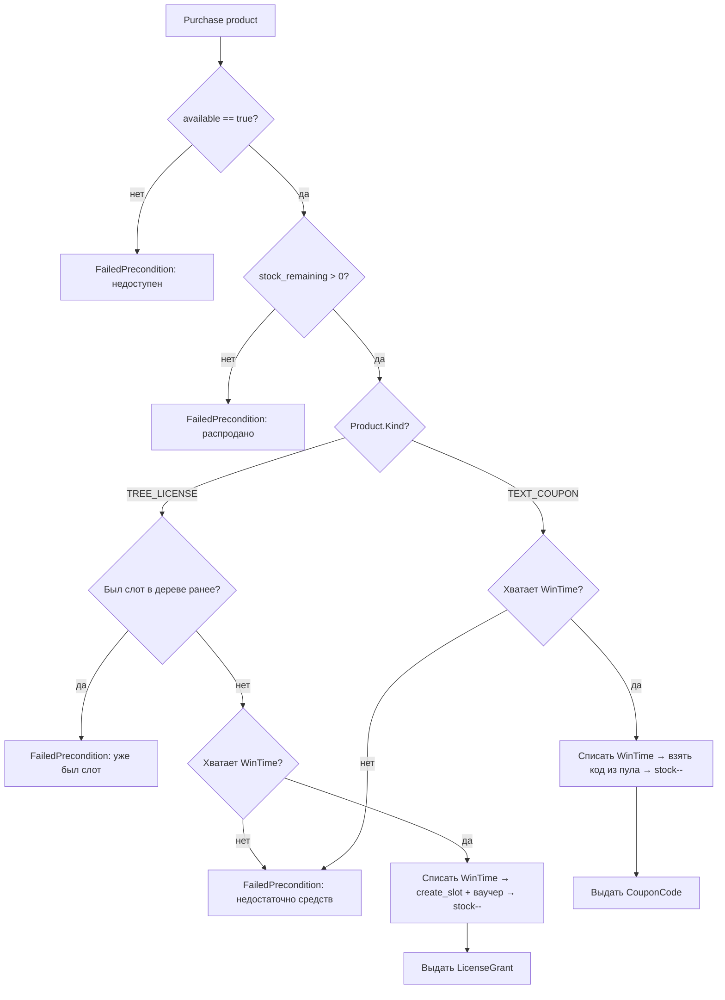

# Сервис: WintimeShopService (Client)

> Общие модели (`biconom.types.WintimeShop.*`) описаны в
> [`biconom/types/wintime_shop.md`](../../types/wintime_shop.md). Здесь — только
> клиентский сервис.

## 1. Описание

**`WintimeShopService`** — клиентская витрина WinTime-магазина: пользователь
просматривает товары и покупает их за WinTime-токены.

**Покупатель.** Списание WinTime идёт с дистрибьютора, под которым авторизован
пользователь — id берётся из **контекста авторизации**, не из запроса. Оплата —
списание валюты `WIN_TIME` (precision 0, целые токены) с ledger покупателя.

**Адресация товара.** `GetProduct` и `Purchase` принимают
`biconom.types.WintimeShop.Product.Id` (`oneof { id | code }`) — товар можно указать
числовым id или строковым slug (`code`).

**Семейства товаров** (`WintimeShop.Product.Kind`) и способ выдачи:
- `TREE_LICENSE` — лицензия-ваучер на слот в дереве (грант в MLM); выдача —
  `Delivery.LicenseGrant { tree_id, slot_id, voucher_id }`;
- `TEXT_COUPON` — уникальный текстовый код из пула; выдача —
  `Delivery.CouponCode { code }` (копируется во внешний продукт).

## 2. Логика покупки

## 3. Описание методов (RPC)

### `rpc ListProducts(ListProductsRequest) returns (WintimeShop.Product.List)`
- **Назначение**: список товаров витрины.
- **Входные параметры** (`ListProductsRequest`):
    - `include_unavailable` (bool): включать ли недоступные к покупке товары
      (`available == false`). По умолчанию `false` — только доступные. `true`
      показывает и скрытые (превью «coming soon»).
- **Возвращаемое значение**: `WintimeShop.Product.List`.

### `rpc GetProduct(WintimeShop.Product.Id) returns (WintimeShop.Product)`
- **Назначение**: карточка одного товара (в т.ч. недоступного).
- **Входные параметры**: `Product.Id` — по числовому `id` или строковому `code`.
- **Возвращаемое значение**: `WintimeShop.Product`.
- **Ошибки**: `NotFound` (`WINTIME_SHOP_PRODUCT_NOT_FOUND`) — товар не найден.

### `rpc Purchase(WintimeShop.Product.Id) returns (PurchaseResponse)`
- **Назначение**: купить товар за WinTime-токены.
- **Входные параметры**: `Product.Id` — покупаемый товар по числовому `id` или
  строковому `code`.
- **Возвращаемое значение** (`PurchaseResponse`):
    - `product` (`WintimeShop.Product`): купленный товар в актуальном состоянии (с
      уменьшенным остатком);
    - `delivery` (`WintimeShop.Delivery`): результат выдачи — `LicenseGrant` (для
      `TREE_LICENSE`) ИЛИ `CouponCode` (для `TEXT_COUPON`);
    - `spent_wintime` (uint64): списано WinTime-токенов.
- **Ошибки**:
    - `NotFound` (`WINTIME_SHOP_PRODUCT_NOT_FOUND`) — товар не найден.
    - `FailedPrecondition` (`WINTIME_SHOP_UNAVAILABLE`) — товар недоступен
      (`available == false`).
    - `FailedPrecondition` (`WINTIME_SHOP_OUT_OF_STOCK`) — распродано
      (`stock_remaining == 0`).
    - `FailedPrecondition` (`WINTIME_SHOP_TREE_ALREADY_OWNED`) — для `TREE_LICENSE`:
      у дистрибьютора уже был слот в этом дереве (лицензию можно купить только один
      раз на дерево).
    - `FailedPrecondition` (`LEDGER_INSUFFICIENT_FUNDS`) — недостаточно WinTime.
- **Побочные эффекты**:
    - Списывает `price_wintime` с дистрибьютора-покупателя (валюта `WIN_TIME`).
    - `TREE_LICENSE` — создаёт/использует слот в дереве и создаёт ваучер-лицензию
      (MLM), декрементирует квоту остатка.
    - `TEXT_COUPON` — изымает один неиспользованный код из пула товара (выдаётся
      ровно один раз), декрементирует остаток пула.

## 4. Права доступа

- Требуется `Session`-токен обычного пользователя. Токены `Guest` и `Confirmation`
  отклоняются. Покупатель определяется контекстом авторизации.

## 5. Сценарии использования

- **Витрина**: `ListProducts` (по умолчанию — доступные; `include_unavailable` —
  включая «coming soon»).
- **Карточка товара**: `GetProduct` по `id` или `code`.
- **Покупка лицензии** («Win Lite»): `Purchase(product = code "win_lite")` →
  `LicenseGrant` (слот + ваучер в первом дереве).
- **Покупка купона** (VPN): `Purchase(product = code "vpn")` → `CouponCode` (текст
  для копирования во внешнее приложение).

> **Примечание об именовании ошибок**: коды `WINTIME_SHOP_*` — предполагаемые
> строковые константы уровня `service::mod.rs`, добавляются на этапе реализации
> механики (см. `types/wintime_shop.md`, раздел «Реализация»).
