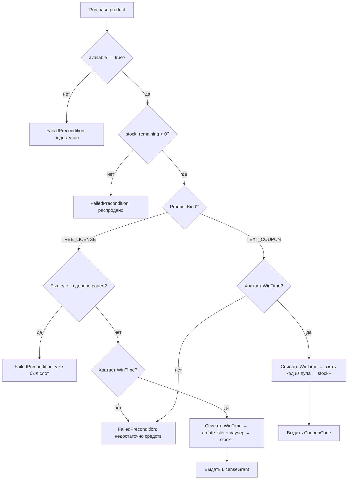

# Сервис: WintimeShopService (Client)

> Общие модели (`biconom.types.WintimeShop.*`) описаны в
> [`biconom/types/wintime_shop.md`](../../types/wintime_shop.md). Здесь — только
> клиентский сервис.

## 1. Описание

**`WintimeShopService`** — клиентская витрина WinTime-магазина: пользователь
просматривает товары и покупает их за WinTime-токены.

**Покупатель.** Списание WinTime идёт с дистрибьютора, под которым авторизован
пользователь — id берётся из **контекста авторизации**, не из запроса. Оплата —
списание валюты `WIN_TIME` (precision 0, целые токены) с ledger покупателя.

**Адресация товара.** `GetProduct` и `Purchase` принимают
`biconom.types.WintimeShop.Product.Id` (`oneof { id | code }`) — товар можно указать
числовым id или строковым slug (`code`).

**Семейства товаров** (`WintimeShop.Product.Kind`) и способ выдачи:
- `TREE_LICENSE` — лицензия-ваучер на слот в дереве (грант в MLM); выдача —
  `Delivery.LicenseGrant { tree_id, slot_id, voucher_id }`;
- `TEXT_COUPON` — уникальный текстовый код из пула; выдача —
  `Delivery.CouponCode { code }` (копируется во внешний продукт).

## 2. Логика покупки

```mermaid
flowchart TD
    P[Purchase product] --> A{available == true?}
    A -->|нет| E1[FailedPrecondition: недоступен]
    A -->|да| S{stock_remaining > 0?}
    S -->|нет| E2[FailedPrecondition: распродано]
    S -->|да| K{Product.Kind?}

    K -->|TREE_LICENSE| L{Был слот в дереве ранее?}
    L -->|да| E3[FailedPrecondition: уже был слот]
    L -->|нет| W1{Хватает WinTime?}
    W1 -->|нет| E4[FailedPrecondition: недостаточно средств]
    W1 -->|да| G1[Списать WinTime → create_slot + ваучер → stock--]
    G1 --> D1[Выдать LicenseGrant]

    K -->|TEXT_COUPON| W2{Хватает WinTime?}
    W2 -->|нет| E4
    W2 -->|да| G2[Списать WinTime → взять код из пула → stock--]
    G2 --> D2[Выдать CouponCode]
```

## 3. Описание методов (RPC)

### `rpc ListProducts(ListProductsRequest) returns (ClientProduct.List)`
- **Назначение**: список товаров витрины.
- **Входные параметры** (`ListProductsRequest`):
    - `include_unavailable` (bool): включать ли недоступные к покупке товары
      (`available == false`). По умолчанию `false` — только доступные. `true`
      показывает и скрытые (превью «coming soon»).
- **Возвращаемое значение**: `ClientProduct.List` — карточки, обогащённые
  персональными полями покупателя (см. ниже).

### `rpc GetProduct(WintimeShop.Product.Id) returns (ClientProduct)`
- **Назначение**: карточка одного товара (в т.ч. недоступного).
- **Входные параметры**: `Product.Id` — по числовому `id` или строковому `code`.
- **Возвращаемое значение**: `ClientProduct`.
- **Ошибки**: `NotFound` (`WINTIME_SHOP_PRODUCT_NOT_FOUND`) — товар не найден.

#### `ClientProduct` — персональные поля карточки

| Поле | Значение |
|---|---|
| `product` | Базовая карточка каталога (`WintimeShop.Product`). |
| `purchased_by_me` | Сколько единиц покупатель приобрёл лично (для `TREE_LICENSE` — 0 или 1). |
| `purchasable_by_me` | ЛИЧНОЕ условие покупателя, две независимые проверки: (1) выполнена маска `Product.required_license_bit_mask` — касается ОБОИХ семейств; (2) для `TREE_LICENSE` дополнительно — не владел деревом. НЕ учитывает витрину/наличие (товар может быть `OUT_OF_STOCK`/`COMING_SOON` при `true`); «можно купить прямо сейчас» — это `status == STATUS_AVAILABLE`. |
| `status` | Агрегатный статус ДЛЯ покупателя: `AVAILABLE` — можно купить; `RESTRICTED` — нельзя по личному условию: либо не выполнена маска условий товара (`required_license_bit_mask != 0` — показывать требование из неё, напр. «нужен тариф PRO»), либо для `TREE_LICENSE` — уже владел деревом; `COMING_SOON` — товар скрыт админом («скоро будет»); `OUT_OF_STOCK` — доступен, но нет в наличии. Приоритет при пересечении: `COMING_SOON` → `RESTRICTED` → `OUT_OF_STOCK` → `AVAILABLE` (личное ограничение выше «нет в наличии»: пополнение остатка такому покупателю не поможет). |

### `rpc Purchase(WintimeShop.Product.Id) returns (PurchaseResponse)`
- **Назначение**: купить товар за WinTime-токены.
- **Входные параметры**: `Product.Id` — покупаемый товар по числовому `id` или
  строковому `code`.
- **Возвращаемое значение** (`PurchaseResponse`):
    - `product` (`WintimeShop.Product`): купленный товар в актуальном состоянии (с
      уменьшенным остатком);
    - `delivery` (`WintimeShop.Delivery`): результат выдачи — `LicenseGrant` (для
      `TREE_LICENSE`) ИЛИ `CouponCode` (для `TEXT_COUPON`);
    - `transaction` (`biconom.types.Transaction.Group`): финансовая транзакция
      этой покупки — тот же визуальный блок, что элемент `items` в
      `ListMyPurchases` / `TransactionService.History`, но один и без
      справочников; сумма списания — в `entry.amount`, детали — в
      `entry.details` (`WintimeShopPurchaseDetails`).
- **Ошибки**:
    - `NotFound` (`WINTIME_SHOP_PRODUCT_NOT_FOUND`) — товар не найден.
    - `FailedPrecondition` (`WINTIME_SHOP_UNAVAILABLE`) — товар недоступен
      (`available == false`).
    - `FailedPrecondition` (`WINTIME_SHOP_OUT_OF_STOCK`) — распродано
      (`stock_remaining == 0`).
    - `FailedPrecondition` (`WINTIME_SHOP_TREE_ALREADY_OWNED`) — для `TREE_LICENSE`:
      у дистрибьютора уже был слот в этом дереве (лицензию можно купить только один
      раз на дерево).
    - `FailedPrecondition` (`WINTIME_SHOP_LICENSE_REQUIRED`) — не выполнена маска
      обязательных условий товара (`required_license_bit_mask`), напр. нужен
      активный тариф PRO. Проверяется ДО списания WinTime и ДО изъятия кода из
      пула — неуспешная покупка не тратит ни баланс, ни купон.
    - `FailedPrecondition` (`LEDGER_INSUFFICIENT_FUNDS`) — недостаточно WinTime.
- **Побочные эффекты**:
    - Списывает `price_wintime` с дистрибьютора-покупателя (валюта `WIN_TIME`).
    - `TREE_LICENSE` — создаёт/использует слот в дереве и создаёт ваучер-лицензию
      (MLM), декрементирует квоту остатка.
    - `TEXT_COUPON` — изымает один неиспользованный код из пула товара (выдаётся
      ровно один раз), декрементирует остаток пула.

## 4. Права доступа

- Требуется `Session`-токен обычного пользователя. Токены `Guest` и `Confirmation`
  отклоняются. Покупатель определяется контекстом авторизации.

## 5. Сценарии использования

- **Витрина**: `ListProducts` (по умолчанию — доступные; `include_unavailable` —
  включая «coming soon»).
- **Карточка товара**: `GetProduct` по `id` или `code`.
- **Покупка лицензии** («Win Lite»): `Purchase(product = code "win_lite")` →
  `LicenseGrant` (слот + ваучер в первом дереве).
- **Покупка купона** (VPN): `Purchase(product = code "vpn")` → `CouponCode` (текст
  для копирования во внешнее приложение).

> **Примечание об именовании ошибок**: коды `WINTIME_SHOP_*` — предполагаемые
> строковые константы уровня `service::mod.rs`, добавляются на этапе реализации
> механики (см. `types/wintime_shop.md`, раздел «Реализация»).

## 6. История своих покупок (`ListMyPurchases`)

ВСЯ история покупок текущего дистрибьютора (из контекста авторизации), новые
сверху, **без пагинации, фильтров и total** — одним ответом:
`ListMyPurchases(google.protobuf.Empty)` → `ListMyPurchasesResponse { items:
biconom.types.Transaction.Group[], accounts, distributors, slots }`.

Ответ — **формат `TransactionService.History`**: аккаунт видит ОТФИЛЬТРОВАННЫЕ
транзакции магазина. Сервер по внутренней истории покупок находит группы
транзакций списания WinTime в леджере и упаковывает их так же, как общую историю
транзакций (одна покупка = одна группа). Детали покупки — в `entry.details`
(`WintimeShopPurchaseDetails`: `product_id`, `coupon_code`, `slot_id`,
`voucher_id`, `tree_id`); сумма entry — фактически списанная цена.
