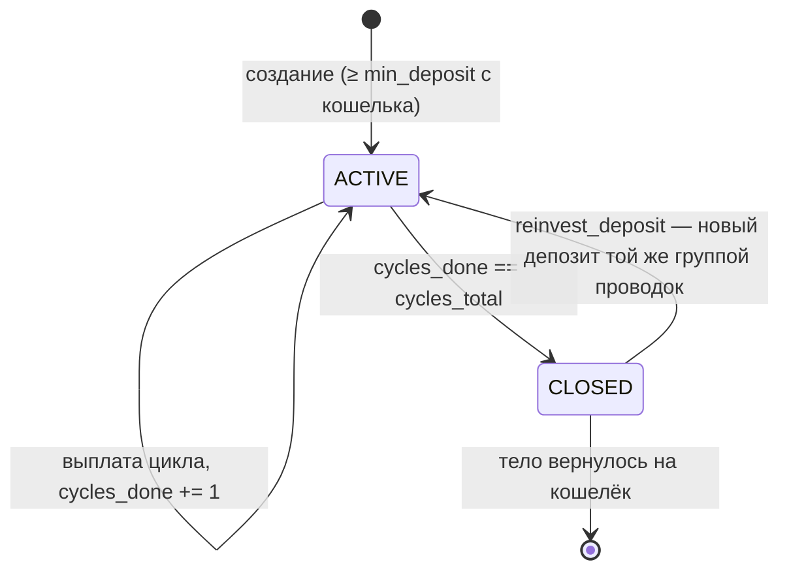

# Модуль: Стейкинг USDT (`staking`)

## 1. Описание

**Стейкинг** — партнёр вкладывает USDT в **депозит**. Депозит приносит **12 выплат**
дохода, по одной каждые **30 суток**, после чего автоматически закрывается и
возвращает тело на кошелёк.

Каждый прирост тела (создание депозита или реинвест дохода) порождает **реферальные
выплаты вверх по спонсорскому дереву**. Их размер зависит от **ранга** получателя;
ранг берётся за личный **вклад** и командный **оборот**, за достижение положен
**бонус за достижение**.

### 1.1. Два процента, которые нельзя путать

В модуле есть две шкалы процентов. Это разные вещи, и объединить их в одну таблицу
нельзя.

| | **Тир** (`Staking.Tier`) | **Ранг** (`Staking.Rank`) |
|---|---|---|
| Что даёт | доход **со своих** денег | долю в раздаче **с чужих** депозитов |
| От чего зависит | сумма тел **активных** депозитов партнёра **сейчас** | личный вклад + командный оборот **за всё время** |
| Динамика | плавает: завершился депозит — сумма упала — ставка ниже | **никогда не понижается** |
| Диапазон | `"0.05"` … `"0.10"` за цикл | `"0.05"` … `"0.16"` от прироста тела в структуре |
| Когда вычисляется | на каждой выплате заново | при каждом изменении объёмов, последовательно вверх |

Партнёр может одновременно иметь **ранг 12** (16% с чужих депозитов, взят давно
командным оборотом) и **тир 5%** (минимальная ставка со своих, потому что сейчас
активных депозитов на $100).

### 1.2. Соответствие терминов

Термины заказчика и имена в API/коде:

| Термин | В API | Значение |
|---|---|---|
| Вклад | `personal_volume` | Сумма максимальных тел по **всем** депозитам, когда-либо созданным партнёром, включая закрытые. Никогда не уменьшается |
| Оборот | `team_volume` | Вклад партнёра + учтённые объёмы всех веток. Это **не** выручка |
| Ветка | `Leg` | Личник первой линии со всем поддеревом |
| Объём ветки | `branch_volume` | Лидер ветки + все его нижестоящие |
| Лимит на ветку | `max_per_leg` | Максимум, который одна ветка даёт в оборот. **Сумма**, не доля |
| Премия за ранг | `achievement_bonus` | Разовый бонус за достижение ранга |

### 1.3. Соглашения о величинах

- **Деньги** — строками, как балансы `biconom.types.Ledger` (высокая точность,
  без потерь на `double`).
- **Ставки** — тоже строками, но не процентом, а **коэффициентом**: `5%` → `"0.05"`,
  `16%` → `"0.16"`. На коэффициент умножают напрямую (`выплата = тело × rate`),
  поэтому ни клиент, ни сервер не делят на 100 и не гадают о масштабе.
  Целочисленное «× 10 000» (как у `DividendPoolBonus.daily_rate`) здесь намеренно
  не используется: ошибка на порядок в таком представлении не видна глазом.
- **Валюта** — программа моно-валютная (USDT). `Config.currency_id` — валюта всей
  программы; `Deposit.currency_id` — валюта конкретного депозита, и **все** его
  денежные поля выражены именно в ней.

---

## 2. Депозит (`Staking.Deposit`)

### 2.1. Счёт депозита

Каждый депозит владеет **собственным счётом-леджером**:
`Ledger.Owner.staking_deposit_id`. Баланс этого счёта **и есть тело** — отдельного
поля с телом в хранилище не существует.

Флаги счёта: `ALLOW_DEBIT | ALLOW_CREDIT` **без** `ALLOW_NEGATIVE`. Счёт депозита —
реальное обязательство перед партнёром, уйти в минус он не может; ошибка расчёта
упрётся в отказ вместо тихой порчи данных.

### 2.2. Деньги депозита

| Поле | Смысл |
|---|---|
| `initial_amount` | Сумма при создании. Не меняется никогда |
| `body` | Тело: у активного — текущий баланс счёта, у закрытого — тело на момент закрытия |
| `total_income_paid` | Начислено дохода за всё время, независимо от того, ушёл он на кошелёк или в тело |

Тело растёт **только** реинвестом дохода, поэтому «сколько ушло в реинвест» =
`body − initial_amount`. Отдельного поля нет намеренно — величина выводится.

`total_income_paid` из `body` **не** выводится: доход мог уходить на кошелёк.

### 2.3. Жизненный цикл



- Досрочно закрыть депозит **нельзя**.
- Закрытие **автоматическое**: как только реализована последняя выплата, депозит
  закрывается в **той же группе проводок**. Состояния «завершён, но партнёр не
  выбрал, что делать» не существует.
- `cycles_done` стартует с 0 и не может превысить `cycles_total`.

`Status` оставлен перечислением, хотя значений сейчас два: в проекте статус сущности
везде enum (`Ledger.Status`, `Wallet.Status`), и добавить значение в enum —
совместимое изменение, а заменить `bool` на enum позже — ломающее.

### 2.4. Два реинвеста — не путать

| Поле | Что делает | Когда читается |
|---|---|---|
| `reinvest_profit_applied` / `reinvest_profit_requested` | Направляет **выплату дохода** в тело этого же депозита | На каждой выплате |
| `reinvest_deposit` | При закрытии тело **целиком открывает новый депозит** | Один раз, в момент закрытия |

**Отложенное отключение реинвеста прибыли.** Пара `applied` / `requested` нужна,
чтобы отключение вступало в силу не мгновенно, а после ближайшей выплаты:

| Действие | `requested` | `applied` | Что видит партнёр |
|---|---|---|---|
| Включил | `true` | `true` | «включено, действует сразу» |
| Подал заявку на отключение | `false` | `true` | «отключится после ближайшей выплаты, она ещё уйдёт в тело» |
| Система применила на выплате | `false` | `false` | «с этого цикла доход идёт на кошелёк» |

Правило одно: на выплате используется `applied`, после выплаты `applied = requested`.
Заявку можно отозвать до наступления выплаты.

`reinvest_deposit` пары не требует — он читается один раз, и действует то значение,
которое стоит в момент закрытия.

### 2.5. Реинвест всего депозита

Это **не особый режим**, а автоматизация двух обычных операций в одной группе
проводок: депозит закрывается, тело уходит на кошелёк, и с кошелька тут же
открывается **новый** депозит на всю сумму — новый счёт, новые 12 циклов, новая
реферальная раздача.

Новый депозит помечен `source = SOURCE_BODY_REINVEST`, а закрытый указан в
`source_deposit_id`.

---

## 3. Ранги и квалификация

### 3.1. Условия

Ранг считается достигнутым, когда выполнены **оба** условия одновременно:
`personal_volume ≥ required_personal_volume` **и**
`team_volume ≥ required_team_volume`.

Пересчёт идёт **не с первого ранга**, а от текущего: проверяются условия следующего,
и так по циклу вверх, пока выполняются. **Перескок невозможен** — партнёр,
выполнивший условия сразу нескольких рангов, получает их последовательно, и за
каждый создаётся своё обязательство по бонусу.

Ранг **никогда не понижается**: хранится достигнутый максимум, даже если объёмы
позже упали.

### 3.2. Командный оборот и лимит на ветку

```
team_volume = personal_volume(партнёр)
для каждой ветки C первой линии:
    если leader_personal_volume(C) > max_per_leg:
        team_volume += leader_personal_volume(C)   // весь вклад лидера,
                                                   // нижестоящие НЕ учитываются
    иначе:
        team_volume += min(branch_volume(C), max_per_leg)
```

`max_per_leg` задан **суммой**, а не долей — чтобы на разных рангах можно было
задать разные правила. По умолчанию это треть требуемого оборота, округлённая
**вверх**: три максимальные ветки обязаны покрывать 100% требования, иначе ранг
недостижим даже теоретически. Инвариант `3 × max_per_leg ≥ required_team_volume`
проверяется тестом.

`RankProgress` отдаёт две величины оборота: `team_volume` — **засчитанный** под
следующий ранг (с лимитами), и `team_volume_uncapped` — **полный** оборот команды без
лимитов. Разница между ними и есть «сколько срезал лимит на ветку».

`Staking.Leg` раскрывает расчёт по каждой ветке: сколько засчиталось, сработал ли
лимит (`capped`), взят ли весь вклад лидера (`leader_exceeds_cap`). Это и есть ответ
на вопрос «почему я не взял ранг».

Поскольку `max_per_leg` зависит от **проверяемого** ранга, величина `team_volume` в
`RankProgress` имеет смысл только в паре со **следующим** рангом — на максимальном
ранге она отсутствует.

### 3.3. Реферальная лестница

```
paid = 0
для каждого предка A вверх по спонсорскому дереву, начиная с прямого спонсора:
    p = referral_percent(rank(A))          # 0, если ранга нет
    если p > paid:
        начислить A: base × (p − paid), округляя ВНИЗ
        paid = p                           # двигается всегда, даже если доля = 0
    если paid == 160000: стоп              # 16% — максимум
дойдя до корня — стоп
```

- Сравниваются **проценты**, а не номера рангов.
- **Забаненные не пропускаются** — получают наравне со всеми. Причина: бан бывает
  временным, а отданные выше деньги не вернуть.
- Недобранное до 16% **никуда не идёт**: из пула списывается ровно распределённая
  сумма, а не 16% с последующим возвратом остатка.
- Раздача идёт по рангам, достигнутым **до** этой операции; пересчёт рангов
  выполняется **после**.

### 3.4. Бонус за достижение (`Staking.Obligation`)

Бонус не выплачивается напрямую — он материализуется как **обязательство**,
и делает это **всегда**, когда у ранга есть бонус: и при автоматической выплате, и
при ручной. Так весь список достижений виден в одном месте, без деления на «авто» и
«ручные».

- `released == false` — деньги ещё не выплачены, ожидание решения админа.
- `released == true` — выплачено; `released_by_user_id == 0` означает «автоматически».
- Отказать в бонусе нельзя: состояний ровно два, статуса «отменено» нет.
- `amount` — **снимок** на момент достижения: последующее изменение таблицы рангов
  уже созданные обязательства не меняет.
- Идемпотентность — по паре `(distributor_id, rank)`: бонус за ранг выплачивается
  один раз за всю жизнь аккаунта.

Автовыплата настраивается **отдельно для каждого ранга**
(`Staking.RankBonusSetting`). Включение флага действует только на **будущие**
достижения — уже висящие обязательства автоматически не выплачиваются, иначе одно
переключение тумблера разом выпустило бы все накопленные суммы.

---

## 4. Конфигурация (`Staking.Config`)

Делится на две части с разным жизненным циклом.

### 4.1. Захардкожено, меняется только пересборкой

`ranks`, `tiers`, `cycles_total`, `cycle_interval_secs`, `currency_id`.

Это экономика программы. Она в коде, а не в YAML, потому что: конфиг читается один
раз на старте (правка файла всё равно требует рестарта); опечатка в ключе YAML не
падает, а тихо подставляет дефолт; трёх env-конфигов пришлось бы держать
синхронными; инвариант `3 × max_per_leg ≥ required_team_volume` с константами
проверяется тестом в CI, а не на проде.

### 4.2. Изменяется админом на лету (`Staking.Settings`)

| Поле | Что это |
|---|---|
| `min_deposit` | Минимальная сумма создания депозита. На реинвест прибыли **не** действует |
| `default_reinvest_profit` | Значение реинвеста прибыли по умолчанию для новых депозитов |
| `default_reinvest_deposit` | Значение реинвеста депозита по умолчанию для новых депозитов |
| `service_status` | Можно ли покупать новые депозиты |

Изменения персистентны, переживают рестарт и действуют на **будущие** депозиты —
у уже открытых ничего не переписывается.

### 4.3. Статусы сервиса

| Статус | Новые депозиты | Выплаты и реинвест |
|---|---|---|
| `ACTIVE` | можно | идут |
| `PAUSED` | **нельзя** (ручное создание) | **идут**, включая автоматический реинвест тела при закрытии |
| `STOPPED` | нельзя | заморожены; плановые моменты накапливаются и догоняются после возврата в `ACTIVE` |

`PAUSED` блокирует только **ручную покупку**. Автоматический реинвест тела при
закрытии — исполнение уже принятого обязательства, а не новая продажа, и потому
продолжает работать.

---

## 4.4. Сводка по депозитам (`Staking.DepositsSummary`)

Агрегаты по депозитам одного партнёра. Отдаются и в `GetOverview`, и вместе со
списком депозитов — **фильтр списка на них не влияет**, поэтому страница «мои
депозиты» обходится одним запросом.

| Группа | Поля |
|---|---|
| Активные сейчас | `active_count`, `active_total` (база тира), `current_rate` |
| За всё время | `total_count`, `invested_total` (реальные деньги), `personal_volume` (вклад для рангов) |
| Доход | `total_income_paid`, `total_reinvested` |

`invested_total` считает только `initial_amount` каждого депозита, `personal_volume` —
максимальные тела с учётом роста от реинвеста. Их разница показывает, какая часть
объёма создана реинвестом, а не новыми деньгами.

## 5. Журнал событий (`Staking.Event`)

Изолированный поток событий стейкинга — **только личные события партнёра по его
депозитам**. Реферальные бонусы, полученные от структуры, сюда **не попадают**: они
видны в общей истории транзакций кошелька, как любые другие бонусы.

| Событие | Когда |
|---|---|
| `DepositOpened` | создан депозит (вручную или реинвестом тела) |
| `IncomePaid` | начислен доход за цикл |
| `IncomeReinvested` | доход ушёл в тело того же депозита |
| `AutoReinvestChanged` | переключение реинвеста прибыли — партнёром или системой |
| `DepositClosed` | депозит закрыт после последней выплаты |
| `RankAchieved` | взят новый ранг |

Два индекса: `(distributor_id, seq)` — вся история партнёра, и `(deposit_id, seq)` —
история конкретного депозита. `seq` — порядковый номер **в рамках партнёра**.

### 5.1. Время события

`ts` — **бизнес-время**, а не время обработки. Для выплат это **плановый** момент
цикла: при догоне после простоя сервиса плановый и фактический моменты расходятся,
и в истории должен стоять плановый.

### 5.2. Самодостаточность `IncomePaid`

Событие несёт доказательство расчёта, поэтому поддержка отвечает на вопрос «почему
7%, а не 8%» не заглядывая в состояние системы, которого уже нет:

```
tier(active_deposits_total)  == rate
body_at_payout × rate        == amount
```

---

## 6. Инварианты

| | |
|---|---|
| Тело депозита — баланс его счёта; отдельного поля нет, двойной учёт исключён по построению |
| `cycles_done ≤ cycles_total`; 13-й цикл невозможен |
| Последняя выплата, возврат тела и (при `reinvest_deposit`) открытие нового депозита — **одна группа проводок** |
| При одновременных выплатах сумма активных депозитов берётся снимком на начало пачки: результат не зависит от порядка обработки |
| Все денежные округления — **вниз**. Никогда не выплачиваем больше положенного |
| Счёт депозита не может уйти в минус |
| Лестница раздаётся по рангам, достигнутым **до** операции; пересчёт рангов — после |
| Из пула списывается ровно распределённая сумма; недобранное до 16% не списывается |
| Ранг монотонно не убывает |
| Ранги берутся последовательно, за каждый — своё обязательство |
| Идемпотентность выплат — по `(deposit_id, payout_seq)`; бонусов — по `(distributor_id, rank)` |
| `3 × max_per_leg ≥ required_team_volume` для каждого ранга |
| Бан не влияет на стейкинг ни в одной точке |

---

## 7. Сервисы

- **Клиент** — [`biconom/client/staking/staking.md`](../client/staking/staking.md)
- **Админ** — [`biconom/admin/staking/staking.md`](../admin/staking/staking.md)
