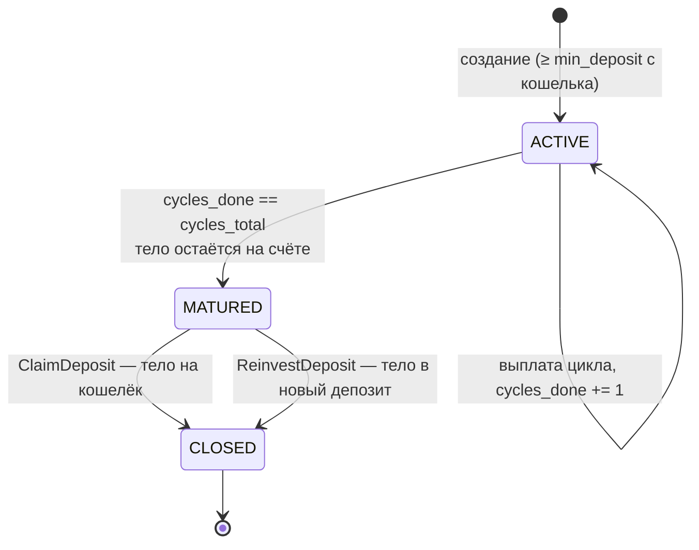

# Модуль: Стейкинг USDT (`staking`)

## 1. Описание

**Стейкинг** — партнёр вкладывает USDT в **депозит**. Депозит приносит **12 выплат**
дохода, по одной за цикл, после чего **созревает**: начисления прекращаются, но тело
остаётся на счёте депозита и ждёт решения партнёра — забрать на кошелёк либо
реинвестировать целиком в новый депозит. Автоматического возврата тела нет.

Длина цикла **зависит от окружения**: 30 суток на продакшене, 60 секунд на
стейджинге. Брать из `Config.cycle_interval_secs`, константу не зашивать.

Каждый прирост тела (создание депозита, реинвест дохода, реинвест тела) порождает **реферальные
выплаты вверх по спонсорскому дереву**. Их размер зависит от **ранга** получателя;
ранг берётся за личный **вклад** и командный **оборот**, за достижение положен
**бонус за достижение**.

### 1.1. Два процента, которые нельзя путать

В модуле есть две шкалы процентов. Это разные вещи, и объединить их в одну таблицу
нельзя.

| | **Тир** (`Staking.Tier`) | **Ранг** (`Staking.Rank`) |
|---|---|---|
| Что даёт | доход **со своих** денег | долю в раздаче **с чужих** депозитов |
| От чего зависит | сумма тел **активных** депозитов партнёра **сейчас** | личный вклад + командный оборот **за всё время** |
| Динамика | плавает: завершился депозит — сумма упала — ставка ниже | **никогда не понижается** |
| Диапазон | `"0.05"` … `"0.10"` за цикл | `"0.05"` … `"0.16"` от прироста тела в структуре |
| Когда вычисляется | на каждой выплате заново | при каждом изменении объёмов, последовательно вверх |

Партнёр может одновременно иметь **ранг 12** (16% с чужих депозитов, взят давно
командным оборотом) и **тир 5%** (минимальная ставка со своих, потому что сейчас
активных депозитов на $100).

### 1.2. Соответствие терминов

Термины заказчика и имена в API/коде:

| Термин | В API | Значение |
|---|---|---|
| Вклад | `personal_volume` | Сумма максимальных тел по **всем** депозитам, когда-либо созданным партнёром, включая закрытые. Никогда не уменьшается |
| Оборот | `team_volume` | Вклад партнёра + учтённые объёмы всех веток. Это **не** выручка |
| Ветка | `Leg` | Личник первой линии со всем поддеревом |
| Объём ветки | `branch_volume` | Лидер ветки + все его нижестоящие |
| Лимит на ветку | `max_per_leg` | Максимум, который одна ветка даёт в оборот. **Сумма**, не доля |
| Премия за ранг | `achievement_bonus` | Разовый бонус за достижение ранга |

### 1.3. Соглашения о величинах

- **Деньги** — строками, как балансы `biconom.types.Ledger` (высокая точность,
  без потерь на `double`).
- **Ставки** — тоже строками, но не процентом, а **коэффициентом**: `5%` → `"0.05"`,
  `16%` → `"0.16"`. На коэффициент умножают напрямую (`выплата = тело × rate`),
  поэтому ни клиент, ни сервер не делят на 100 и не гадают о масштабе.
  Целочисленное «× 10 000» (как у `DividendPoolBonus.daily_rate`) здесь намеренно
  не используется: ошибка на порядок в таком представлении не видна глазом.
- **Валюта** — программа моно-валютная (USDT). `Config.currency_id` — валюта всей
  программы; `Deposit.currency_id` — валюта конкретного депозита, и **все** его
  денежные поля выражены именно в ней.

---

## 2. Депозит (`Staking.Deposit`)

### 2.1. Счёт депозита

Каждый депозит владеет **собственным счётом-леджером**:
`Ledger.Owner.staking_deposit_id`. Баланс этого счёта **и есть тело** — отдельного
поля с телом в хранилище не существует.

Флаги счёта: `ALLOW_DEBIT | ALLOW_CREDIT` **без** `ALLOW_NEGATIVE`. Счёт депозита —
реальное обязательство перед партнёром, уйти в минус он не может; ошибка расчёта
упрётся в отказ вместо тихой порчи данных.

### 2.2. Деньги депозита

| Поле | Смысл |
|---|---|
| `initial_amount` | Сумма при создании. Не меняется никогда |
| `body` | Тело: у активного и созревшего — текущий баланс счёта, у закрытого — тело на момент закрытия |
| `total_income_paid` | Начислено дохода за всё время, независимо от того, ушёл он на кошелёк или в тело |

Тело растёт **только** реинвестом дохода, поэтому «сколько ушло в реинвест» =
`body − initial_amount`. Отдельного поля нет намеренно — величина выводится.

`total_income_paid` из `body` **не** выводится: доход мог уходить на кошелёк.

### 2.3. Жизненный цикл



- Досрочно закрыть депозит **нельзя**.
- Последняя выплата депозит **не закрывает**. Она прекращает начисления и переводит
  его в `MATURED`; тело при этом никуда не двигается. Дальше решает партнёр, и
  **срока на решение нет** — депозит может висеть в `MATURED` сколько угодно, ничего
  не сгорает.
- `MATURED` **не входит** в `active_total` и на тир не влияет: депозит больше не
  зарабатывает, значит и ставку по остальным депозитам держать не должен. Иначе
  созревшие можно было бы не забирать и получать высокий тир даром.
- `CLOSED` означает ровно одно: тело ушло с депозита по решению партнёра.
  `closed_at` заполняется в этот момент, а не при созревании.
- `cycles_done` стартует с 0 и не может превысить `cycles_total`.

`Status` — перечисление, а не `bool`: в проекте статус сущности везде enum
(`Ledger.Status`, `Wallet.Status`), и добавить значение в enum — совместимое
изменение. Именно этим и воспользовался `MATURED`; он стоит **после** `CLOSED`,
потому что хранилище кодирует статус порядковым номером.

### 2.4. Два реинвеста — не путать

| Что | Как задаётся | Когда действует |
|---|---|---|
| **Реинвест прибыли** — выплата дохода уходит в тело этого же депозита | флаги `reinvest_profit_applied` / `reinvest_profit_requested` на депозите | на каждой выплате |
| **Реинвест тела** — всё тело созревшего депозита открывает новый | разовая команда `ReinvestDeposit` | один раз, по решению партнёра |

Флага `reinvest_deposit` больше нет: заранее заданного поведения при завершении не
существует.

Начальное значение реинвеста прибыли берётся из
`Config.settings.default_reinvest_profit` — клиент его при создании депозита **не
передаёт**. Менять после создания — `SetAutoReinvestProfit`.

**Отложенное отключение реинвеста прибыли.** Пара `applied` / `requested` нужна,
чтобы отключение вступало в силу не мгновенно, а после ближайшей выплаты:

| Действие | `requested` | `applied` | Что видит партнёр |
|---|---|---|---|
| Включил | `true` | `true` | «включено, действует сразу» |
| Подал заявку на отключение | `false` | `true` | «отключится после ближайшей выплаты, она ещё уйдёт в тело» |
| Система применила на выплате | `false` | `false` | «с этого цикла доход идёт на кошелёк» |

Правило одно: на выплате используется `applied`, после выплаты `applied = requested`.
Заявку можно отозвать до наступления выплаты.

### 2.5. Забор и реинвест тела созревшего депозита

Оба действия применимы **только** к депозиту в статусе `MATURED`; активный или уже
закрытый вернут `STAKING_DEPOSIT_NOT_MATURED`.

| | `ClaimDeposit` | `ReinvestDeposit` |
|---|---|---|
| Что делает | тело уходит на USDT-кошелёк | тело целиком открывает новый депозит |
| Статус сервиса | разрешён при **любом**, включая `STOPPED` | запрещён при `PAUSED` и `STOPPED` |
| Минимум входа | — | **не** проверяется: это не новая покупка |
| Реферальная раздача | нет | да, от полной суммы тела |
| Возвращает | закрытый исходный депозит | **новый** депозит |

Забрать своё тело партнёру запретить нельзя ни при каком статусе — поэтому кнопку
«забрать» по `service_status` прятать не нужно, а «реинвестировать» нужно.

Реинвест — это закрытие старого депозита и открытие нового **одной группой
проводок**: деньги не существуют «между» депозитами. Новый депозит помечен
`source = SOURCE_BODY_REINVEST`, получает новые 12 циклов и наследует **выбор
партнёра** по реинвесту прибыли, а не дефолт настроек.

Повторный реинвест того же тела невозможен: на один исходный депозит приходится не
больше одного порождённого (`STAKING_DEPOSIT_ALREADY_REINVESTED`).

### 2.6. Цепочка реинвестов — двусвязный список

Одни и те же деньги могут перекладываться из депозита в депозит сколько угодно раз.
Оба конца связи хранятся полями, поэтому цепочку проходят в **обе** стороны, не
перебирая список депозитов:

```
#1 CLOSED ──reinvested_into──▶ #7 CLOSED ──reinvested_into──▶ #12 ACTIVE
   ◀── source_deposit_id ─────    ◀── source_deposit_id ─────
```

| Поле | Направление | Когда 0 |
|---|---|---|
| `source_deposit_id` | назад, к депозиту-источнику | депозит создан вручную |
| `reinvested_into_deposit_id` | вперёд, к порождённому депозиту | депозит активен или созрел; тело забрано на кошелёк; это последнее звено |

Ненулевой `reinvested_into_deposit_id` бывает только у депозита в `CLOSED` и
совпадает с `Event.DepositClosed.reinvested_into_deposit_id`.

---

## 3. Ранги и квалификация

### 3.1. Условия

Ранг считается достигнутым, когда выполнены **оба** условия одновременно:
`personal_volume ≥ required_personal_volume` **и**
`team_volume ≥ required_team_volume`.

Пересчёт идёт **не с первого ранга**, а от текущего: проверяются условия следующего,
и так по циклу вверх, пока выполняются. **Перескок невозможен** — партнёр,
выполнивший условия сразу нескольких рангов, получает их последовательно, и за
каждый создаётся своё обязательство по бонусу.

Ранг **никогда не понижается**: хранится достигнутый максимум, даже если объёмы
позже упали.

### 3.2. Командный оборот и лимит на ветку

```
team_volume = personal_volume(партнёр)
для каждой ветки C первой линии:
    если leader_personal_volume(C) > max_per_leg:
        team_volume += leader_personal_volume(C)   // весь вклад лидера,
                                                   // нижестоящие НЕ учитываются
    иначе:
        team_volume += min(branch_volume(C), max_per_leg)
```

`max_per_leg` задан **суммой**, а не долей — чтобы на разных рангах можно было
задать разные правила. По умолчанию это **34% требуемого оборота, округлённые
вниз**: три максимальные ветки покрывают 102% требования, то есть ранг остаётся
достижимым с запасом. Инвариант `3 × max_per_leg ≥ required_team_volume`
проверяется тестом.

`RankProgress` отдаёт две величины оборота: `team_volume` — **засчитанный** под
следующий ранг (с лимитами), и `team_volume_uncapped` — **полный** оборот команды без
лимитов. Разница между ними и есть «сколько срезал лимит на ветку».

`Staking.Leg` раскрывает расчёт по каждой ветке: сколько засчиталось, сработал ли
лимит (`capped`), взят ли весь вклад лидера (`leader_exceeds_cap`). Это и есть ответ
на вопрос «почему я не взял ранг».

Поскольку `max_per_leg` зависит от **проверяемого** ранга, величина `team_volume` в
`RankProgress` имеет смысл только в паре со **следующим** рангом — на максимальном
ранге она отсутствует.

#### Карточки лидеров веток

`legs` отдаёт по ветке только `distributor_id`. Рядом идут дедуплицированные
справочники `distributors` и `accounts` — чтобы показать список веток с логином и
аватаром без запроса на каждую:

```
Leg.distributor_id → Distributor.id → Distributor.account_id → Account.id → Account.user
```

`Account.user` несёт аватар, статус присутствия и контакты. В `distributors`
попадает и САМ партнёр, чей прогресс запрошен, — под карточку в шапке экрана;
его идентификатор лежит в `RankProgress.distributor_id`, а его цифры по депозитам
— в `RankProgress.summary` (та же модель `DepositsSummary`, что в `State`). Внутри
`State` это поле пустое: сводка там уже есть на верхнем уровне. Оба
списка пусты, когда пуст `legs`, — то есть всегда внутри `State`.

#### Сколько партнёров в структуре реально в стейкинге

Объёмы показывают деньги, а число участников — отдельные счётчики:

| Поле | Что считает |
|---|---|
| `RankProgress.stakers_partners` | личников первой линии, купивших хотя бы один депозит |
| `RankProgress.stakers_team` | то же по всей команде — поддерево БЕЗ самого партнёра |
| `Leg.personal_activated` | активировал ли депозит САМ лидер ветки |
| `Leg.stakers_partners` | активированных личников у лидера ветки |
| `Leg.stakers_team` | активированных во всей команде лидера ветки, БЕЗ него самого |

Считаются **партнёры, а не депозиты**: второй депозит того же человека счётчик не
двигает. Учёт пожизненный — созревание, забор тела и закрытие депозита партнёра
из счёта не убирают, ровно как и `personal_volume`. Лимит на ветку на счётчики не
влияет: это метрика структуры, а не денег.

Поля `RankProgress` читаются за `O(1)` и приходят также внутри `State`; поля
внутри `Leg` — только там, где есть сам `legs`.

### 3.3. Реферальная лестница

```
paid = 0
для каждого предка A вверх по спонсорскому дереву, начиная с прямого спонсора:
    p = referral_percent(rank(A))          # 0, если ранга нет
    если p > paid:
        начислить A: base × (p − paid), округляя ВНИЗ
        paid = p                           # двигается всегда, даже если доля = 0
    если paid == 160000: стоп              # 16% — максимум
дойдя до корня — стоп
```

- Сравниваются **проценты**, а не номера рангов.
- **Забаненные не пропускаются** — получают наравне со всеми. Причина: бан бывает
  временным, а отданные выше деньги не вернуть.
- Недобранное до 16% **никуда не идёт**: из пула списывается ровно распределённая
  сумма, а не 16% с последующим возвратом остатка.
- Раздача идёт по рангам, достигнутым **до** этой операции; пересчёт рангов
  выполняется **после**.

### 3.4. Бонус за достижение (`Staking.Obligation`)

Бонус не выплачивается напрямую — он материализуется как **обязательство**,
и делает это **всегда**, когда у ранга есть бонус: и при автоматической выплате, и
при ручной. Так весь список достижений виден в одном месте, без деления на «авто» и
«ручные».

- `released == false` — деньги ещё не выплачены, ожидание решения админа.
- `released == true` — выплачено; `released_by_user_id == 0` означает «автоматически».
- Отказать в бонусе нельзя: состояний ровно два, статуса «отменено» нет.
- `amount` — **снимок** на момент достижения: последующее изменение таблицы рангов
  уже созданные обязательства не меняет.
- Идемпотентность — по паре `(distributor_id, rank)`: бонус за ранг выплачивается
  один раз за всю жизнь аккаунта.

Автовыплата настраивается **отдельно для каждого ранга**
(`Staking.RankBonusSetting`). Включение флага действует только на **будущие**
достижения — уже висящие обязательства автоматически не выплачиваются, иначе одно
переключение тумблера разом выпустило бы все накопленные суммы.

---

## 4. Конфигурация (`Staking.Config`)

Делится на две части с разным жизненным циклом.

### 4.1. Захардкожено, меняется только пересборкой

`ranks`, `tiers`, `cycles_total`, `cycle_interval_secs`, `currency_id`.

`cycle_interval_secs` из этого списка — единственное, что зависит от **окружения**:
2 592 000 (30 суток) на продакшене и **60** на стейджинге, иначе полный путь депозита
до созревания нельзя пройти руками. Значение приходит на старте сервиса, не хранится
в БД (копия базы стейджинга иначе принесла бы минутный цикл на прод) и попадает в
депозит **снимком** — у уже открытых расписание не переписывается.

Остальное — экономика программы. Она в коде, а не в YAML, потому что: конфиг читается один
раз на старте (правка файла всё равно требует рестарта); опечатка в ключе YAML не
падает, а тихо подставляет дефолт; трёх env-конфигов пришлось бы держать
синхронными; инвариант `3 × max_per_leg ≥ required_team_volume` с константами
проверяется тестом в CI, а не на проде.

### 4.2. Изменяется админом на лету (`Staking.Settings`)

| Поле | Что это |
|---|---|
| `min_deposit` | Минимальная сумма создания депозита. На реинвест прибыли и на `ReinvestDeposit` **не** действует |
| `default_reinvest_profit` | Реинвест прибыли для новых депозитов. **Единственный** источник флага: клиент его в `CreateDeposit` не передаёт |
| `service_status` | Можно ли покупать новые депозиты |

Изменения персистентны, переживают рестарт и действуют на **будущие** депозиты —
у уже открытых ничего не переписывается.

### 4.3. Статусы сервиса

| Статус | `CreateDeposit` | `ReinvestDeposit` | `ClaimDeposit` | Выплаты и реинвест прибыли |
|---|---|---|---|---|
| `ACTIVE` | можно | можно | можно | идут |
| `PAUSED` | **нельзя** | **нельзя** | **можно** | **идут** |
| `STOPPED` | нельзя | нельзя | **можно** | заморожены; плановые моменты накапливаются и догоняются после возврата в `ACTIVE` |

`PAUSED` останавливает **продажи** — и обычную покупку, и реинвест тела: последний
тоже решение вложить деньги. Выплаты и реинвест прибыли при этом идут: они исполняют
уже принятое обязательство.

`ClaimDeposit` не смотрит на статус вовсе: забрать своё тело партнёру нельзя
запретить даже при полной остановке модуля.

---

## 4.4. Сводка по депозитам (`Staking.DepositsSummary`)

Агрегаты по депозитам одного партнёра. Приходят в `GetState` вместе со списком
депозитов — **фильтр списка на них не влияет**, поэтому страница «мои депозиты»
обходится одним запросом.

| Группа | Поля |
|---|---|
| Активные сейчас | `active_count`, `active_total` (база тира), `current_rate` |
| Ждут решения | `matured_count`, `matured_total` — сколько можно забрать или реинвестировать прямо сейчас. В `active_total` **не** входит |
| За всё время | `total_count`, `invested_total` (реальные деньги), `personal_volume` (вклад для рангов) |
| Доход | `total_income_paid`, `total_reinvested` |

`invested_total` считает только `initial_amount` каждого депозита, `personal_volume` —
максимальные тела с учётом роста от реинвеста. Их разница показывает, какая часть
объёма создана реинвестом, а не новыми деньгами.

## 5. Журнал событий (`Staking.Event`)

Изолированный поток событий стейкинга: и собственные депозиты партнёра, и доли
реферальной лестницы, пришедшие с депозитов структуры — весь его заработок в модуле
одной лентой.

| Событие | Когда |
|---|---|
| `DepositOpened` | создан депозит (вручную или реинвестом тела) |
| `IncomePaid` | начислен доход за цикл |
| `IncomeReinvested` | доход ушёл в тело того же депозита |
| `AutoReinvestChanged` | переключение реинвеста прибыли — партнёром или системой |
| `DepositMatured` | депозит отработал все циклы и ждёт решения партнёра. Денег не двигает, `ledger_group_id = 0` |
| `DepositClosed` | тело ушло с депозита: на кошелёк (`reinvested_into_deposit_id == 0`) либо в новый депозит |
| `RankAchieved` | взят новый ранг |
| `RankBonusReleased` | бонус за ранг выплачен — автоматически либо админом |
| `ReferralReceived` | пришла доля лестницы с депозита нижестоящего партнёра |

`RankAchieved` и `RankBonusReleased` — разные моменты: между достижением ранга и выплатой
бонуса могут пройти недели ручной модерации. Первое денег не двигает
(`ledger_group_id == 0`), второе — двигает.

`ReferralReceived` — единственное событие, приходящее не от своего депозита. У него
`Event.deposit_id == 0`, а депозит-источник лежит внутри payload: иначе чужое начисление
всплывало бы в `ListDepositEvents` одноимённого своего депозита.

Оно же несёт **`lost_profit`** — сколько партнёр получил бы с этого начисления на
максимальном ранге, минус то, что получил. Считается от той же базы и того же
`paid_before_percent`: часть процента уже забрали нижестоящие звенья цепочки, и вернуть её
ростом собственного ранга нельзя. Величина справочная — этих денег не существует, это
показатель «сколько даст рост ранга».

Два индекса: `(distributor_id, seq)` — вся история партнёра, и `(deposit_id, seq)` —
история конкретного депозита. `seq` — порядковый номер **в рамках партнёра**.

### 5.1. Время события

`ts` — **бизнес-время**, а не время обработки. Для выплат это **плановый** момент
цикла: при догоне после простоя сервиса плановый и фактический моменты расходятся,
и в истории должен стоять плановый.

### 5.2. Самодостаточность `IncomePaid`

Событие несёт доказательство расчёта, поэтому поддержка отвечает на вопрос «почему
7%, а не 8%» не заглядывая в состояние системы, которого уже нет:

```
tier(active_deposits_total)  == rate
body_at_payout × rate        == amount
```

---

## 5.3. Журнал как индекс финансовых транзакций

Каждое **денежное** событие журнала несёт `ledger_group_id` — группу проводок, которой оно
порождено. Безденежные (`DepositMatured`, `AutoReinvestChanged`, `RankAchieved`) несут `0`.

Благодаря этому журнал работает индексом для клиентских методов
`ListTransactions` / `ListDepositTransactions`: они выбирают из него `ledger_group_id`,
дедуплицируют и отдают через тот же упаковщик, что `TransactionService.History`. Отдельного
индекса групп не заводится — он был бы вторым представлением того же факта.

Следствие, о котором надо помнить при добавлении новых денежных операций: **операция,
создавшая группу проводок, но не записавшая событие журнала, выпадет из финансовой истории
стейкинга**. Инвариант закреплён тестом
`every_staking_money_group_is_reachable_from_the_transaction_list`.

Одна группа обычно даёт несколько событий: доход, его реинвест в тело и доли лестницы
нижестоящим — всё это одна группа проводок. Поэтому лимит страницы считается в **группах**,
а не в событиях.

---

## 6. Инварианты

| | |
|---|---|
| Тело депозита — баланс его счёта; отдельного поля нет, двойной учёт исключён по построению |
| `cycles_done ≤ cycles_total`; 13-й цикл невозможен |
| Последняя выплата тело **не двигает**: депозит созревает, тело остаётся на его счёте |
| Возврат тела со старого депозита и открытие нового при реинвесте — **одна группа проводок** |
| При одновременных выплатах сумма активных депозитов берётся снимком на начало пачки: результат не зависит от порядка обработки |
| Все денежные округления — **вниз**. Никогда не выплачиваем больше положенного |
| Счёт депозита не может уйти в минус |
| Лестница раздаётся по рангам, достигнутым **до** операции; пересчёт рангов — после |
| Из пула списывается ровно распределённая сумма; недобранное до 16% не списывается |
| Ранг монотонно не убывает |
| Ранги берутся последовательно, за каждый — своё обязательство |
| Идемпотентность выплат — по `(deposit_id, payout_seq)`; бонусов — по `(distributor_id, rank)`; реинвеста тела — по `reinvested_into_deposit_id` источника |
| `3 × max_per_leg ≥ required_team_volume` для каждого ранга |
| Бан не влияет на стейкинг ни в одной точке |

---

## 7. Сервисы

- **Клиент** — [`biconom/client/staking/staking.md`](../client/staking/staking.md)
- **Админ** — [`biconom/admin/staking/staking.md`](../admin/staking/staking.md)
