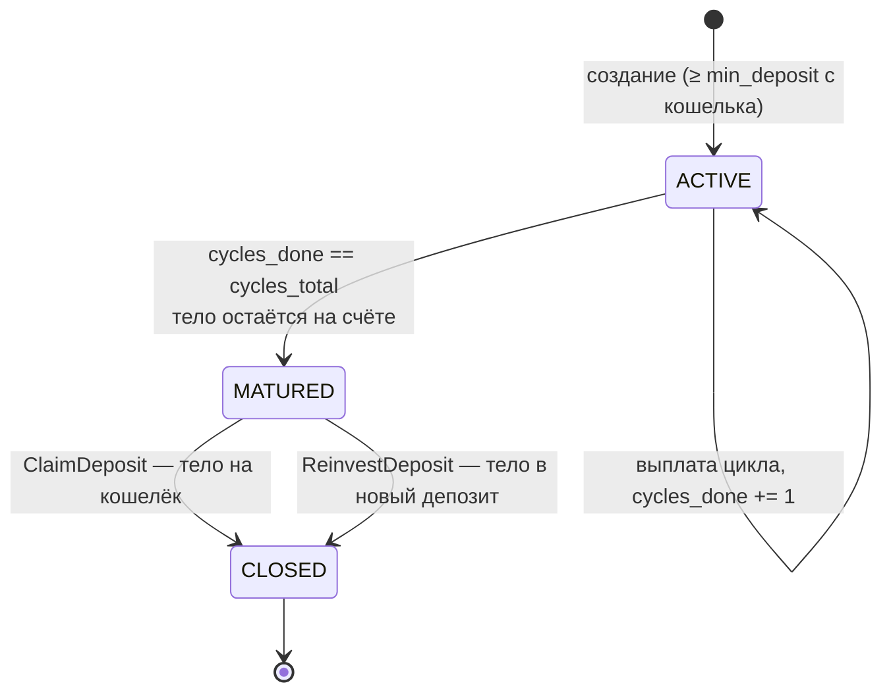

# Модуль: Стейкинг USDT (`staking`)

## 1. Описание

**Стейкинг** — партнёр вкладывает USDT в **депозит**. Депозит приносит **12 выплат**
дохода, по одной за цикл, после чего **созревает**: начисления прекращаются, но тело
остаётся на счёте депозита и ждёт решения партнёра — забрать на кошелёк либо
реинвестировать целиком в новый депозит. Автоматического возврата тела нет.

Длина цикла **зависит от окружения**: 30 суток на продакшене, 60 секунд на
стейджинге. Брать из `Config.cycle_interval_secs`, константу не зашивать.

Каждый прирост тела (создание депозита, реинвест дохода, реинвест тела) порождает **реферальные
выплаты вверх по спонсорскому дереву**. Их размер зависит от **ранга** получателя;
ранг берётся за личный **вклад** и командный **оборот**, за достижение положен
**бонус за достижение**.

### 1.1. Два процента, которые нельзя путать

В модуле есть две шкалы процентов. Это разные вещи, и объединить их в одну таблицу
нельзя.

| | **Тир** (`Staking.Tier`) | **Ранг** (`Staking.Rank`) |
|---|---|---|
| Что даёт | доход **со своих** денег | долю в раздаче **с чужих** депозитов |
| От чего зависит | сумма тел **активных** депозитов партнёра **сейчас** | личный вклад + командный оборот **за всё время** |
| Динамика | плавает: завершился депозит — сумма упала — ставка ниже | **никогда не понижается** |
| Диапазон | `"0.05"` … `"0.10"` за цикл | `"0.05"` … `"0.16"` от прироста тела в структуре |
| Когда вычисляется | на каждой выплате заново | при каждом изменении объёмов, последовательно вверх |

Партнёр может одновременно иметь **ранг 12** (16% с чужих депозитов, взят давно
командным оборотом) и **тир 5%** (минимальная ставка со своих, потому что сейчас
активных депозитов на $100).

Поверх тира может действовать **экстра-прибыль** (`Staking.ExtraPromo`, см. 4.5) — акция
с диапазоном дат: депозит, **созданный** в этом диапазоне, на каждой выплате получает
дополнительный процент от своего тела. Это не третья шкала, а добавка к тиру: от суммы
депозитов и от ранга она не зависит, только от даты создания депозита.

### 1.2. Соответствие терминов

Термины заказчика и имена в API/коде:

| Термин | В API | Значение |
|---|---|---|
| Вклад | `personal_volume` | Сумма максимальных тел по **всем** депозитам, когда-либо созданным партнёром, включая закрытые. Никогда не уменьшается |
| Оборот | `team_volume` | Вклад партнёра + учтённые объёмы всех веток. Это **не** выручка |
| Ветка | `Leg` | Личник первой линии со всем поддеревом |
| Объём ветки | `branch_volume` | Лидер ветки + все его нижестоящие |
| Лимит на ветку | `max_per_leg` | Максимум, который одна ветка даёт в оборот. **Сумма**, не доля |
| Премия за ранг | `achievement_bonus` | Разовый бонус за достижение ранга |

### 1.3. Соглашения о величинах

- **Деньги** — строками, как балансы `biconom.types.Ledger` (высокая точность,
  без потерь на `double`).
- **Ставки** — тоже строками, но не процентом, а **коэффициентом**: `5%` → `"0.05"`,
  `16%` → `"0.16"`. На коэффициент умножают напрямую (`выплата = тело × rate`),
  поэтому ни клиент, ни сервер не делят на 100 и не гадают о масштабе.
  Целочисленное «× 10 000» (как у `DividendPoolBonus.daily_rate`) здесь намеренно
  не используется: ошибка на порядок в таком представлении не видна глазом.
- **Валюта** — программа моно-валютная (USDT). `Config.currency_id` — валюта всей
  программы; `Deposit.currency_id` — валюта конкретного депозита, и **все** его
  денежные поля выражены именно в ней.

### 1.4. Деньги партнёра: что откуда берётся и что нельзя складывать

У партнёра в стейкинге **четыре** источника заработка, каждый в своём поле. Все они
приходят **обычным клиентским** `GetState` — прав админа для этого не нужно.

| Источник | Поле | Что входит | Что **не** входит |
|---|---|---|---|
| Доход своих депозитов по ставке тира | `State.summary.total_income_paid` | Все начисления по тиру за всё время, по всем депозитам, включая закрытые; и ушедшие на кошелёк, и ушедшие в тело | Экстра-прибыль, реферальные, бонусы за ранги |
| Экстра-прибыль своих депозитов | `State.summary.total_extra_paid` | Все начисления по акциям `ExtraPromo`, так же за всё время | Доход по тиру |
| Реферальная лестница | `State.total_referral_received` | Доли с приростов тел **чужих** депозитов, включая «токены упущенной выгоды» (по 0.000001 USDT) | Что-либо со своих депозитов |
| Бонусы за ранги | `State.total_achievement_bonus_received` | Только **выплаченные** бонусы | Бонусы, которые ещё ждут выплаты (`obligations[].released == false`) |

Сумму четырёх полей сервер отдаёт готовым числом:

```
State.total_earned = summary.total_income_paid
                   + summary.total_extra_paid
                   + total_referral_received
                   + total_achievement_bonus_received
```

Равенство точное, до минимальной единицы валюты. **Клиент ничего не складывает** — плитка
«Заработано» показывает `State.total_earned`.

**Какие поля пересекаются — их нельзя прибавлять друг к другу:**

| Поле | Почему нельзя прибавлять к заработанному |
|---|---|
| `summary.total_reinvested` | Это **часть** суммы `total_income_paid + total_extra_paid` — та, что ушла обратно в тела. Не отдельный доход |
| `Deposit.body`, `summary.active_total`, `summary.matured_total` | Тела уже содержат реинвестированную прибыль. `body + total_income_paid` считает её дважды |
| `summary.invested_total` | Сумма начальных сумм всех депозитов. Не заработок и не «свои вложенные деньги»: переложенное тело входит повторно, подарок компании — как вложение (см. 4.4) |
| `summary.personal_volume` | Квалификационный объём для рангов, а не деньги |
| `Event.IncomeReinvested.amount` | Перемещение уже начисленного (`IncomePaid` + `ExtraIncomePaid` того же цикла) в тело |

**Чего в `total_earned` нет:** WINZU по промо «токен за депозит» (другая валюта), подаренного
компанией депозита (`GrantDeposit`), невыплаченных бонусов за ранги, возврата собственного
тела (`ClaimDeposit`) и реинвеста тела (`ReinvestDeposit`).

**Две сводки с похожими именами полей:**

| | `Staking.DepositsSummary` | `Staking.Summary` |
|---|---|---|
| О ком | **один** партнёр | **весь** модуль, все партнёры сразу |
| Кто получает | сам партнёр — `State.summary` в клиентском `GetState`; админ — в админском `GetState` | **только** админ — `StakingAdminService.GetSummary` |
| Нужны ли права админа | **нет** | да |
| Одноимённые поля | `total_income_paid`, `total_extra_paid`, `matured_total` — по партнёру | те же имена — сумма по всем партнёрам |

Наличие поля в `Summary` не означает, что клиенту нужны права админа: своё значение партнёр
видит в `DepositsSummary`.

---

## 2. Депозит (`Staking.Deposit`)

### 2.1. Счёт депозита

Каждый депозит владеет **собственным счётом-леджером**:
`Ledger.Owner.staking_deposit_id`. Баланс этого счёта **и есть тело** — отдельного
поля с телом в хранилище не существует.

Флаги счёта: `ALLOW_DEBIT | ALLOW_CREDIT` **без** `ALLOW_NEGATIVE`. Счёт депозита —
реальное обязательство перед партнёром, уйти в минус он не может; ошибка расчёта
упрётся в отказ вместо тихой порчи данных.

### 2.2. Деньги депозита

| Поле | Смысл |
|---|---|
| `initial_amount` | С какой суммы депозит начался: списана с кошелька при создании. Не меняется никогда. При `BODY_REINVEST` это всё тело исходного депозита (вместе с реинвестированной прибылью), при `ADMIN_GRANT` — сумма подарка; то есть это **не** «сколько своих денег вложил партнёр» |
| `body` | Тело — сколько денег сейчас в депозите: у активного и созревшего — текущий баланс счёта, у закрытого — тело на момент закрытия. `body = initial_amount + прибыль, ушедшая в тело реинвестом прибыли` |
| `total_income_paid` | Начислено дохода **по ставке тира** за всё время, независимо от того, ушёл он на кошелёк или в тело. Экстра-прибыль, реферальные и бонусы за ранги сюда **не** входят |
| `total_extra_paid` | Начислено экстра-прибыли за всё время, тоже независимо от того, ушла она на кошелёк или в тело |
| `extra_rate` | Экстра-ставка **ближайшей** выплаты, коэффициентом (`"0.05"`). Всегда непустая; `"0.00"` — акции нет либо депозит больше не получает выплат (созрел или закрыт). Не зафиксирована в депозите, см. 4.5 |
| `extra_promo_id` | Версия акции, давшая `extra_rate`. `0` — акции нет |

Тело растёт **только** реинвестом прибыли (доход по тиру вместе с экстрой), поэтому
«сколько ушло в реинвест» = `body − initial_amount`. Отдельного поля нет намеренно —
величина выводится.

`total_income_paid` из `body` **не** выводится: доход мог уходить на кошелёк.

`total_income_paid` и `total_extra_paid` — **два отдельных** счётчика, они не пересекаются.
Сколько принёс **один депозит** — их сумма (отдельного поля на депозите нет). Сколько
партнёр заработал **всего** — `State.total_earned`, складывать по депозитам не нужно.

`body` с этими счётчиками **не складывают**: реинвестированная прибыль уже сидит и в теле,
и в счётчиках.

**Карточка депозита — какое поле для какой строки:**

| Строка | Откуда |
|---|---|
| Следующая выплата | `next_payout_at` — есть только у `ACTIVE`; у созревшего и закрытого пусто |
| Ожидаемый доход | `body × State.summary.current_rate` |
| Экстра-прибыль | `body × extra_rate`; при `extra_rate == "0.00"` строки нет |
| Куда уйдёт выплата | `reinvest_profit_applied`: `true` — в тело этого же депозита, `false` — на кошелёк |
| Заработано по депозиту | `total_income_paid + total_extra_paid` |

Обе ожидаемые суммы — **прогноз**, его считает клиент; сервер округляет вниз до минимальной
единицы валюты. Ставка тира выбирается в момент выплаты по сумме активных депозитов на тот
момент: если до выплаты сумма изменится (открыт новый депозит, созрел другой), изменится и
ставка.

### 2.3. Жизненный цикл


```mermaid
stateDiagram-v2
    [*] --> ACTIVE: создание (≥ min_deposit с кошелька)
    ACTIVE --> ACTIVE: выплата цикла, cycles_done += 1
    ACTIVE --> MATURED: cycles_done == cycles_total<br/>тело остаётся на счёте
    MATURED --> CLOSED: ClaimDeposit — тело на кошелёк
    MATURED --> CLOSED: ReinvestDeposit — тело в новый депозит
    CLOSED --> [*]
```

- Досрочно закрыть депозит **нельзя**.
- Последняя выплата депозит **не закрывает**. Она прекращает начисления и переводит
  его в `MATURED`; тело при этом никуда не двигается. Дальше решает партнёр, и
  **срока на решение нет** — депозит может висеть в `MATURED` сколько угодно, ничего
  не сгорает.
- `MATURED` **не входит** в `active_total` и на тир не влияет: депозит больше не
  зарабатывает, значит и ставку по остальным депозитам держать не должен. Иначе
  созревшие можно было бы не забирать и получать высокий тир даром.
- `CLOSED` означает ровно одно: тело ушло с депозита по решению партнёра.
  `closed_at` заполняется в этот момент, а не при созревании.
- `cycles_done` стартует с 0 и не может превысить `cycles_total`.

`Status` — перечисление, а не `bool`: в проекте статус сущности везде enum
(`Ledger.Status`, `Wallet.Status`), и добавить значение в enum — совместимое
изменение. Именно этим и воспользовался `MATURED`; он стоит **после** `CLOSED`,
потому что хранилище кодирует статус порядковым номером.

### 2.4. Два реинвеста — не путать

| Что | Как задаётся | Когда действует |
|---|---|---|
| **Реинвест прибыли** — выплата дохода уходит в тело этого же депозита | флаги `reinvest_profit_applied` / `reinvest_profit_requested` на депозите | на каждой выплате |
| **Реинвест тела** — всё тело созревшего депозита открывает новый | разовая команда `ReinvestDeposit` | один раз, по решению партнёра |

Флага `reinvest_deposit` больше нет: заранее заданного поведения при завершении не
существует.

Начальное значение реинвеста прибыли берётся из
`Config.settings.default_reinvest_profit` — клиент его при создании депозита **не
передаёт**. Менять после создания — `SetAutoReinvestProfit`.

**Отложенное отключение реинвеста прибыли.** Пара `applied` / `requested` нужна,
чтобы отключение вступало в силу не мгновенно, а после ближайшей выплаты:

| Действие | `requested` | `applied` | Что видит партнёр |
|---|---|---|---|
| Включил | `true` | `true` | «включено, действует сразу» |
| Подал заявку на отключение | `false` | `true` | «отключится после ближайшей выплаты, она ещё уйдёт в тело» |
| Система применила на выплате | `false` | `false` | «с этого цикла доход идёт на кошелёк» |

Правило одно: на выплате используется `applied`, после выплаты `applied = requested`.
Заявку можно отозвать до наступления выплаты.

### 2.5. Забор и реинвест тела созревшего депозита

Оба действия применимы **только** к депозиту в статусе `MATURED`; активный или уже
закрытый вернут `STAKING_DEPOSIT_NOT_MATURED`.

| | `ClaimDeposit` | `ReinvestDeposit` |
|---|---|---|
| Что делает | тело уходит на USDT-кошелёк | тело целиком открывает новый депозит |
| Статус сервиса | разрешён при **любом**, включая `STOPPED` | запрещён при `PAUSED` и `STOPPED` |
| Минимум входа | — | **не** проверяется: это не новая покупка |
| Реферальная раздача | нет | да, от полной суммы тела |
| Возвращает | закрытый исходный депозит | **новый** депозит |

Забрать своё тело партнёру запретить нельзя ни при каком статусе — поэтому кнопку
«забрать» по `service_status` прятать не нужно, а «реинвестировать» нужно.

Реинвест — это закрытие старого депозита и открытие нового **двумя группами
проводок** подряд: тело возвращается на кошелёк, затем с кошелька покупается новый
депозит. Обе выполняются одной операцией, поэтому между депозитами деньги не зависают; в
истории это две карточки — «возврат депозита» и «вложение». Для партнёра это движение своих
денег, а не доход: `State.total_earned` не меняется. Новый депозит помечен
`source = SOURCE_BODY_REINVEST`, получает новые 12 циклов и наследует **выбор
партнёра** по реинвесту прибыли, а не дефолт настроек.

Повторный реинвест того же тела невозможен: на один исходный депозит приходится не
больше одного порождённого (`STAKING_DEPOSIT_ALREADY_REINVESTED`).

### 2.6. Цепочка реинвестов — двусвязный список

Одни и те же деньги могут перекладываться из депозита в депозит сколько угодно раз.
Оба конца связи хранятся полями, поэтому цепочку проходят в **обе** стороны, не
перебирая список депозитов:

```
#1 CLOSED ──reinvested_into──▶ #7 CLOSED ──reinvested_into──▶ #12 ACTIVE
   ◀── source_deposit_id ─────    ◀── source_deposit_id ─────
```

| Поле | Направление | Когда 0 |
|---|---|---|
| `source_deposit_id` | назад, к депозиту-источнику | депозит создан вручную |
| `reinvested_into_deposit_id` | вперёд, к порождённому депозиту | депозит активен или созрел; тело забрано на кошелёк; это последнее звено |

Ненулевой `reinvested_into_deposit_id` бывает только у депозита в `CLOSED` и
совпадает с `Event.DepositClosed.reinvested_into_deposit_id`.

---

## 3. Ранги и квалификация

### 3.1. Условия

Ранг считается достигнутым, когда выполнены **оба** условия одновременно:
`personal_volume ≥ required_personal_volume` **и**
`team_volume ≥ required_team_volume`.

Пересчёт идёт **не с первого ранга**, а от текущего: проверяются условия следующего,
и так по циклу вверх, пока выполняются. **Перескок невозможен** — партнёр,
выполнивший условия сразу нескольких рангов, получает их последовательно, и за
каждый создаётся своё обязательство по бонусу.

Ранг **никогда не понижается**: хранится достигнутый максимум, даже если объёмы
позже упали.

### 3.2. Командный оборот и лимит на ветку

```
team_volume = personal_volume(партнёр)
для каждой ветки C первой линии:
    если leader_personal_volume(C) > max_per_leg:
        team_volume += leader_personal_volume(C)   // весь вклад лидера,
                                                   // нижестоящие НЕ учитываются
    иначе:
        team_volume += min(branch_volume(C), max_per_leg)
```

`max_per_leg` задан **суммой**, а не долей — чтобы на разных рангах можно было
задать разные правила. По умолчанию это **34% требуемого оборота, округлённые
вниз**: три максимальные ветки покрывают 102% требования, то есть ранг остаётся
достижимым с запасом. Инвариант `3 × max_per_leg ≥ required_team_volume`
проверяется тестом.

`RankProgress` отдаёт две величины оборота: `team_volume` — **засчитанный** под
следующий ранг (с лимитами), и `team_volume_uncapped` — **полный** оборот команды без
лимитов. Разница между ними и есть «сколько срезал лимит на ветку».

`Staking.Leg` раскрывает расчёт по каждой ветке: сколько засчиталось, сработал ли
лимит (`capped`), взят ли весь вклад лидера (`leader_exceeds_cap`). Это и есть ответ
на вопрос «почему я не взял ранг».

Поскольку `max_per_leg` зависит от **проверяемого** ранга, величина `team_volume` в
`RankProgress` имеет смысл только в паре со **следующим** рангом — на максимальном
ранге она отсутствует.

#### Карточки лидеров веток

`legs` отдаёт по ветке только `distributor_id`. Рядом идут дедуплицированные
справочники `distributors` и `accounts` — чтобы показать список веток с логином и
аватаром без запроса на каждую:

```
Leg.distributor_id → Distributor.id → Distributor.account_id → Account.id → Account.user
```

`Account.user` несёт аватар, статус присутствия и контакты. В `distributors`
попадает и САМ партнёр, чей прогресс запрошен, — под карточку в шапке экрана;
его идентификатор лежит в `RankProgress.distributor_id`, а его цифры по депозитам
— в `RankProgress.summary` (та же модель `DepositsSummary`, что в `State`). Внутри
`State` это поле пустое: сводка там уже есть на верхнем уровне. Оба
списка пусты, когда пуст `legs`, — то есть всегда внутри `State`.

#### Сколько партнёров в структуре реально в стейкинге

Объёмы показывают деньги, а число участников — отдельные счётчики:

| Поле | Что считает |
|---|---|
| `RankProgress.stakers_partners` | личников первой линии, купивших хотя бы один депозит |
| `RankProgress.stakers_team` | то же по всей команде — поддерево БЕЗ самого партнёра |
| `Leg.personal_activated` | активировал ли депозит САМ лидер ветки |
| `Leg.stakers_partners` | активированных личников у лидера ветки |
| `Leg.stakers_team` | активированных во всей команде лидера ветки, БЕЗ него самого |

Считаются **партнёры, а не депозиты**: второй депозит того же человека счётчик не
двигает. Учёт пожизненный — созревание, забор тела и закрытие депозита партнёра
из счёта не убирают, ровно как и `personal_volume`. Лимит на ветку на счётчики не
влияет: это метрика структуры, а не денег.

Поля `RankProgress` читаются за `O(1)` и приходят также внутри `State`; поля
внутри `Leg` — только там, где есть сам `legs`.

### 3.3. Реферальная лестница

```
paid_amount = 0                            # сколько уже причиталось звеньям ниже, в ДЕНЬГАХ
paid_percent = 0
для каждого предка A вверх по спонсорскому дереву, начиная с прямого спонсора:
    p = referral_percent(rank(A))          # 0, если ранга нет
    если p > paid_percent:
        due = floor(base × p)              # сколько всего причитается по рангу A
        начислить A: due − paid_amount     # ровно недостающую разницу
        paid_amount = due
        paid_percent = p
    если выбран потолок 16% от base: стоп
дойдя до корня — стоп
```

- Сравниваются **проценты**, а не номера рангов.
- Округление — один раз на накопленной сумме, а не на каждой разнице: всего раздаётся ровно
  `floor(base × наибольший процент в цепочке)`.
- Предок, мимо которого лестница прошла, не начислив ничего (нет ранга, ранг не выше уже
  выбранного нижними, либо доля округлилась до нуля), получает **«токен упущенной выгоды»** —
  одну минимальную единицу валюты (0.000001 USDT) за счёт компании, с заполненным
  `lost_profit`. Токен — настоящие деньги: он входит в `State.total_referral_received` и в
  `State.total_earned`. На доли остальных он не влияет.
- **Забаненные не пропускаются** — получают наравне со всеми. Причина: бан бывает
  временным, а отданные выше деньги не вернуть.
- Недобранное до 16% **никуда не идёт**: из пула списывается ровно распределённая
  сумма, а не 16% с последующим возвратом остатка.
- Раздача идёт по рангам, достигнутым **до** этой операции; пересчёт рангов
  выполняется **после**.

### 3.4. Бонус за достижение (`Staking.Obligation`)

Бонус не выплачивается напрямую — он материализуется как **обязательство**,
и делает это **всегда**, когда у ранга есть бонус: и при автоматической выплате, и
при ручной. Так весь список достижений виден в одном месте, без деления на «авто» и
«ручные».

- `released == false` — деньги ещё не выплачены, ожидание решения админа.
- `released == true` — выплачено; `released_by_user_id == 0` означает «автоматически».
- Отказать в бонусе нельзя: состояний ровно два, статуса «отменено» нет.
- `amount` — **снимок** на момент достижения: последующее изменение таблицы рангов
  уже созданные обязательства не меняет.
- Идемпотентность — по паре `(distributor_id, rank)`: бонус за ранг выплачивается
  один раз за всю жизнь аккаунта.

Автовыплата настраивается **отдельно для каждого ранга**
(`Staking.RankBonusSetting`). Включение флага действует только на **будущие**
достижения — уже висящие обязательства автоматически не выплачиваются, иначе одно
переключение тумблера разом выпустило бы все накопленные суммы.

---

## 4. Конфигурация (`Staking.Config`)

Делится на две части с разным жизненным циклом.

### 4.1. Захардкожено, меняется только пересборкой

`ranks`, `tiers`, `cycles_total`, `cycle_interval_secs`, `currency_id`.

`cycle_interval_secs` из этого списка — единственное, что зависит от **окружения**:
2 592 000 (30 суток) на продакшене и **60** на стейджинге, иначе полный путь депозита
до созревания нельзя пройти руками. Значение приходит на старте сервиса, не хранится
в БД (копия базы стейджинга иначе принесла бы минутный цикл на прод) и попадает в
депозит **снимком** — у уже открытых расписание не переписывается.

Остальное — экономика программы. Она в коде, а не в YAML, потому что: конфиг читается один
раз на старте (правка файла всё равно требует рестарта); опечатка в ключе YAML не
падает, а тихо подставляет дефолт; трёх env-конфигов пришлось бы держать
синхронными; инвариант `3 × max_per_leg ≥ required_team_volume` с константами
проверяется тестом в CI, а не на проде.

### 4.2. Изменяется админом на лету (`Staking.Settings`)

| Поле | Что это |
|---|---|
| `min_deposit` | Минимальная сумма создания депозита. На реинвест прибыли и на `ReinvestDeposit` **не** действует |
| `default_reinvest_profit` | Реинвест прибыли для новых депозитов. **Единственный** источник флага: клиент его в `CreateDeposit` не передаёт |
| `service_status` | Можно ли покупать новые депозиты |

Изменения персистентны, переживают рестарт и действуют на **будущие** депозиты —
у уже открытых ничего не переписывается.

### 4.3. Статусы сервиса

| Статус | `CreateDeposit` | `ReinvestDeposit` | `ClaimDeposit` | Выплаты и реинвест прибыли |
|---|---|---|---|---|
| `ACTIVE` | можно | можно | можно | идут |
| `PAUSED` | **нельзя** | **нельзя** | **можно** | **идут** |
| `STOPPED` | нельзя | нельзя | **можно** | заморожены; плановые моменты накапливаются и догоняются после возврата в `ACTIVE` |

`PAUSED` останавливает **продажи** — и обычную покупку, и реинвест тела: последний
тоже решение вложить деньги. Выплаты и реинвест прибыли при этом идут: они исполняют
уже принятое обязательство.

`ClaimDeposit` не смотрит на статус вовсе: забрать своё тело партнёру нельзя
запретить даже при полной остановке модуля.

---

## 4.4. Сводка по депозитам (`Staking.DepositsSummary`)

Личные цифры **одного** партнёра по его депозитам. Партнёр получает их **обычным клиентским**
`GetState` — это поле `State.summary`; прав админа не нужно. Та же модель приходит в
`RankProgress.summary` (`GetRankProgress`) и в админском `GetState`.

> **Не путать с `Staking.Summary`** (раздел 4.7): та сводка — по всему модулю, по всем
> партнёрам сразу, и доступна только админу. Одноимённые поля (`total_income_paid`,
> `total_extra_paid`, `matured_total`) здесь — про одного партнёра.

**Фильтр списка депозитов на сводку не влияет**: она всегда считается по всем депозитам,
включая закрытые, поэтому страница «мои депозиты» обходится одним запросом.

| Поле | Что входит | Что **не** входит |
|---|---|---|
| `active_count`, `active_total` | Число и сумма тел депозитов в статусе `ACTIVE` — деньги, которые работают сейчас; база выбора тира. В телах — начальные суммы, реинвестированная прибыль, подаренные депозиты, депозиты вне маркетинга | Созревшие и закрытые депозиты, деньги на кошельке |
| `current_rate` | Ставка **тира** за цикл по `active_total`. Всегда непустая; `"0.00"` = начислять нечего | Экстра-ставка — она у каждого депозита своя (`Deposit.extra_rate`) |
| `matured_count`, `matured_total` | Число и сумма тел созревших депозитов — столько можно забрать или реинвестировать прямо сейчас | В `active_total` не входит |
| `total_count` | Сколько депозитов было за всё время, включая закрытые. Депозит, открытый `ReinvestDeposit`, считается отдельным | — |
| `invested_total` | Сумма `initial_amount` **всех** депозитов за всё время | Рост тела внутри депозита (он в `total_reinvested`) |
| `personal_volume` | Личный вклад для рангов: растёт на каждый прирост тела (создание, реинвест прибыли, реинвест тела) и не уменьшается при закрытии | Депозиты вне маркетинга (`marketing_blocked`) |
| `total_income_paid` | Доход **по ставке тира** за всё время по всем депозитам — и ушедший на кошелёк, и ушедший в тела | Экстра-прибыль, реферальные, бонусы за ранги |
| `total_extra_paid` | Экстра-прибыль за всё время по всем депозитам | Доход по тиру |
| `total_reinvested` | Сколько из `total_income_paid + total_extra_paid` ушло обратно в тела реинвестом прибыли | Реинвест тела (`ReinvestDeposit`) |

Три вещи, на которых легко ошибиться:

- **`total_reinvested` — часть заработанного, а не добавка к нему.** На кошелёк ушло
  `total_income_paid + total_extra_paid − total_reinvested`. Поскольку в реинвест уходит доход
  вместе с экстрой, `total_reinvested` может превышать `total_income_paid`.
- **`invested_total` — не «сколько своих денег внёс партнёр».** Тело, переложенное
  `ReinvestDeposit`, входит повторно — как `initial_amount` нового депозита, уже вместе с
  реинвестированной прибылью; подаренный компанией депозит входит наравне с купленным. Для
  плитки «сколько у меня сейчас в депозитах» это поле не годится — нужно `active_total`
  (плюс `matured_total`, если считать и созревшие; эти два поля не пересекаются).
- **`personal_volume` — не деньги.** Это квалификационный объём. Пока у партнёра нет депозитов
  вне маркетинга, `personal_volume = invested_total + total_reinvested`; с таким депозитом вклад
  может быть и **меньше** `invested_total`.

Реферальных и бонусов за ранги в этой сводке нет — они в `State` (раздел 4.6).

## 4.5. Экстра-прибыль (`Staking.ExtraPromo`)

Акция: **дополнительная ставка сверх ставки тира** для депозитов, **созданных** в
заданный диапазон времени.

### Правило начисления

На каждой выплате цикла сервис берёт дату **создания** депозита (`Deposit.created_at`,
**не** момент выплаты) и ищет действующую акцию, в диапазон которой она попадает.

- Нашлась — к доходу цикла **в той же группе проводок** добавляется **отдельная проводка**
  `тело × rate` (событие `ExtraIncomePaid`, карточка `staking_extra_income`).
- Не нашлась — экстра-прибыль равна нулю, ничего не приходит.
- Реинвест прибыли включён — в тело депозита уходят **доход и экстра вместе**
  (`IncomeReinvested.amount` = `IncomePaid.amount` + `ExtraIncomePaid.amount`).
- Реинвест выключен — обе суммы идут на кошелёк, двумя проводками.

Диапазон: `Deposit.created_at >= deposit_created_at_ge` **и**
`Deposit.created_at < deposit_created_at_lt` — нижняя граница включается, верхняя нет.

**Диапазон ограничивает дату создания депозита, а не период выплат.** Депозит, созданный в
диапазоне, получает экстру на **каждой** своей выплате, пока акция остаётся действующей, — в
том числе после того, как диапазон закончился, до самого созревания (до 12 выплат). Акция
«на октябрь» означает «депозиты, открытые в октябре, получают экстру весь свой срок», а не
«экстра платится в октябре». Остановить выплаты можно только новой версией акции
(деактивация, другие даты или ставка) — с ближайшей выплаты каждого депозита.

Депозит, открытый `ReinvestDeposit`, — новый депозит: в акцию он попадает по **своей** дате
создания, а не по дате исходного.

Экстра считается от тела депозита (`тело × rate`, округление вниз) и не зависит ни от ставки
тира, ни от суммы депозитов, ни от ранга. Это не промо «токен за депозит» (WINZU) — та акция
к экстра-прибыли отношения не имеет.

### Модель

| Поле | Смысл |
|---|---|
| `id` | Идентификатор **версии**. У каждой правки свой id |
| `deposit_created_at_ge` / `deposit_created_at_lt` | Диапазон дат создания депозита. `ge` включается, `lt` не включается, `lt` строго больше `ge` |
| `rate` | Экстра-ставка за цикл — **коэффициент** строкой (`5%` → `"0.05"`). Прибавляется к ставке тира, применяется к телу депозита |
| `status` | Битовая маска (`StatusBit`). `0` — **действующая** |
| `prev_id` / `next_id` | Цепочка **действующих**: соседи по времени (раньше / позже). `0` — соседа нет либо запись не в цепочке |
| `version_prev_id` / `version_next_id` | Цепочка **версий**: прошлая версия (`0` — первая) / новая (`0` — верхняя, текущая) |
| `created_by_user_id` | Админ, создавший версию. Только в админском API, клиенту приходит `0` |
| `created_at` / `updated_at` | Момент создания версии / последнего изменения ссылок или статуса |

Биты `status` независимы и могут быть взведены оба: деактивированную акцию тоже можно
заменить новой версией.

| `StatusBit` | Значение | Смысл |
|---|---|---|
| `STATUS_BIT_UNSPECIFIED` | 0 | Заглушка proto3, в маске не используется. Действующая акция — это маска `0` |
| `STATUS_BIT_ARCHIVED` | 1 | Запись заменена новой версией и ушла вниз по цепочке версий. Новая версия — `version_next_id` |
| `STATUS_BIT_DEACTIVATED` | 2 | Акция выключена админом: в цепочке действующих её нет, диапазон она не занимает, экстра по ней не платится |

### Две цепочки

Запись **неизменяема**: любая правка (даты, ставка, статус) — это **новая** запись, то есть
новая версия. Меняются у существующей записи только ссылки цепочек и бит `ARCHIVED`,
значения (даты, ставка) не переписываются никогда.

```
Цепочка действующих (status == 0, диапазоны не пересекаются, по времени):
   #3 ◀─ prev_id / next_id ─▶ #9 ◀─ prev_id / next_id ─▶ #14

Цепочка версий одной акции (новая сверху):
   #14 ──version_prev_id──▶ #9 ──version_prev_id──▶ #3
       ◀──version_next_id──     ◀──version_next_id──
```

У архивной записи соседей `prev_id` / `next_id` уже нет — остаётся только цепочка версий.

### Что влияет на уже выплаченное

| Действие | Будущие выплаты | Выплаченное |
|---|---|---|
| Акция создана **для прошлого диапазона** | Депозиты, открытые в нём, получают экстру со своей **ближайшей** выплаты | За прошедшие циклы **не** доначисляется |
| Выпущена новая версия (даты, ставка, статус) | Меняются у уже открытых депозитов | **Не** пересчитывается: ставка сохранена в событии и в карточке транзакции |

### Где видно клиенту

| Что | Где |
|---|---|
| Акция, действующая **сейчас** (для нового депозита) | `State.extra_promo` — отсутствует, если такой нет |
| Ставка **открытого** депозита | `Deposit.extra_rate`, у каждого депозита по своей дате создания |
| Сколько начислено | `Deposit.total_extra_paid` — по депозиту; `State.summary.total_extra_paid` — по всем депозитам партнёра. Оба поля приходят в клиентском `GetState` |
| Всё заработанное вместе с экстрой | `State.total_earned` |

Сервер **не** отдаёт прогнозной суммы: ожидаемую экстру клиент считает сам как
`Deposit.body × Deposit.extra_rate`.

Список акций, история версий, создание и правка — только админ
(`StakingAdminService`, см. [`admin/staking/staking.md`](../admin/staking/staking.md)).

## 4.6. Состояние партнёра (`Staking.State`) и «всего заработано»

`State` — всё, что нужно главному экрану, одним запросом. Партнёр получает его клиентским
`StakingService.GetState`, админ — по любому партнёру через `StakingAdminService.GetState`;
денежные поля считаются одинаково.

| Поле | Смысл |
|---|---|
| `summary` | Сводка по своим депозитам — `DepositsSummary`, раздел 4.4 |
| `deposits` | Депозиты: активные и созревшие всегда, закрытые — по флагу. На суммы флаг не влияет |
| `to_next_tier`, `next_tier_rate` | Сколько `summary.active_total` не хватает до следующей ступени тира и её ставка. Отсутствуют **только** на максимальном тире; ниже первой ступени (в том числе без единого депозита) это расстояние до первой ступени |
| `total_referral_received` | Получено по реферальной лестнице с **чужих** депозитов за всё время, включая токены упущенной выгоды |
| `total_achievement_bonus_received` | **Выплаченные** бонусы за ранги: сумма `obligations[].amount` с `released == true` |
| `obligations` | Все бонусы за ранги, включая ещё не выплаченные |
| `extra_promo` | Акция экстра-прибыли для депозита, открываемого **сейчас** |
| `total_earned` | **Всего заработано** — одно число, см. ниже |

### `total_earned`

```
total_earned = summary.total_income_paid          — доход своих депозитов по тиру
             + summary.total_extra_paid           — экстра-прибыль своих депозитов
             + total_referral_received            — реферальные с чужих депозитов
             + total_achievement_bonus_received   — ВЫПЛАЧЕННЫЕ бонусы за ранги
```

Считает сервер, по **всем** депозитам партнёра, включая закрытые; от флага
`include_closed_deposits` число не зависит. Валюта — валюта программы (USDT). Число только
растёт.

Каждый доллар входит ровно один раз:

| Операция | Что с `total_earned` |
|---|---|
| Создание депозита, подарок компании (`GrantDeposit`) | не меняется — это вложение, а не доход |
| Выплата цикла на кошелёк | растёт на доход по тиру и экстру |
| Выплата цикла с реинвестом прибыли | растёт на те же суммы **один** раз; `total_reinvested` сверху не прибавляется |
| Доля лестницы или токен упущенной выгоды с чужого депозита | растёт на полученную сумму |
| Достигнут ранг, бонус ждёт выплаты | не меняется |
| Бонус за ранг выплачен (автоматически или админом) | растёт на сумму бонуса |
| Созревание, `ClaimDeposit`, `ReinvestDeposit` | не меняется — движение своих денег |
| WINZU по промо «токен за депозит» | не меняется — другая валюта |

Это «сколько заработано», а не «сколько сейчас есть»: заработанное могло уйти в тела
реинвестом или быть потрачено с кошелька. Остаток денег в депозитах —
`summary.active_total + summary.matured_total`.

### Главный экран: какое поле для какого элемента

| Элемент экрана | Поле |
|---|---|
| Плитка «Текущий депозит» | `summary.active_total` — сумма тел работающих депозитов. Созревшие, ждущие решения, — отдельно в `summary.matured_total`; все деньги в депозитах = сумма двух полей |
| Плитка «Заработано» | `total_earned` — готовое число, складывать ничего не нужно |
| Плитка «Текущая доходность» | `summary.current_rate`; до следующей ступени — `to_next_tier`, её ставка — `next_tier_rate` |
| Плитка ранга | `rank.current_rank`; процент лестницы и требования — строка `Config.ranks` с этим номером; следующий ранг — `rank.next` |
| Карточка депозита: следующая выплата | `Deposit.next_payout_at` |
| Карточка депозита: ожидаемый доход | `Deposit.body × summary.current_rate` |
| Карточка депозита: экстра-прибыль | `Deposit.body × Deposit.extra_rate`; при `"0.00"` строки нет |
| Диалог нового депозита: «Extra profit» | `extra_promo.rate`; нет `extra_promo` — строки нет |
| Диалог нового депозита: минимальная сумма | `settings.min_deposit` |

## 4.7. Сводка модуля (`Staking.Summary`) — только админ

Итоги по **всему** модулю, по всем партнёрам сразу. Единственный источник —
`StakingAdminService.GetSummary`; клиентское приложение это сообщение не получает.

| Поле | Смысл |
|---|---|
| `total_in_deposits` | Тела, которые программа держит: активные **плюс** созревшие, но не забранные |
| `matured_total` | Тела созревших депозитов. **Входит** в `total_in_deposits` |
| `deposits_active`, `deposits_matured`, `deposits_total` | Счётчики депозитов; `deposits_total` — все за всё время, включая закрытые |
| `total_income_paid` | Выплачено дохода по ставке тира всем партнёрам. Экстра не входит |
| `total_extra_paid` | Выплачено экстра-прибыли всем партнёрам |
| `total_referral_paid` | Выплачено долей реферальной лестницы. Токены упущенной выгоды **не** входят — они идут из отдельного пула и в сводке не показаны |
| `total_achievement_bonus_paid` | **Выплаченные** бонусы за ранги |
| `obligations_pending_amount`, `obligations_pending_count` | Невыплаченные бонусы за ранги — долг компании, в доход партнёров ещё не вошёл |

Четыре поля «выплачено» читаются из балансов пулов компании и не пересекаются: всего
выплачено партнёрам — их сумма. Сумма `State.total_earned` по всем партнёрам больше этого
итога ровно на токены упущенной выгоды. Подаренных депозитов (`GrantDeposit`) и WINZU по
промо в сводке нет.

## 5. Журнал событий (`Staking.Event`)

Изолированный поток событий стейкинга: и собственные депозиты партнёра, и доли
реферальной лестницы, пришедшие с депозитов структуры — весь его заработок в модуле
одной лентой.

| Событие | Когда |
|---|---|
| `DepositOpened` | создан депозит (вручную, реинвестом тела или подарком компании). Не доход |
| `DepositGranted` | депозит подарен компанией (`GrantDeposit`); несёт группу проводок подарка. Не заработок стейкинга |
| `IncomePaid` | начислен доход **по ставке тира** за цикл. Если доход цикла нулевой (ставка `"0.00"`), события нет |
| `ExtraIncomePaid` | начислена экстра-прибыль за цикл (акция `ExtraPromo`), в той же группе проводок, что и `IncomePaid` |
| `IncomeReinvested` | заработанное за цикл ушло в тело того же депозита. `amount` — доход **вместе** с экстрой, если она была. **Не новый доход**: те же деньги, что в `IncomePaid` и `ExtraIncomePaid` этого цикла |
| `PromoTokenReceived` | подарен WINZU по промо «токен за депозит». Сумма в WINZU, в долларовые итоги не входит |
| `MarketingBlockChanged` | админ переключил блокировку маркетинга у депозита. Денег не двигает |
| `AutoReinvestChanged` | переключение реинвеста прибыли — партнёром или системой |
| `DepositMatured` | депозит отработал все циклы и ждёт решения партнёра. Денег не двигает, `ledger_group_id = 0` |
| `DepositClosed` | тело ушло с депозита: на кошелёк (`reinvested_into_deposit_id == 0`) либо в новый депозит |
| `RankAchieved` | взят новый ранг |
| `RankBonusReleased` | бонус за ранг выплачен — автоматически либо админом |
| `ReferralReceived` | пришла доля лестницы с депозита нижестоящего партнёра |

`RankAchieved` и `RankBonusReleased` — разные моменты: между достижением ранга и выплатой
бонуса могут пройти недели ручной модерации. Первое денег не двигает
(`ledger_group_id == 0`), второе — двигает.

**Какие события — заработок.** В `State.total_earned` входят суммы ровно четырёх событий:

| Событие | В какое слагаемое |
|---|---|
| `IncomePaid.amount` | `summary.total_income_paid` |
| `ExtraIncomePaid.amount` | `summary.total_extra_paid` |
| `ReferralReceived.amount` | `total_referral_received` |
| `RankBonusReleased.amount` | `total_achievement_bonus_received` |

Остальные события заработком не являются: `DepositOpened`, `DepositMatured`, `DepositClosed`
и `IncomeReinvested` — движение своих денег между кошельком и депозитом, `DepositGranted` —
подарок, `PromoTokenReceived` — WINZU.

`ReferralReceived` — единственное событие, приходящее не от своего депозита. У него
`Event.deposit_id == 0`, а депозит-источник лежит внутри payload: иначе чужое начисление
всплывало бы в `ListDepositEvents` одноимённого своего депозита.

Оно же несёт **`lost_profit`** — сколько партнёр получил бы с этого начисления на
максимальном ранге, минус то, что получил. Считается от той же базы и того же
`paid_before_percent`: часть процента уже забрали нижестоящие звенья цепочки, и вернуть её
ростом собственного ранга нельзя. Величина справочная — этих денег не существует, это
показатель «сколько даст рост ранга».

Два индекса: `(distributor_id, seq)` — вся история партнёра, и `(deposit_id, seq)` —
история конкретного депозита. `seq` — порядковый номер **в рамках партнёра**.

### 5.1. Время события

`ts` — **бизнес-время**, а не время обработки. Для выплат это **плановый** момент
цикла: при догоне после простоя сервиса плановый и фактический моменты расходятся,
и в истории должен стоять плановый.

### 5.2. Самодостаточность `IncomePaid`

Событие несёт доказательство расчёта, поэтому поддержка отвечает на вопрос «почему
7%, а не 8%» не заглядывая в состояние системы, которого уже нет:

```
tier(active_deposits_total)  == rate
body_at_payout × rate        == amount
```

`ExtraIncomePaid` самодостаточно так же: `body_at_payout × rate == amount`, а применённая
ставка и версия акции (`extra_promo_id`) сохранены в событии — последующие версии акции
уже выплаченное не меняют.

---

## 5.3. Журнал как индекс финансовых транзакций

Каждое **денежное** событие журнала несёт `ledger_group_id` — группу проводок, которой оно
порождено. Безденежные (`DepositMatured`, `AutoReinvestChanged`, `RankAchieved`) несут `0`.

Благодаря этому журнал работает индексом для клиентских методов
`ListTransactions` / `ListDepositTransactions`: они выбирают из него `ledger_group_id`,
дедуплицируют и отдают через тот же упаковщик, что `TransactionService.History`. Отдельного
индекса групп не заводится — он был бы вторым представлением того же факта.

Следствие, о котором надо помнить при добавлении новых денежных операций: **операция,
создавшая группу проводок, но не записавшая событие журнала, выпадет из финансовой истории
стейкинга**. Инвариант закреплён тестом
`every_staking_money_group_is_reachable_from_the_transaction_list`.

Одна группа обычно даёт несколько событий: доход, его реинвест в тело и доли лестницы
нижестоящим — всё это одна группа проводок. Поэтому лимит страницы считается в **группах**,
а не в событиях.

---

## 6. Инварианты

| | |
|---|---|
| Тело депозита — баланс его счёта; отдельного поля нет, двойной учёт исключён по построению |
| `cycles_done ≤ cycles_total`; 13-й цикл невозможен |
| Последняя выплата тело **не двигает**: депозит созревает, тело остаётся на его счёте |
| Возврат тела со старого депозита и открытие нового при реинвесте тела — **две группы проводок**, выполняемые одной операцией |
| `State.total_earned` = доход по тиру + экстра + реферальные + выплаченные бонусы за ранги; каждый доллар входит один раз. Если других операций по кошельку не было: кошелёк + тела живых депозитов = внесено извне + `total_earned` |
| При одновременных выплатах сумма активных депозитов берётся снимком на начало пачки: результат не зависит от порядка обработки |
| Все денежные округления — **вниз**. Никогда не выплачиваем больше положенного |
| Счёт депозита не может уйти в минус |
| Лестница раздаётся по рангам, достигнутым **до** операции; пересчёт рангов — после |
| Из пула списывается ровно распределённая сумма; недобранное до 16% не списывается |
| Ранг монотонно не убывает |
| Ранги берутся последовательно, за каждый — своё обязательство |
| Идемпотентность выплат — по `(deposit_id, payout_seq)`; бонусов — по `(distributor_id, rank)`; реинвеста тела — по `reinvested_into_deposit_id` источника |
| `3 × max_per_leg ≥ required_team_volume` для каждого ранга |
| Бан не влияет на стейкинг ни в одной точке |
| Экстра-прибыль определяется датой **создания** депозита, а не моментом выплаты |
| Экстра идёт той же группой проводок, что и доход цикла, **отдельной** проводкой; в `total_income_paid` и `total_extra_paid` они не смешиваются |
| Запись `ExtraPromo` неизменяема: правка — новая версия, прежняя получает `ARCHIVED`. Диапазоны **действующих** акций не пересекаются |

---

## 7. Сервисы

- **Клиент** — [`biconom/client/staking/staking.md`](../client/staking/staking.md)
- **Админ** — [`biconom/admin/staking/staking.md`](../admin/staking/staking.md)
