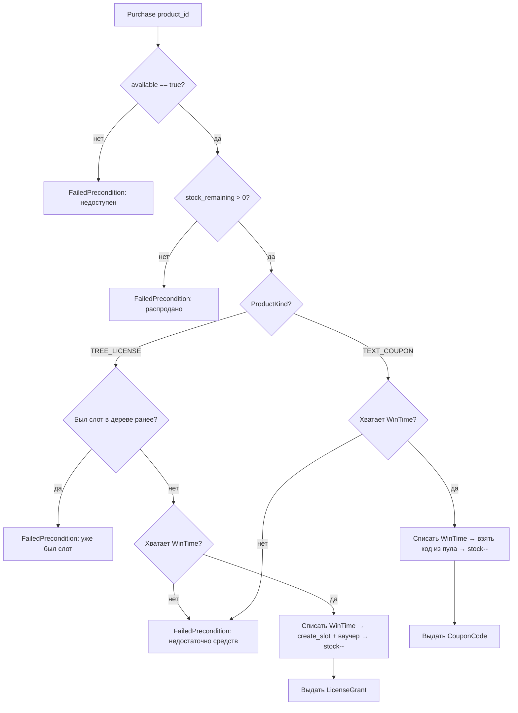

# Модуль: WinTime Shop (`wintime_shop`)

## 1. Описание

**WinTime Shop** — магазин, где за WinTime-токены дистрибьютор покупает товары и
услуги. Оплата — списание WinTime с ledger покупателя (валюта `WIN_TIME`,
precision 0, целые токены). Списание идёт с дистрибьютора, под которым авторизован
пользователь (id из контекста авторизации, не из запроса).

Товары делятся на **два семейства** (`WintimeShop.Product.Kind`), с разной механикой
покупки и способом выдачи:

| Семейство | Пример | Что выдаётся | Тираж (остаток) | Ограничение |
|---|---|---|---|---|
| `TREE_LICENSE` | «Win Lite» (20 000 WinTime) | Лицензия-ваучер на слот в дереве (грант в MLM) | Целочисленная квота | Один раз на дистрибьютора на дерево |
| `TEXT_COUPON` | VPN, «Контент-завод», Банковская карта | Уникальный текстовый код (копируется во внешний продукт) | Пул загруженных кодов | Код уникален **в пределах товара** |

Каждый товар имеет флаг доступности (`available`) и остаток к продаже
(`stock_remaining`). Оба поля управляются админом.

**Идентификация товара.** У товара два стабильных ключа, любой из которых
адресует его в API через `WintimeShop.Product.Id` (`oneof { id | code }`):
- `id` (uint32) — числовой ключ, назначается сервером при создании;
- `code` (string) — строковый slug для фронта («понять, что это за товар»).
  Обязателен, уникальный, **неизменяемый** после создания. Нормализуется сервером:
  пробелы по краям срезаются, приводится к нижнему регистру; допустимы только
  латинские буквы, цифры и подчёркивание (`[a-z0-9_]+`) — иначе `InvalidArgument`.

## 2. Семейства товаров

### 2.1. `TREE_LICENSE` — лицензия на слот в дереве

Покупка лицензии для дерева (например «Win Lite» — лицензия для первого дерева,
`tree_id = 1`). При покупке в MLM создаётся/используется слот и создаётся
ваучер-лицензия (механика `create_slot` + `slot_license_voucher`).

**Жёсткое ограничение** — купить можно, только если у дистрибьютора **НИКОГДА не
было слота в этом дереве**, независимо от того, был ли ваучер на слоте активен.
Проверка durable (переживает soft-delete слота): наличие записи
`(tree_id, distributor_id)` в `tree_distributor`. Таким образом, лицензию можно
купить только себе и только один раз на дерево.

Тираж — целочисленная квота остатка (`stock_remaining`), управляемая админом
(`AdjustLicenseStock`: ADD / SUBTRACT / SET). Покупка декрементирует квоту.

### 2.2. `TEXT_COUPON` — текстовый купон

Пул заранее загруженных админом текстовых кодов. При покупке пользователю
выдаётся один неиспользованный код, который он копирует и вставляет во внешнем
приложении (скидка/возможности во внешнем продукте). Код выдаётся ровно один раз.

**Уникальность** — код уникален **в пределах товара** (нельзя переиспользовать код
в рамках своей группы; каждый купон только для своего товара). Один и тот же код у
**разных** товаров — допустим (важна только уникальная группа).

Тираж — размер пула неиспользованных кодов (`stock_remaining`). Пополняется
загрузкой новых кодов (`LoadCoupons` с проверкой уникальности).

## 3. Логика покупки (клиент)

## 4. Клиентский сервис (`WintimeShopService`)

Требует Session-токен обычного пользователя. Покупатель — дистрибьютор из контекста
авторизации.

### `rpc ListProducts(ListProductsRequest) returns (WintimeShop.Product.List)`
- Список товаров витрины. По умолчанию только доступные (`available == true`);
  `include_unavailable = true` показывает и скрытые (превью «coming soon»).

### `rpc GetProduct(WintimeShop.Product.Id) returns (WintimeShop.Product)`
- Карточка одного товара по идентификатору (`id` или `code`; в т.ч. недоступного).
- **Ошибки**: `NotFound` — товар не найден.

### `rpc Purchase(WintimeShop.Product.Id) returns (PurchaseResponse)`
- Купить товар за WinTime (адресация — `Product.Id`, `id` или `code`).
  Списывается `price_wintime`, возвращается выдача (`Delivery`: лицензия ИЛИ купон)
  и `spent_wintime`.
- **Ошибки**:
    - `NotFound` — товар не найден.
    - `FailedPrecondition` — товар недоступен (`available == false`).
    - `FailedPrecondition` — распродано (`stock_remaining == 0`).
    - `FailedPrecondition` — (для TREE_LICENSE) у дистрибьютора уже был слот в дереве.
    - `FailedPrecondition` (`LEDGER_INSUFFICIENT_FUNDS`) — недостаточно WinTime.

## 5. Админский сервис (`WintimeShopAdminService`)

Доступ — только под `Permission::ROOT`. Токены `Guest` и `Confirmation` отклоняются.

### Каталог
- `UpsertProduct(UpsertProductRequest) returns (WintimeShop.Product)` — создать
  (`id == 0`) или обновить (`id != 0`) товар: `code`, название, цена, семейство,
  привязка к дереву (для лицензий), доступность. При создании `code` обязателен
  (нормализуется, `[a-z0-9_]+`, уникален). **Семейство `kind` и `code` при
  обновлении менять нельзя** (`InvalidArgument`).
- `ListProducts(Empty) returns (WintimeShop.Product.List)` — все товары (включая
  недоступные).
- `SetAvailability(SetAvailabilityRequest) returns (WintimeShop.Product)` —
  включить/выключить продажу товара.

### Тираж
- `AdjustLicenseStock(AdjustLicenseStockRequest) returns (WintimeShop.Product)` —
  изменить квоту остатка **лицензии** (товар — `Product.Id`; ADD `+N` / SUBTRACT `−N` / SET `=N`).
  Можно добавить в пул несколько лицензий, отнять или установить значение.
  SUBTRACT не опускает остаток ниже 0 (`InvalidArgument`). Для `TEXT_COUPON` —
  `InvalidArgument` (у купонов тираж управляется кодами).
- `LoadCoupons(LoadCouponsRequest) returns (LoadCouponsResponse)` — массово
  загрузить текстовые коды в пул **купона**. Уникальность в пределах товара: коды,
  уже присутствующие в пуле этого товара (в т.ч. выданные), и повторы внутри
  запроса — отклоняются (`skipped_duplicates`). Для `TREE_LICENSE` —
  `InvalidArgument`.

### Статистика
- `GetStats(WintimeShop.Product.Id) returns (WintimeShop.Stats)` — остаток
  (`stock_remaining`), сколько всего продано (`sold_total`), доступность.

> Отчёт «кем куплено» отдельным методом не предоставляется — покупателей можно
> получить через существующую историю MLM (ваучеры/транзакции WinTime).

## 6. Модель данных (`biconom.types.WintimeShop`)

| Сущность | Назначение |
|---|---|
| `Product.Id` | Идентификатор товара — `oneof { uint32 id \| string code }` (адресация по числовому id или строковому slug). |
| `Product` | Товар витрины: `id`, `code` (уникальный slug, неизменяем), `kind` (вложенный enum `Product.Kind`: `TREE_LICENSE` / `TEXT_COUPON`, append-only), `title`, `price_wintime`, `available`, `stock_remaining`, `sold_total`, `spec` (oneof: `TreeLicenseSpec{tree_id}` / `TextCouponSpec{details}`). |
| `Delivery` | Результат выдачи (oneof): `LicenseGrant{tree_id, slot_id, voucher_id}` / `CouponCode{code}`. |
| `Stats` | Сводная статистика по товару. |

## 7. Права доступа

- Клиентский `WintimeShopService` — Session-токен обычного пользователя; покупатель
  из контекста авторизации.
- Админский `WintimeShopAdminService` — `Permission::ROOT`.

## 8. Реализация (план, отдельная задача)

Механика — отдельным этапом после согласования proto:
- Новый RocksDB-движок `infra/wintime_shop` (write-through + fsync-перед-RAM для
  «выдать код один раз»), standalone `Arc<tokio::sync::RwLock<…>>` в `main.rs`
  (шаблон `slot_quest`/`wintime`). Поле `wintime_shop_db` в конфиге.
- Списание WinTime — `mlm::Service::wintime_ledger_accrue(did, -price, reason)`
  (эмитит WinTime-проекцию для world-map; при нехватке — `LedgerInsufficientFunds`).
- Лицензии — квота остатка в движке + `create_slot` + ваучер в MLM; гейт
  «был ли слот в дереве» — по `tree_distributor`.
- Купоны — пул кодов в движке, уникальность в пределах товара при загрузке.
